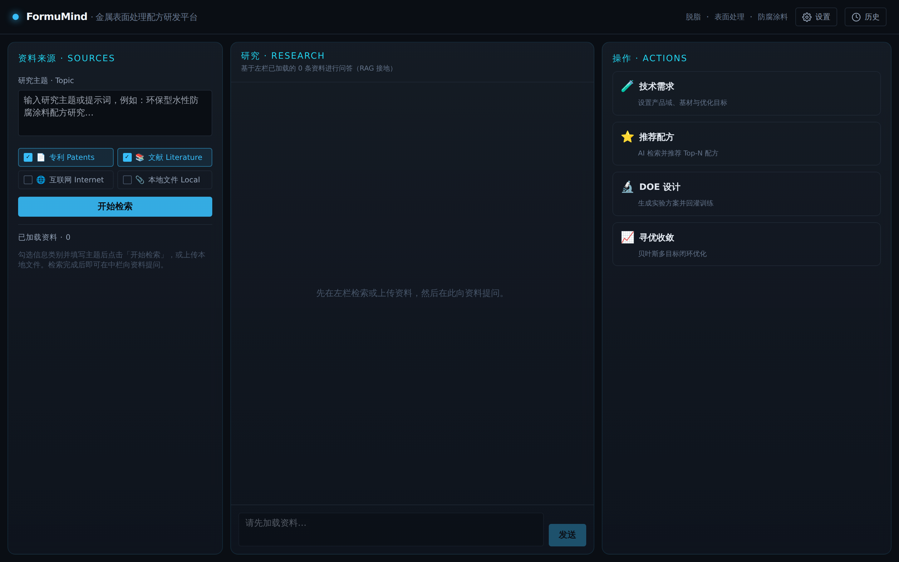
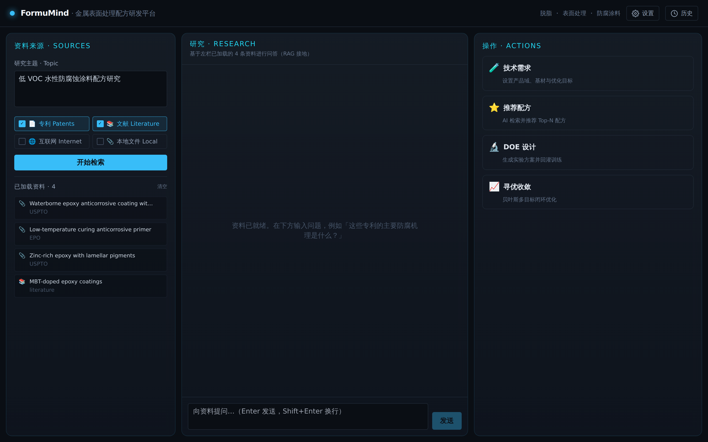
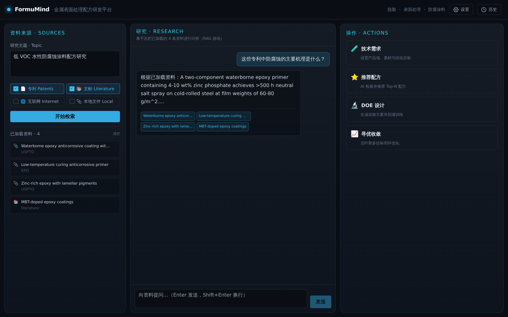
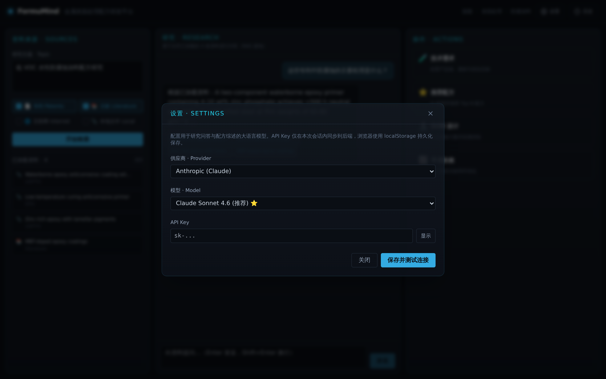
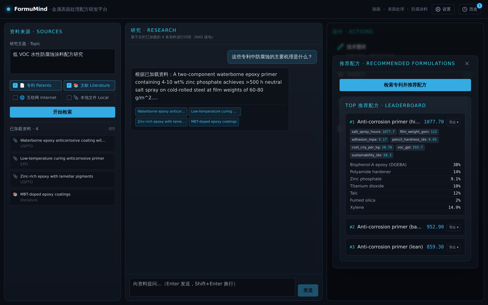
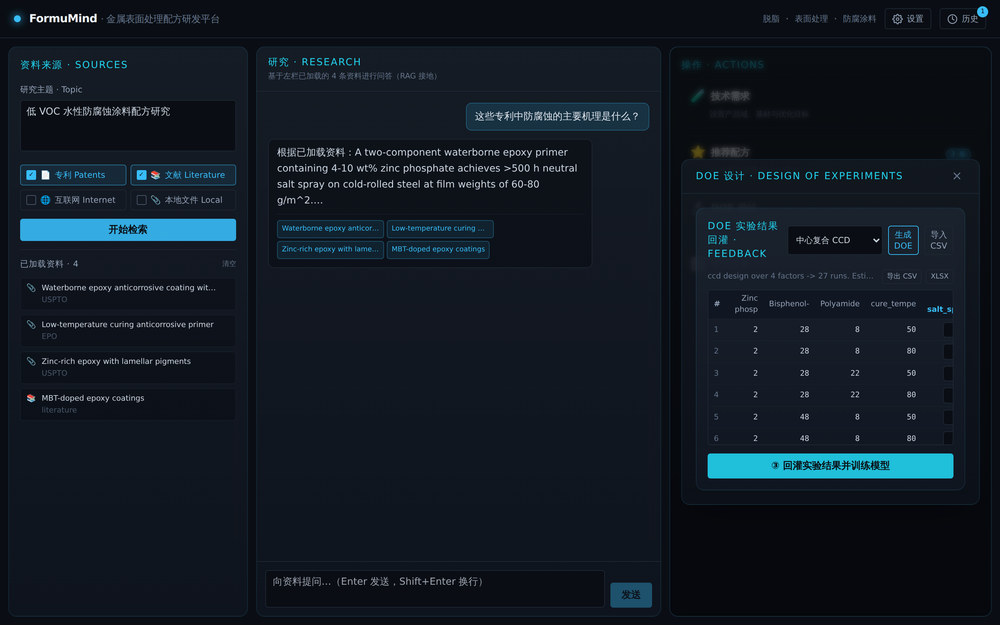
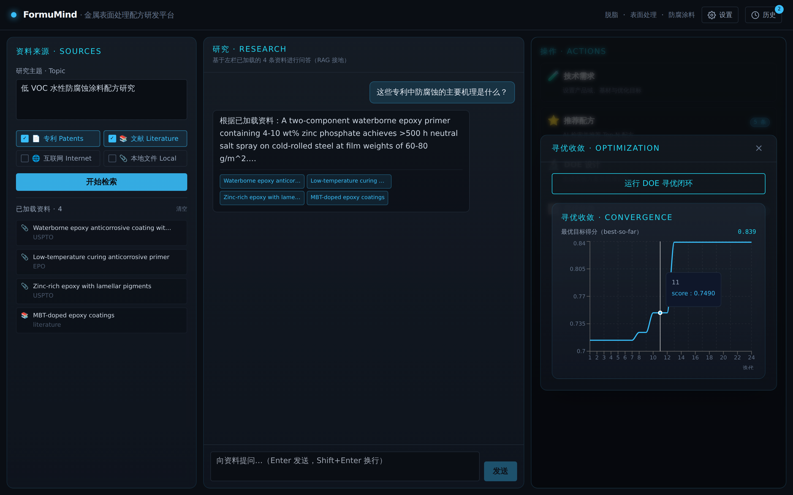

# FormuMind Quick Start (5 minutes)

Run a complete formulation R&D loop in 5 minutes, with real UI screenshots.
For the full reference see [USER_GUIDE.md](./USER_GUIDE.md) (中文: [快速入门.md](./快速入门.md)).

---

## Prerequisite: start the platform

```bash
# Backend (terminal 1)
cd backend
pip install -e ".[dev]"
uvicorn app.main:app --reload      # http://localhost:8000/docs

# Frontend (terminal 2)
cd frontend
npm install
npm run dev                        # http://localhost:5173
```

Open **http://localhost:5173**. No API key required — the platform runs fully
offline.

---

## Step 0 · Overview

FormuMind v0.3 uses a NotebookLM-style three-pane layout that separates
**inputs → research → outputs**: **Sources** on the left, **Research** Q&A in
the center, and the **Actions** toolbar on the right. The header holds
**⚙ Settings** (LLM provider) and **🕐 History**.



- **Left (Sources)**: research-topic prompt box, source-type checkboxes
  (patents / literature / internet / local files), file upload, a **Search**
  button, and the loaded-sources list.
- **Center (Research)**: chat that answers questions grounded in the loaded
  sources, with citations.
- **Right (Actions)**: four buttons — 🧪 Requirements, ⭐ Recommend,
  🔬 DOE Design, 📈 Optimization — each opening a focused modal.

---

## Step 1 · Load sources

Type a research topic (e.g. "low-VOC waterborne anti-corrosion coating"), tick
the source types to search (patents / literature / internet), and click
**Search**. You can also upload local files (PDF/DOCX/XLSX/PPTX/HTML/images),
parsed via markitdown.



Results from every selected source are merged, de-duplicated, ranked by
relevance, and listed in the left column (each removable). Offline, patent
search returns the curated seed corpus; literature/internet search need the
optional `intel` libraries.

---

## Step 2 · Ask the sources (grounded Q&A)

In the center column, ask a question about the loaded sources — e.g. "What is
the main corrosion-protection mechanism in these patents?". The answer is
**grounded in the evidence** (TF-IDF re-rank → LLM) and shows citation chips
linking back to the sources used.



---

## Step 3 · Choose your LLM (Settings)

Click **⚙ Settings** in the header. FormuMind supports **nine providers** —
Claude, OpenAI, Gemini, Grok, Meta (via Groq), DeepSeek, Qwen, Kimi, MiniMax.
Pick a provider and model, paste an API key, optionally set a custom base URL,
then **Save & test connection**. With no key, everything still runs via the
offline rule engine.



---

## Step 4 · Recommend formulations

Open **⭐ Recommend** (right column) and click **research patents & recommend
formulations**. The Top-N leaderboard appears — each card shows the ingredient
table and predicted metrics, including the auto-computed `cost_cny_per_kg`,
`voc_gpl`, and `sustainability_idx` (with ± uncertainty).



---

## Step 5 · Generate a DOE and feed results back

Open **🔬 DOE Design**, choose a design (e.g. **central composite CCD**) and
click **Generate DOE**. You get a run table — one row per experiment, natural
factor values plus a blank "measured" column.



Two feedback paths:

1. **Manual**: type lab-measured values into the "measured" column, then click
   **③ feed back results and train model**.
2. **Batch**: click **Export CSV**, hand it to the lab, then **Import CSV** once
   it's filled in.

Once a metric reaches ≥ 4 samples, a data-driven model is trained automatically;
the model-quality dashboard shows an R² half-gauge + RMSE, and subsequent
recommendations/optimization switch to the "empirical + measured" blend.

---

## Step 6 · Run the optimization loop

Open **📈 Optimization** and click **run optimization loop** to start Bayesian
multi-objective optimization (24 iterations by default). The **convergence
chart** plots the best-so-far objective score per iteration; hover for exact
values. The leaderboard updates to the optimized Top-5 formulations, balancing
salt-spray, cost and sustainability simultaneously.



> Every successful research / recommend / optimize / feedback run is saved as a
> session snapshot — open **🕐 History** in the header to review and restore the
> last 20 sessions (stored in browser localStorage).

---

## Next steps

- Custom objective weights, batch feedback, multi-LLM configuration, wiring up
  the real engines? See the **[full User Guide](./USER_GUIDE.md)**.
- Interactive API docs: start the backend and visit
  **http://localhost:8000/docs**.

> The offline performance numbers are engineering-reasonable screening
> estimates, not lab-validated specs. Feed real DOE data back and predictions
> get progressively more accurate.
