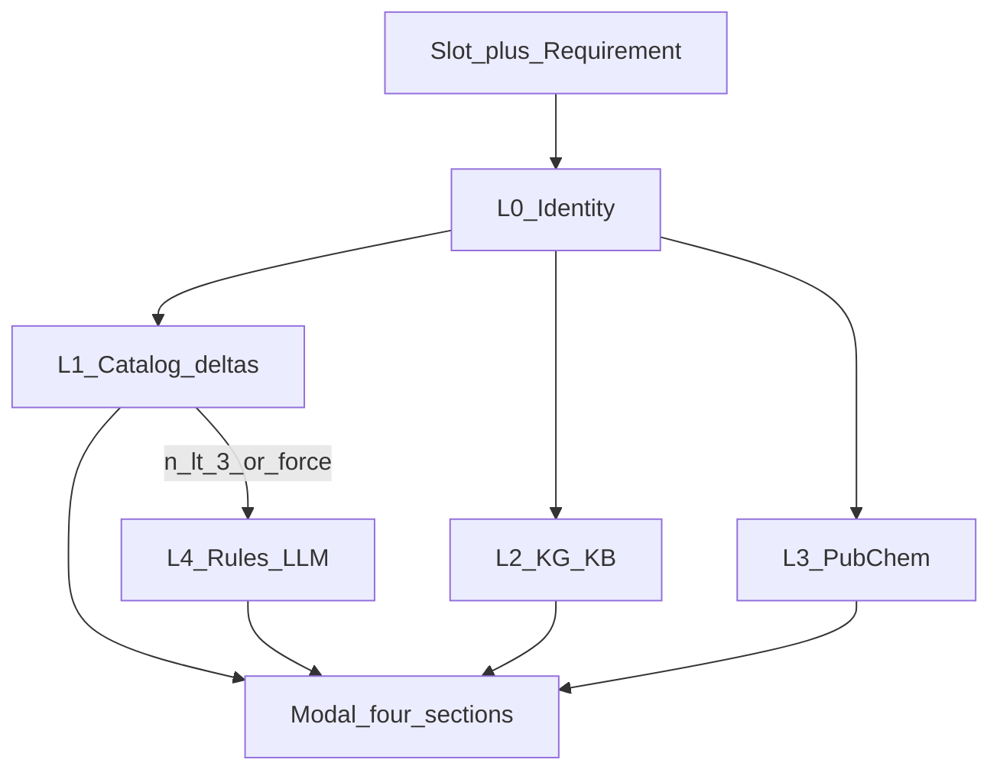

# 材料替代四层漏斗 — 可实施方案

状态：**P0/P1 已实现**（PR 待合入；产品决策 2026-09-08）  
前置：[`2026-09-08-external-substitutes-sketch.md`](./2026-09-08-external-substitutes-sketch.md)（L3 PubChem 已落地）  
主接口：`POST /api/materials/substitutes`  
核心编排：`backend/app/services/substitution.py` · UI：`MaterialSubstitutionModal.tsx`

---

## 1. 目标

推荐配方「材料替代 → 查找替代」按统一漏斗召回**功能相似、符合技术需求**的原料：

1. **L1 材料库**（可供应、可算配方 Δ）— 产品差异点，始终优先  
2. **L2 知识库 / KG**（有文献/关系证据）  
3. **L3 CAS / 相似 SMILES**（仅鉴定到结构时）  
4. **L4 规则 + LLM 功能扩召回**（L1 不足或用户强制）

---

## 2. 红线（回归禁止）

| 不做 | 原因 |
|------|------|
| `materials_only` / 「仅材料库」硬过滤 | 与推荐软偏好决策一致 |
| 文献 / PubChem / LLM 命中静默全量入库 | 噪声与合规风险 |
| 有 CAS/SMILES 时仍把 LLM 排在结构检索前 | 化学事实可靠性 |
| 联网/文献/LLM 项冒充已算配方 Δ | 误导「性能中性」 |

---

## 3. 默认策略（锁定）

| 层 | 开关 | 默认 |
|----|------|------|
| L1 材料库 | 无（始终） | 开 |
| L2 文献 | `include_literature` | **true** |
| L3 结构 | `include_external` | **true**；无 SMILES/CAS 则跳过并写 `skipped_reason` |
| L4 AI/规则 | `include_llm` | **`null` = 自动**：当 `len(candidates) < 3` 启用；Modal 勾选可强制 true/false |

降级原则：任一层超时/缺依赖 → 该层空数组 + meta，**HTTP 仍 200**（库内结果优先保住）。

---

## 4. 漏斗流程

```text
输入：槽位材料 + Requirement + Formulation/genome
  │
  ▼
L0 鉴定：catalog → lookup → cas_no / smiles / role
  │
  ├─► L1 材料库：substitute_group 或同 role
  │     · 重建配方 strict=False（允许库外槽位）
  │     · 预测 Δ + 可行性 + 供应过滤
  │     · 按技术需求方向软重排（不硬剔）
  │
  ├─► L2 KG discover_substitutes + kb_products[+ 轻量 chunk]
  │     · 写入 literature[]；已在库则标 in_catalog
  │
  ├─► L3 PubChem similar（仅 resolved 结构）
  │     · 写入 external[]（现有）
  │
  └─► L4（candidates < 3 或强制）：chemist 规则 → 可选 LLM 扩名
        · 写入 llm[]；默认待入库
  │
  ▼
去重：cas_no > smiles > norm_name
UI 四分区展示；仅 L1 含 Δ
```



---

## 5. API 契约

### 5.1 请求 `SubstituteRequest` 增量

文件：[`backend/app/api/materials.py`](../backend/app/api/materials.py)

| 字段 | 类型 | 默认 | 说明 |
|------|------|------|------|
| `include_literature` | bool | `true` | L2 |
| `include_llm` | bool \| null | `null` | `null`=自动；true/false 强制 |
| `literature_limit` | int | `8` | 1–25 |
| `llm_limit` | int | `5` | 1–15 |
| （已有）`include_external` | bool | `true` | L3 |
| （已有）`external_limit` | int | `8` | |
| （已有）`similarity_threshold` | int | `85` | |
| （已有）`include_unavailable` | bool | `false` | L1 停产 |
| （已有）`limit` | int | `10` | **仅 L1** 上限 |

### 5.2 响应增量（并列，不改 `candidates`/`external` 语义）

```json
{
  "original": "Cerium nitrate hexahydrate",
  "original_in_catalog": false,
  "slot_index": 2,
  "role": "inhibitor",
  "substitute_group": null,
  "base_metrics": {},
  "identity": { "query": "...", "cas_no": "", "smiles": null, "resolved": false, "source": "none" },
  "candidates": [ /* L1 不变：deltas / feasible / evidence */ ],
  "total_considered": 12,
  "literature": [
    {
      "name": "Cerium nitrate",
      "source": "kg",
      "confidence": 0.72,
      "entity_id": "chem:catalog:...",
      "cas_no": null,
      "smiles": null,
      "role_hint": "inhibitor",
      "in_catalog": true,
      "catalog_name": "Cerium nitrate",
      "evidence": [
        { "source_id": "...", "chunk_id": "...", "sentence": "...", "confidence": 0.7 }
      ],
      "note": "知识图谱 substitutes 边"
    }
  ],
  "literature_meta": {
    "enabled": true,
    "queried": true,
    "count": 1,
    "skipped_reason": null,
    "providers": ["kg", "kb_product"]
  },
  "external": [ /* L3 现有 */ ],
  "external_meta": { /* 现有 */ },
  "llm": [
    {
      "name": "Lanthanum nitrate",
      "kind": "substitute_inhibitor",
      "rationale": "同为稀土钝化盐，水相体系常用",
      "source": "chemist_rules",
      "in_catalog": false,
      "note": "AI/规则建议；未做配方 Δ"
    }
  ],
  "llm_meta": {
    "enabled": true,
    "queried": true,
    "count": 1,
    "skipped_reason": null,
    "mode": "auto"
  },
  "layers_used": ["catalog", "literature", "llm"]
}
```

### 5.3 L1 技术需求软重排（可实施规则）

在现有 sort key 之前增加 `requirement_fit`（越大越好），不删除候选：

- 解析 `Requirement.objectives` / VOC 限 / 领域默认指标  
- 对每个候选看对应 metric 的 `deltas.pct`：  
  - 指标 **越大越好**（盐雾、效率）：`pct > 0` 加分  
  - 指标 **越小越好**（成本、VOC）：`pct < 0` 加分  
- 权重低于 `feasible`，高于纯 `structural_score` 平局打破

---

## 6. 后端模块拆分

| 模块 | 职责 |
|------|------|
| [`substitution.py`](../backend/app/services/substitution.py) `find_substitutes` | 编排 L0–L4；合并 meta；L1 重排 |
| 新建 `literature_alternatives.py` | L2：`discover_substitutes` + `ProductStore` + 可选 chunk；统一 item 形状；超时 degrade |
| [`external_alternatives.py`](../backend/app/services/external_alternatives.py) | L3（已有） |
| 新建 `llm_alternatives.py`（P1） | L4：先 `agents/rules.py` 表，再可选 LLM JSON 扩名；禁止无依据编造 CAS |
| [`materials.py`](../backend/app/api/materials.py) | 请求字段透传 |

**L2 调用要点**

- KG：[`graph_query.discover_substitutes`](../backend/app/services/kg/graph_query.py)（今日 `_kg_evidence` 仅贴库内证据 → 升级为独立召回）  
- KB：[`product_store.find_for_material` / `search`](../backend/app/db/product_store.py)  
- Chunk（P0 可省略，P1 补）：`kb_index.search_chunks`，限 top 句且需含替代类关键词  

**L4 调用要点（P1）**

- 复用 [`WATERBORNE_ALTERNATIVES`](../backend/app/agents/rules.py) 等确定性表  
- LLM 仅扩名称 + rationale；无 key/超时 → 空 `llm` + reason  
- 环境开关可挂 `FORMUMIND_SUBSTITUTE_LLM`（需写入 Settings 字段，避免 unknown env 审计失败）

---

## 7. Modal 线框与行为

文件：[`MaterialSubstitutionModal.tsx`](../frontend/src/components/MaterialSubstitutionModal.tsx)

```text
┌─ 材料替代 ───────────────────────────────────── ✕ ─┐
│ 漏斗：库内(Δ) → 文献证据 → 结构相似 → AI扩召回     │
│ [成分▾]  [🔍 查找替代]                              │
│ ☐ 包含停产   ☑ 联网结构(PubChem)                    │
│ ☑ 文献/知识库   ☐/☑ AI功能扩召回（自动：库内<3）     │
│ 鉴定：… · layers: catalog,literature,…              │
│ ▸ 库内候选（预测偏离）  …表…                         │
│ ▸ 文献/知识库候选  [证据] [入库并选用|见上方]        │
│ ▸ 联网结构候选     …现有…                            │
│ ▸ AI功能建议       [入库并选用]                      │
│ ⓘ 仅库内项含配方Δ；其余入库后再查偏离。              │
└────────────────────────────────────────────────────┘
```

- 「入库并选用」一律 `api.proposeMaterial`（`source: user`）  
- 类型：[`frontend/src/api.ts`](../frontend/src/api.ts) 增补 `literature`/`llm` 与请求字段；库内补齐 `evidence?`

---

## 8. 交付切片与工期估时

### P0（主交付，约 2–3 人日）

1. 本文档入库  
2. API：`include_literature` + `literature[]`/`literature_meta` + `layers_used` + `original_in_catalog`  
3. L2 实现（KG + kb_products）；失败降级  
4. L1 需求软重排  
5. Modal 文献分区 + 文案 + 类型  
6. 测试：mock KG/产品；`include_literature=false` 回归；库外槽位仍 200；vitest 文献区  

### P1（约 1.5–2 人日）

1. `include_llm` 自动策略 + `llm[]`  
2. 规则表 + 可选 LLM  
3. Modal AI 区  
4. （可选）chunk 句级替代召回  

### 非目标（本方案不做）

- 替换逆向设计候选池逻辑  
- 新建独立 `/substitutes/literature` 多接口（一律走原 POST 编排）  
- 为 L2/L4 自动算全量 Δ  

---

## 9. 验收清单

**P0**

- [x] 默认请求含 `literature` 键；关 `include_literature` 时 count=0 且 reason 清晰  
- [x] KG/KB 不可用时库内+联网仍 200  
- [x] 库外原组分（如 Cerium nitrate hexahydrate）可出同 role 库内候选  
- [x] 无结构时 L3 skipped_reason 可见，不阻塞 L1/L2  
- [x] Modal 展示文献区；已在库显示「见上方」  

**P1**

- [x] L1≥3 且未强制时 `llm_meta.mode=auto` 且未查询或 count=0  
- [x] L1&lt;3 时自动出现规则/LLM 建议；入库走 propose  

**红线回归**

- [x] 无 `materials_only` API/UI  
- [x] 无静默批量 upsert 文献/LLM 结果  

---

## 10. 风险与缓解

| 风险 | 缓解 |
|------|------|
| L2/L3/L4 拖慢 Modal | 层内超时（建议 ≤3–5s）；L1 先返回逻辑上可同步编排但限制外呼 |
| KG 实体 id 对不上商品名 | 名称 fallback `q=`；失败空 literature |
| LLM 幻觉 CAS | 禁止 LLM 输出作为高置信 identity；CAS 仅来自 catalog/lookup |
| 与旧客户端兼容 | 仅追加字段；旧前端忽略 literature/llm |

---

## 11. 开工顺序（执行清单）

1. 扩展 `SubstituteRequest` + `find_substitutes` 签名  
2. 实现 `literature_alternatives.fetch_literature_alternatives(...)`  
3. 接入编排与 L1 重排  
4. 前端类型 + Modal 文献区  
5. 单测 / vitest / 本地冒烟（推荐配方库外抑制剂）  
6. P1：`llm_alternatives` + AI 区  

---

## 12. 关联现状（避免重复造轮）

| 已有 | 用途 |
|------|------|
| `find_substitutes` L1 + Δ | 直接扩展 |
| `external_alternatives` | L3 |
| `discover_substitutes` / `api.kgSubstitutes` | L2 KG |
| `ProductStore` / harvest | L2 产品与入库 |
| `proposeMaterial` | 文献/联网/AI 入库 |
| `strict=False` 库外槽位 | 保持 |
| chemist `WATERBORNE_ALTERNATIVES` | P1 L4 种子 |
