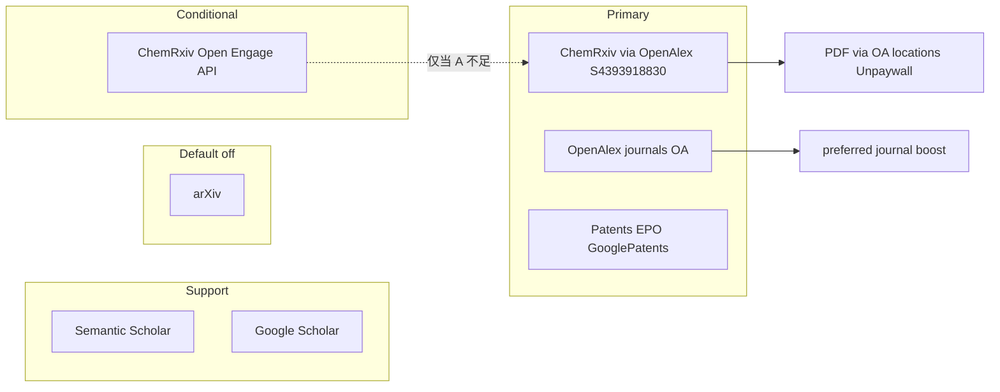

# 文献源策略评估 + 检索提质实施计划（修订版 v2）

日期: 2026-09-10（v2：重评 ChemRxiv）  
状态: **实施中 / 核心切片已落地**（S0–S3 主干；S0c 原生 ChemRxiv API 仍为条件项未做）  
关联: [2026-09-09-kb-quality-p0.md](./2026-09-09-kb-quality-p0.md) · [2026-09-05-multi-source-ingestion-audit.md](./2026-09-05-multi-source-ingestion-audit.md) · 本文件 v1 同路径历史结论已作废其中「ChemRxiv 不做」条目

---

## 0. ChemRxiv 重评（相对 v1 / 2026-09-05 审计的纠正）

### 0.1 先前判断哪里过严

| 旧说法 | 重评 |
|---|---|
| 「以合成化学为主，金属表面处理交集小」 | **片面**。ChemRxiv 由 ACS / RSC / GDCh / CCS / CSJ 共同运营，覆盖 materials science、polymer、physical/analytical chemistry 等；站内已有 passivation / corrosion / surface film 类预印本（如 ePBR 钝化膜等）。与 FormuMind 四域（防腐涂料、脱脂、表面处理、自沉积）的化学/材料属性对齐度 **远高于 arXiv** |
| 「OpenAlex 已含 ChemRxiv，不必单独做」 | **半对**。元数据可经 OpenAlex 发现，但通用 OpenAlex 检索会被期刊洪流淹没，**不会主动把 ChemRxiv 预印本当成化学主通道**；需要 **显式 Source 过滤/加权** 或 **独立探针** 才能发挥其专业预印本价值 |
| 「不做探针」 | **改为分阶段做**：先 OpenAlex ChemRxiv 通道（零新依赖），再视索引延迟决定是否上 Open Engage public-api |

### 0.2 ChemRxiv 相对 arXiv 的优势（对本产品）

| 维度 | ChemRxiv | arXiv（现状问题） |
|---|---|---|
| 学科边界 | 化学及相关，PhD 化学家筛选 | 物理/天文/CS 串扰大，配方域噪声高 |
| 学会背书 | ACS/RSC 等 | 非化学学会主场 |
| 全文 | 预印本公开 PDF，符合「可全文」原则 | 有 LaTeX 快路径，但领域噪声抵消收益 |
| 体量 | OpenAlex 源 `S4393918830`，约 **6.3 万** works（2026-09 查询） | 更大，但对本域信噪比差 |

### 0.3 接入方式对比

| 路径 | 增量 | 风险 | 建议阶段 |
|---|---|---|---|
| **A. OpenAlex + `primary_location.source.id:S4393918830`** | 复用现有 `search_openalex`；可强制 OA；打 `domain_match`/`taxonomy_source` | 索引相对 ChemRxiv 站有延迟（通常可接受） | **S0 / S0b 必做** |
| **B. Cambridge Open Engage public-api**（`chemrxiv.org/engage/.../public-api`：items 搜索 + DOI；另有 OAI-PMH） | 更新更及时、可按 subject（如 Materials Science）收口 | 新 HTTP 客户端与限流；社区 wrapper 有 API 迁移历史；需核对 ToS/署名 | **S0c 条件项**：仅当 A 实测召回不足或延迟不可接受时 |
| 爬站 HTML | — | 脆弱、易违 ToS | **不做** |

**OpenAlex ChemRxiv Source ID（固化进 Profile）：** `S4393918830`（`https://openalex.org/S4393918830`）。

### 0.4 裁决（v2）

- **ChemRxiv：采纳为化学预印本主通道**（替代默认 arXiv 的预印本角色）。  
- **实现优先走路径 A**（OpenAlex 限定 ChemRxiv source），`source_policy` 键名建议：`"chemrxiv": "primary"`（学术预印本）或与 OpenAlex 并列的 primary 配额切片。  
- **路径 B（原生 API）列为条件增强**，不阻塞 S0–S1。  
- 2026-09-05 审计 B4「ChemRxiv → 不做」**对本产品域予以撤销**；改为「不做盲目爬虫；做受控 ChemRxiv 通道」。

---

## 1. 源策略总表（v2）

| 候选源 | 裁决 | 理由 |
|---|---|---|
| **arXiv** | 默认四域 **`source_policy=off`**（保留代码/旗标） | 对本域噪声高；预印本角色改由 ChemRxiv 承担 |
| **OpenAlex（通用）** | **`primary`** | 期刊 OA 主源；concept 过滤已有 |
| **ChemRxiv** | **`primary`（经 OpenAlex source 通道）**；可选后期原生 API | 专业化学预印本；学会背书；全文公开 |
| **Crossref / habanero** | **不引入检索探针** | OpenAlex 已聚合 DOI 元数据 |
| **ACS / RSC / Springer / Wiley API** | **不直连** | 付费墙 vs 无全文过滤红线 |
| **专业正刊偏好** | OpenAlex `preferred_openalex_source_ids` soft boost | 用 Source ID 表达 ACS/RSC 等刊，不直连出版社 |
| **专利 EPO / Google Patents** | **`primary`** | 配方/工艺主战场不变 |
| **S2 / Scholar** | **`support`** | 降配额降权 |

**原则不变：** 无全文不进可入库主列表；合法 OA only。



---

## 2. 与 DomainSearchProfile 提质的合并切片（v2）

| 切片 | 内容 | 优先级 |
|---|---|---|
| **S0** | 四域：`arxiv=off`；接线 `source_policy`；OpenAlex primary；**ChemRxiv→OpenAlex source 流 primary** | P0 |
| **S1** | ingest 传 `domain`；`domain_match=none` 丢弃；requirement 一致性；UI 第四域；修 arXiv 打标（可选开源时） | P0 |
| **S0b** | `preferred_openalex_source_ids`（正刊）+ ChemRxiv ID 写入 Profile 常量 | P1 |
| **S0c** | （条件）ChemRxiv Open Engage public-api 探针 + subject 过滤 | P2 / 有证据再做 |
| **S2** | 扩展 deny + 基材 hard；`keyword_deny` 检索期 | P1 |
| **S3** | 无全文不进主列表；分层 UI；审计源占比（arXiv≈0，ChemRxiv 可见） | P2 |

**字段策略：**

- 不新增 `search_deny` → 前移 `keyword_deny`
- `source_policy` 增加键 **`chemrxiv`**（取值 primary/support/off）；实现上映射到「OpenAlex 限定 Source」流，而非第二套无关配置
- Profile 建议字段：
  - `preferred_openalex_source_ids: tuple[str, ...]`（正刊 boost）
  - `chemrxiv_openalex_source_id: str = "S4393918830"`（或并入 preferred，但 **单独一流更清晰**：预印本 vs 正刊配额可拆）

---

## 3. S0 — 源策略落地要点（含 ChemRxiv）

### 3.1 `_DEFAULT_SOURCE_POLICY` 修订草案

```python
_DEFAULT_SOURCE_POLICY = {
    "arxiv": "off",
    "openalex": "primary",
    "chemrxiv": "primary",   # 经 OpenAlex source 通道实现
    "semantic_scholar": "support",
    "epo": "primary",
    "google_patents": "primary",
    "surechembl": "support",
    "google_scholar": "support",
    "pubchem": "support",
}
```

### 3.2 `_build_streams` 行为

- 读 Profile `source_policy`
- `arxiv=off` → 不建 arXiv 流；ChemLit 内 arXiv 分支同步跳过
- `chemrxiv=primary` → 额外（或替代一部分通用 OpenAlex 配额）调用 OpenAlex：  
  `filter=...,primary_location.source.id:S4393918830`（可与 `is_oa:true` / concept 组合）  
  Evidence `source` 标签建议标为 **`ChemRxiv`**（便于审计），`taxonomy_source` 可用 `openalex` 或新增字面 `"chemrxiv"`
- 通用 OpenAlex 流与 ChemRxiv 流 **分配额**，避免预印本挤占正刊 OA 或反之（例如各 `per_source_cap` 一半）

### 3.3 全文

ChemRxiv 条目优先：OpenAlex `best_oa_location` / `oa_locations` PDF → Unpaywall 补查；一般可直接下预印本 PDF，无墙。

### 3.4 S0c 条件触发标准（原生 API）

仅当冒烟满足任一：

1. 同主题下 ChemRxiv 官网能搜到 ≥N 篇高相关，但 OpenAlex ChemRxiv 通道 0 命中或延迟 >90 天占多数；或  
2. 需要 ChemRxiv **subject**（Materials Science 等）硬过滤而 OpenAlex 无法等价表达  

则新增 `search_chemrxiv`（httpx → Open Engage items API），纳入 `_build_streams`，policy 键仍为 `chemrxiv`。

---

## 4. S1–S3（承接，略）

与 v1 相同：**domain 传递、none 丢弃、requirement 锁死、deny/基材前移、无全文过滤、审计 UI**。  
验收增加：默认检索审计中 **ChemRxiv 占比 > 0**（有化学主题时），**arXiv ≈ 0**。

---

## 5. 明确不做

- Crossref/habanero 检索探针  
- ACS/RSC/Springer/Wiley 官方/爬虫 API  
- Sci-Hub  
- 物理删除 arXiv 代码  
- ChemRxiv **站点 HTML 爬取**  
- 本阶段新建 `search_deny` / `source_quota` 平行字段  

---

## 6. 验收标准（v2 增补）

| ID | 标准 |
|---|---|
| V1 | 默认四域：无 arXiv 请求；审计 arXiv ≈ 0 |
| V2 | 化学/表面主题：出现 `source=ChemRxiv`（或等价标识）命中；OpenAlex 正刊仍为主力之一 |
| V3 | 歧义主题医学/天文噪声相对现状下降 |
| V4 | ingest 审计含正确 `domain` |
| V5 | `chemrxiv=off` 时不建 ChemRxiv/OpenAlex-ChemRxiv 流 |
| V6 | 临时 `arxiv=support` 仍可回归 |
| V7 | ChemRxiv 命中条目可走全文管线入库（OA PDF） |

---

## 7. 关键文件（实施时）

| 文件 | 动作 |
|---|---|
| `backend/app/domain/search_profiles.py` | policy：arxiv=off，chemrxiv=primary；ChemRxiv Source ID 常量 |
| `backend/app/services/literature.py` / `search_providers.py` | policy 接线；OpenAlex ChemRxiv 过滤流；Evidence 源名 |
| `backend/app/worker/tasks.py` 等 | S1 domain 传递与门控 |
| 测试 | policy off/on、ChemRxiv filter 字符串断言、源占比冒烟 |
| 本文档 | 评审通过后改「已确认」 |

---

## 8. 实施顺序与估时

1. **S0** policy + 关 arXiv + OpenAlex-ChemRxiv 流 — ~0.5–1 天  
2. **S1** 门控/domain/requirement — ~1 天  
3. **S0b** 正刊 preferred boost — ~0.5 天  
4. **S2** deny/基材 — ~0.5–1 天  
5. **S3** UI/审计 — ~0.5–1 天  
6. **S0c** 仅证据触发 — 另计 ~0.5–1 天  

---

## 9. 一句话（v2）

**ChemRxiv 应作为化学专业预印本主通道启用（优先经 OpenAlex Source `S4393918830`），用以替代默认 arXiv；不直连出版社、不引入 Crossref；原生 ChemRxiv API 仅作索引不足时的条件增强。**

---

## 10. 实施记录（2026-09-10）

已落地：

- S0：`source_policy` arxiv=off / chemrxiv=primary；`_build_streams` 按 tier 建流；ChemRxiv→OpenAlex `S4393918830`
- S1：ingest 传 domain；`domain_match=none` 检索+入库双丢；requirement 换域重置 objectives；检索前 domain 一致性 409；UI 第四域；修 arXiv 打标死代码
- S0b：`preferred_openalex_source_ids` 期刊 soft boost
- S2：扩展期 deny 过滤同义词；检索期 keyword_deny + `wrong_substrate_hit`
- S3：`is_oa=False` 文献不出主列表；`FilterReport.source_counts` + 通知栏源占比

未做（按计划条件项）：S0c ChemRxiv Open Engage 原生 API。
