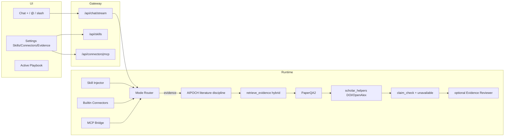

# FormuMind × 双 OpenScience：Skills / MCP / Evidence Synthesis 升级方案

> 状态：**方案评审 · v2（整合 AIPOCH）**（2026-09-26）  
> 依据：
> 1. `synthetic-sciences/openscience` → `/tmp/openscience`（Bun/TS Research workbench）  
> 2. `aipoch/open-science` → `/tmp/aipoch-open-science`（Electron 本地科研工作台，v0.33.3）  
> 3. FormuMind 主干（含 #160 RAG/Wiki 统一）  
> 目标：评估「Claude Science / OpenScience 类能力」的必要性与可实现性，给出可落地的分阶段升级路径  
> 约束：**不**整体移植任一 OpenScience；**不**把配方闭环改造成通用科学 coding agent；优先补齐「文献综合反幻觉」与「技能/MCP 统一管理」

---

## 0. 两仓对照（先分清再借鉴）

| | **SynSci OpenScience** | **AIPOCH Open-Science** | **FormuMind** |
|--|------------------------|-------------------------|---------------|
| 定位 | CLI + 浏览器 Research agent | Desktop-first 科研工作台 | 配方 R&D 闭环 + KB/Wiki |
| 栈 | Bun/TS、SolidJS、Hono/SSE | Electron、React、Prisma/SQLite、ACP backends | FastAPI、React、Celery、Postgres |
| Skills | ~371 `SKILL.md` 指令包 + Git 安装 | 23 内置 + Marketplace 525；`activationPolicy`；可带 `kernel.py` | 静态 **playbook**（技能坞） |
| MCP / Connectors | Settings Connectors，进程隔离 | **24 内置 connectors** + 自定义 MCP；工具级权限；`useWhen` 路由文案 | 无（历史明确不做） |
| 文献 | connectors + research skills | **Literature Library** + Smart Screening + PDF 注解 + DOI/OpenAlex | hybrid RAG + PaperQA(best-effort) + STORM |
| 反幻觉 / 审核 | 可见 tool trace | **Reviewer** 回合后审 + **Provenance**（缺证据标 unavailable） | claim-check + CitationChip |
| Composer | Tools 菜单 + slash | `+`/`@`/`/`、YourFiles、审批模式、Specialist | 📷 + textarea |
| 可移植产物 | — | `.science` 包、RO-Crate | Wiki 草稿 / 会话存档 |
| 对 FM 价值 | Skills 协议、Settings IA、Composer Tools、MCP 模型 | **文献综合 SOP、Provenance 诚实原则、Reviewer、activationPolicy、chemistry/literature connectors 元数据** | 自身壁垒 |

**命名约定（本稿）**

- **SynSci-OS** = `synthetic-sciences/openscience`
- **AIPOCH-OS** = `aipoch/open-science`
- 二者皆称 OpenScience，但**不是同一产品分叉**；借鉴策略不同。

---

## 1. 一句话结论（v2）

| 维度 | 结论 |
|------|------|
| **产品定位** | FormuMind = **配方 R&D 闭环 + 钢印级文献综合 Agent**；不是第三个 OpenScience |
| **SynSci-OS 可借** | `SKILL.md` 协议、Settings Skills/Connectors IA、Composer「设置开启 ≠ 本轮选用」、MCP 进程隔离 |
| **AIPOCH-OS 可借（新增重点）** | `literature-review` 技能 SOP、**retrieve-first + DOI 校验 + 撤稿检查**、Provenance「缺证据不可推断」、可选 **Reviewer** 回合、`activationPolicy`、connector `useWhen` 路由文案、chemistry/literature 连接器目录思路 |
| **双方均勿借** | 整栈、shell/notebook/HPC harness、技能市场全量同步、Specialist 子代理生态、`.science` 包作为主路径 |
| **PaperQA2 定位** | Evidence 模式**综合引擎**；检索仍走 #160 hybrid；流程纪律抄 AIPOCH `literature-review` |
| **技能坞→设置** | 必要且拆型：Playbook / Chat Skill / MCP /（可选）Literature Connector |
| **中栏 +** | 高价值；并吸收 AIPOCH 的 `@` 引用已选资料 / KB 文档 |
| **MCP** | Phase 4；默认关；优先接文献类只读工具（对齐 AIPOCH literature connector 能力边界） |

**推荐策略：双源模式借鉴 + 能力增量；拒绝 Frankenstein。AIPOCH 对「文献反幻觉」比 SynSci 更贴 FormuMind 痛点。**

---

## 2. SynSci-OS 代码画像（摘要）

```
Browser workspace (SolidJS)
  → Local Bun/TS server (Hono + SSE)
      → Research agent session loop
      → Tools: shell / edit / LSP / MCP / science connectors
      → Skills: bundled + user/git/project packs (SKILL.md)
```

- Skills = on-demand instruction bundles（`backend/cli/src/skill`）
- Settings → Skills / Connectors；Composer Tools + slash
- 哲学：薄 runtime + 扩展（`docs/notes/scientific-harness-design.md`）
- **不是** PaperQA2；文献靠 connectors + skills + trace

---

## 3. AIPOCH-OS 代码画像（本次新增分析）

### 3.1 系统形状

```
Electron desktop (React renderer + main)
  → ACP agent backends (Claude Code / OpenCode / Codex / CodeBuddy)
  → Skills runtime + Marketplace
  → Connectors (24 built-in) + custom MCP
  → Literature library / smart screening / PDF annotations
  → Notebook (Python/R) + SSH/Slurm
  → Immutable artifacts + Provenance + optional Reviewer
```

关键文档：`README.md`、`ROADMAP.md`、`docs/PRD.md`。

### 3.2 对 FormuMind 最有价值的五块

#### A. `literature-review` 技能（反幻觉操作手册）

路径：`/tmp/aipoch-open-science/resources/skills/literature-review/SKILL.md`

核心纪律（应写入 FM Evidence 系统提示 + Chat Skill 正文）：

1. **Retrieve first, then write** — 先检索再写；回忆只定 framing  
2. **DOI 必须可解析** — 模糊则 Crossref/OpenAlex 查，禁止「补全式伪造 DOI」  
3. **引用图扩展** — 对 top hits 做 backward/forward citation expand  
4. **撤稿 / 更正检查** — Crossref `updated-by`；高调结果必查  
5. **合成 = 比较，不是摘要列表** — 按主题组织；段首是主张、后接引用  
6. **置信度校准** — preprint / 单队列 / RCT 分档表述  
7. **缺论文就说没有** — 禁止用「最接近」冒充目标论文  
8. **纯技能 + 确定性 `kernel.py`** — HTTP/stdlib 调 Crossref/OpenAlex，推理仍在主模型  

> FormuMind 启示：Evidence 模式不只是换 RAG 引擎，还要固化这套**写作与校验纪律**；可用 Python 服务实现 `verify_dois` / `search_openalex` 类助手（不必 Electron notebook）。

#### B. Provenance 诚实原则

`ROADMAP.md` / `docs/PRD.md` 明确三分：

1. **可追溯（traceability）** ≠  
2. **可重放检查（replay）** ≠  
3. **科学正确（validity）**

且：**缺证据标 unavailable，禁止从模型声称推断谱系。**  
FormuMind 的 claim-check / CitationChip 应升级为同等诚实语义：无 chunk / DOI 失败 → UI 显式「无据 / 未校验」，而非静默省略。

#### C. Reviewer（回合后审）

独立上下文审查本轮回答 + 执行/文件证据 → pass / warning / failure，有界纠正循环。  
FM 已有 claim-check chips；可演进为可选 **Evidence Reviewer pass**（默认关，Evidence 模式建议开），不必上完整 ACP Reviewer。

#### D. Skills `activationPolicy`

`always-on`（受信内置）vs `user-controlled`（设置可关）。  
设置页「启用」与应用强制技能分离——比单纯 boolean 开关更稳。

#### E. Connectors 元数据：`useWhen` + chemistry/literature

`src/main/connectors/catalog.ts`：每个连接器有面向检索的 `useWhen` 文案，供自动选型。  
内置 **Chemistry**（PubChem/ChEBI/…）与 **Literature Graph**（OpenAlex/arXiv/Crossref/DataCite）与涂料/配方场景高度相关——Phase 4 优先做「内置文献/化学只读适配器」，MCP 自定义次之。

### 3.3 AIPOCH Composer UX（吸收点）

- 附件上传 + `@` 引用项目文件  
- `/` 选 skill  
- 审批模式（approval）  
- Specialist 选型（FM **不做**子代理；可做成「模式预设」而非 Specialist 市场）

### 3.4 明确不借

| AIPOCH 能力 | 原因 |
|-------------|------|
| Electron / ACP 多 backend | 栈错位；FM 已有 FastAPI agent |
| Notebook/SSH/Slurm | 非配方主路径 |
| Skills Marketplace 525 | 维护与安全面过大；协议兼容即可 |
| `.science` / RO-Crate 主路径 | 后期可选；先 Wiki/会话 |
| 全量 Specialist 市场 | 子代理复杂度；用 Mode/Skill 代替 |

---

## 4. FormuMind 现状差距图（相对双源）

| 能力 | FormuMind | SynSci-OS | AIPOCH-OS | 缺口优先级 |
|------|-----------|-----------|-----------|------------|
| 配方闭环 | 核心壁垒 | 无 | 无 | **保持** |
| 「技能」 | playbook 坞 | SKILL runtime | SKILL + marketplace + activation | **拆型 + Settings** |
| 文献综合纪律 | 弱（模型自由发挥） | 部分 research skills | **literature-review SOP 极强** | **P0 写入 Evidence** |
| 检索引擎 | hybrid + PaperQA sync-only | connectors | library + connectors | PaperQA stream + 解耦 OpenAI |
| 引用诚实 | CitationChip + claim-check | tool trace | Provenance unavailable | **P0 语义对齐** |
| 回合后审 | claim-check（轻） | — | Reviewer | **P1 可选加固** |
| Composer 选型 | 📷 only | Tools/slash | + / @ / / | **P0 + 菜单** |
| MCP | 无 | Connectors | Connectors+24 | **P2 克制** |
| 文献库 UX | KB/Wiki | — | Literature Library + Screening | **P3 按需**（非阻塞） |

锚点：

- `ActionSkillsDock.tsx` / `formulation_skills.py`
- `llm.py` PaperQA（running loop → `None`；绑 OpenAI key）
- `chat.py` stream 与 sync 分叉
- `ResearchPanel.tsx` 输入条

---

## 5. 对原建议的再评估（整合后）

### 5.1 技能坞 → 设置 Skills + MCP

| | |
|--|--|
| **必要性** | **中高**（双源一致：库存在 Settings） |
| **修订** | 增加 AIPOCH 的 `activationPolicy`；右栏保留 Active Playbook |
| **勿做** | 把 playbook 伪装成 SKILL.md runtime |

### 5.2 自定义技能

| | |
|--|--|
| **必要性** | **高** |
| **协议** | 兼容双源 frontmatter 子集：`name`, `description`, `license`, `metadata`, `activationPolicy`；可选 `allowed_tools` |
| **首发内置 Chat Skill** | 移植/改编 AIPOCH `literature-review`（涂料/高分子域示例 + DOI 助手），Apache-2.0 注意归因 |
| **暂不做** | Marketplace / 签名发布 |

### 5.3 PaperQA2 Evidence Synthesis

| | |
|--|--|
| **必要性** | **最高** |
| **引擎** | PaperQA2 综合 + hybrid 检索（#160） |
| **纪律层（AIPOCH）** | retrieve-first、DOI verify、合成非列表、unavailable 诚实 |
| **后审（AIPOCH 轻量）** | Evidence 模式默认跑 claim-check；可选第二轮 Reviewer LLM |

### 5.4 中栏「+」

| | |
|--|--|
| **必要性** | **高** |
| **v2 菜单** | 上传 · Skills · Mode(Evidence) ·（后期）MCP · **@ 已选资料/KB**（借 AIPOCH） |
| **slash** | Phase 1.5：`/literature-review` 等价于选中对应 Chat Skill |

---

## 6. 目标信息架构（v2）

```
设置 Settings
├── Skills
│   ├── 配方行动包（Playbooks）          ← 现有 silane/DOE/…
│   ├── 对话技能（Chat Skills）          ← SKILL.md；含内置 literature-review
│   ├── activation：always-on | user-controlled
│   └── 导入 .zip / Markdown（无市场）
├── Connectors / MCP
│   ├── 内置只读：Literature（OpenAlex/Crossref/…）· Chemistry（PubChem…）← Phase 4a
│   ├── 自定义 MCP（stdio/SSE）                         ← Phase 4b
│   └── 工具白名单 · useWhen 文案 · 密钥 vault
└── Evidence Synthesis
    ├── 引擎：paperqa | hybrid_strict
    ├── DOI / retraction 校验开关
    ├── claim-check / optional Reviewer
    └── 「无据」展示策略（unavailable）

中栏 Composer
└── [+]  Attach | Skills | Mode | MCP*
    @   引用左栏已选 / KB 文档
    /   slash 技能
    chips：本轮已选技能与模式

右栏 Actions
└── Active Playbook Strip（闭环进度 only）
```

### 6.1 四种能力命名

| 名称 | 含义 | 示例 |
|------|------|------|
| **Playbook** | 打开配方 Modal/Celery | CCD DOE |
| **Chat Skill** | 注入 SOP + 工具白名单 | literature-review、Method 写作 |
| **Connector** | 一等公民科学数据源（可先非 MCP 实现） | OpenAlex、PubChem |
| **MCP Tool** | 外部进程工具 | Zotero、LIMS |

---

## 7. 分阶段落地（v2 · 整合）

### Phase 0 — 决策锁定（0.5 天）

1. 产品句：**配方闭环为本；Evidence Synthesis（PaperQA2 + AIPOCH 纪律）为锋刃；Skills/Connectors 可插拔。**  
2. 不做清单：两仓整栈、Marketplace、Notebook/HPC、Specialist 子代理、第二套向量库。  
3. 旗标（默认关）：
   - `CHAT_COMPOSER_PLUS_ENABLED`
   - `CHAT_SKILLS_RUNTIME_ENABLED`
   - `EVIDENCE_SYNTHESIS_MODE=off|paperqa|hybrid_strict`
   - `EVIDENCE_DOI_VERIFY_ENABLED`
   - `EVIDENCE_REVIEWER_ENABLED`
   - `CONNECTORS_BUILTIN_ENABLED`
   - `MCP_CLIENT_ENABLED`

### Phase 1 — UX 骨架：Settings Skills + 中栏 `+` / `@`（1–1.5 周）

- API：`/api/settings/skills`；`ChatRequest.selected_skills` / `mode` / `ref_doc_ids`
- Playbook `kind=playbook` 行为回归不变
- `+` 菜单 + 本轮 chips；`@` 插入已选资料标题（先文本锚点）
- 设置：启用/pin/`activationPolicy`

**验收**：关技能则菜单不可见；playbook 仍开 Modal；请求带 skill ids。

### Phase 2 — Evidence Synthesis（PaperQA2 + AIPOCH 纪律）（2–2.5 周）**【峰值】**

1. `services/evidence_synthesis.py` + 可选 `services/scholar_helpers.py`（DOI verify / OpenAlex search，stdlib/httpx，对标 AIPOCH `kernel.py` 能力而非抄 Electron）  
2. 系统提示嵌入 literature-review 纪律（域适配：涂料/高分子/硅烷）  
3. 打通 **stream**；解耦 OpenAI embedding/LLM  
4. 输出：`citations` + `claims` + `doi_status` + `evidence_availability`  
5. UI：无据/DOI 失败显式标记；STORM Method/Background 可挂此引擎  

**验收**：DeepSeek-only 不炸；伪造 DOI 被拦住或标红；金标 20 题 citation precision。

### Phase 2.5 — 轻量 Reviewer（可选，0.5–1 周）

- Evidence 模式结束后可选第二上下文：只审「断言↔引用」  
- 复用/加强现有 claim-check；有界 1 轮 regenerate（对齐 #160 regenerate flag）  
- **不做**完整 AIPOCH Reviewer/ACP

### Phase 3 — Chat Skills Runtime + 内置 literature-review（1–2 周）

- `data/skills/**/SKILL.md`；白名单工具映射  
- 内置改编版 `literature-review`（归因 AIPOCH Apache-2.0）+ `method-writer`（配方）  
- 设置导入 zip；slash `/literature-review`

### Phase 4a — 内置 Connectors（只读）（1.5–2 周）**【优于通用 MCP】**

- Literature Graph 适配器：OpenAlex + Crossref（+ 现有 arxiv/S2）  
- Chemistry 适配器：PubChem（FM 已有 PubChemPy 基础）  
- Settings 目录 + `useWhen`；中栏 `+` 可勾选  
- **仍走 Python 服务**，不必 MCP 进程

### Phase 4b — 自定义 MCP Client（1.5–2 周）

- stdio/SSE；默认只读；审批写工具  
- 配置导入/导出（借 AIPOCH connectors settings 思路，轻量实现）

### Phase 5 — 按需深化

- Smart screening（纳入/排除）轻量版 — 仅当用户做系统综述时  
- 技能 Git 安装 + 审查  
- Evidence bench（涂料 50 题）  
- 可选：调用外部 SynSci/AIPOCH CLI 作为高级出口（永不反向嵌入）

---

## 8. 架构草图（目标态 v2）



---

## 9. 必要性总评（v2）

| 提案 | 必要性 | 紧迫性 | 主要灵感源 |
|------|--------|--------|------------|
| Evidence + 文献纪律 | ★★★★★ | 高 | AIPOCH literature-review + PaperQA2 |
| 中栏 + / @ | ★★★★★ | 高 | SynSci Composer + AIPOCH |
| Settings Skills + activationPolicy | ★★★★☆ | 高 | 双源 |
| 内置 Literature/Chemistry connectors | ★★★★☆ | 中高 | AIPOCH catalog |
| 自定义 Chat Skills | ★★★★☆ | 中 | 双源 SKILL.md |
| 轻量 Reviewer | ★★★☆☆ | 中 | AIPOCH Reviewer |
| 自定义 MCP | ★★★☆☆ | 中低 | 双源 Connectors |
| Literature Library / Screening 全量 | ★★☆☆☆ | 低 | AIPOCH（FM 用 KB/Wiki 替代） |
| 整仓对齐任一 OS | ★☆☆☆☆ | 无 | — |

**结论：值得升级。Phase 顺序调整为 1 → 2（含纪律）→ 2.5 → 3 → 4a → 4b；AIPOCH 把「怎么写文献综合」补进了原先偏引擎的 Phase 2。**

---

## 10. 风险与工作量

| 风险 | 等级 | 缓解 |
|------|------|------|
| 两仓名词/协议混用 | 高 | 文档固定 SynSci-OS / AIPOCH-OS；API `kind` |
| 抄 AIPOCH 技能版权 | 中 | Apache-2.0 归因；大幅改编域文案 |
| OpenAlex key / 速率限制 | 中 | 可选；无 key 降级 Crossref + 本地 KB |
| PaperQA stream | 高 | 独立 async 模块 |
| Connectors 做成第二 RAG | 高 | 只产 Evidence[]，检索融合仍走 hybrid |
| 范围膨胀 | 高 | Phase 闸门；不做 Marketplace/Notebook |

粗估（1 全栈）：Phase1 1–1.5w · Phase2 2–2.5w · Phase2.5 0.5–1w · Phase3 1–1.5w · Phase4a 1.5–2w · Phase4b 1.5–2w。

---

## 11. 与历史决策

| 文档 | 原决策 | v2 态度 |
|------|--------|---------|
| `2026-09-15-action-skills-dock.md` | 不做 MCP/子代理 | MCP→4b 默认关；子代理仍不做；**Connectors 4a 用 Python 适配器** |
| Wiki 计划 | MCP 非核心 | 维持；文献连接器服务 Evidence，非配方主路径 |
| #160 | 统一 hybrid | **强制**：PaperQA/connectors 只追加证据，不另建索引栈 |
| 本方案 v1 | 偏 SynSci UX | **v2 补 AIPOCH 文献纪律与 Provenance 诚实** |

---

## 12. 立即下一步

1. 确认 v2 IA（§6）与「四种命名」。  
2. Phase 1 实施分支。  
3. 并行 spike：  
   - PaperQA2 + DeepSeek/本地 embedding  
   - `scholar_helpers.verify_dois` 最小实现  
   - 将 AIPOCH literature-review 纪律压缩为 ≤2k token 系统附加段（涂料域）  
4. Spike 过后再开 Phase 2。

---

## 13. 验收愿景（用户可感知）

1. 设置启用 `literature-review` 技能与 Literature connector。  
2. 中栏 `+` → Evidence 模式 + 该技能；`@` 引用左栏三篇专利/论文。  
3. 提问界面固化工艺参数 → 段首主张 + 可点击引用；DOI 校验通过；撤稿标红；无据 claim 显式「无据」。  
4. 可选 Reviewer 提示「2 处弱支撑」并允许一轮修正。  
5. 一键进 Wiki Method；右栏 CCD DOE 不受影响。

---

## 附录 A — SynSci-OS 路径

| 主题 | 路径 |
|------|------|
| 架构 | `/tmp/openscience/ARCHITECTURE.md` |
| Harness | `/tmp/openscience/docs/notes/scientific-harness-design.md` |
| Skill runtime | `/tmp/openscience/backend/cli/src/skill/skill.ts` |
| Skills UI | `/tmp/openscience/frontend/workspace/src/atlas/SkillsPage.tsx` |
| Connectors | `/tmp/openscience/frontend/workspace/src/components/settings/Connectors.tsx` |
| Composer | `/tmp/openscience/frontend/workspace/src/components/prompt-input.tsx` |

## 附录 B — AIPOCH-OS 路径

| 主题 | 路径 |
|------|------|
| README / 能力表 | `/tmp/aipoch-open-science/README.md` |
| Roadmap / 边界 | `/tmp/aipoch-open-science/ROADMAP.md` |
| PRD 架构 | `/tmp/aipoch-open-science/docs/PRD.md` |
| literature-review 技能 | `/tmp/aipoch-open-science/resources/skills/literature-review/SKILL.md` |
| paper-narrative | `/tmp/aipoch-open-science/resources/skills/paper-narrative/SKILL.md` |
| Skill frontmatter | `/tmp/aipoch-open-science/src/shared/skill-frontmatter.ts` |
| activationPolicy | `/tmp/aipoch-open-science/src/main/skills/activation-policy.ts` |
| Connector catalog | `/tmp/aipoch-open-science/src/main/connectors/catalog.ts` |
| Literature | `/tmp/aipoch-open-science/src/main/literature/` |
| Reviewer | `/tmp/aipoch-open-science/src/main/reviewer/` |
| Provenance | `/tmp/aipoch-open-science/src/main/artifacts/provenance-*.ts` |
| Composer | `/tmp/aipoch-open-science/src/renderer/src/pages/workspace/Composer*.tsx` |

## 附录 C — FormuMind 路径

| 主题 | 路径 |
|------|------|
| 技能坞 | `frontend/src/components/ActionSkillsDock.tsx` |
| 行动包 | `backend/app/resources/formulation_skills.py` |
| PaperQA | `backend/app/services/llm.py` |
| 流式问答 | `backend/app/api/chat.py` |
| 中栏 | `frontend/src/components/ResearchPanel.tsx` |
| 原坞计划 | `docs/plans/2026-09-15-action-skills-dock.md` |
