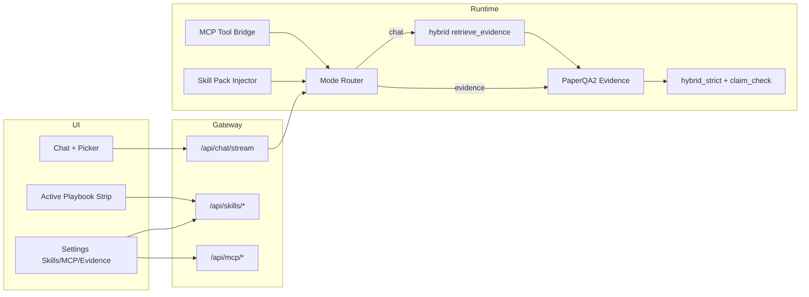

# FormuMind × OpenScience：Skills / MCP / Evidence Synthesis 升级方案

> 状态：**方案评审**（2026-09-26）  
> 依据：本地克隆 `synthetic-sciences/openscience`（`/tmp/openscience`）全面对照 + FormuMind 主干（含 #160 RAG/Wiki 统一）  
> 目标：评估「Claude Science / OpenScience 类能力」的必要性与可实现性，给出可落地的分阶段升级路径  
> 约束：**不**整体移植 OpenScience；**不**把配方闭环改造成通用科学 coding agent；优先补齐「文献综合反幻觉」与「技能/MCP 统一管理」

---

## 1. 一句话结论

| 维度 | 结论 |
|------|------|
| **产品定位** | FormuMind 应做「**配方 R&D 闭环 + 钢印级文献综合 Agent**」，不是第二个 OpenScience workbench |
| **OpenScience 可借** | Skills 包协议（`SKILL.md`）、Settings 统一目录、Composer「+ / Tools」选型 UX、MCP 进程隔离与权限模型 |
| **OpenScience 勿借** | 371 条泛科学技能库、Bun/TS 整栈、shell/kernel/compute harness、Ace 计费、Harbor 评测壳 |
| **PaperQA2 定位** | **高优先级**：作为中栏「Evidence Synthesis」模式的核心引擎，补 Claude Science 的引用追溯短板 |
| **技能坞→设置** | **必要但需拆型**：右栏 playbook ≠ Agent Skill；应拆成「配方行动包」与「对话技能」两层 |
| **中栏 + 按钮** | **高价值、可快速落地**：设置里「开启」≠ 本轮「选用」；对齐 OpenScience Composer Tools |
| **MCP** | **中长期必要、短期克制**：先 Settings 管理 + 只读/白名单工具，再谈执行类 MCP |

**推荐策略：模式借鉴 + 能力增量，拒绝 Frankenstein 整仓嵌入。**

---

## 2. OpenScience 代码画像（分析摘要）

### 2.1 系统形状

```
Browser workspace (SolidJS)
    → Local Bun/TS server (Hono + SSE)
        → Research agent session loop
        → Tools: shell / edit / LSP / MCP / science connectors
        → Skills: bundled + user/git/project packs (SKILL.md)
        → Compute jobs (local / SSH / Modal…)
```

要点见其 `ARCHITECTURE.md`：

- **Skills** = 按需加载的 **instruction bundles**（`backend/cli/src/skill`），默认库 `backend/cli/skills`（约 **371** 个 `SKILL.md`），支持 user / git / project 安装与安全审查。
- **MCP** = **进程隔离**的工具协议；Settings → **Connectors** 管理启停、OAuth、探测状态（`frontend/workspace/src/components/settings/Connectors.tsx`）。
- **Skills UI** = Settings → Skills（`atlas/SkillsPage.tsx`）：目录、开关、pin、从 Git 安装、分类货架。
- **Composer** = 输入区 Tools 菜单 + slash：附件、技能、MCP、命令一体选型（`prompt-input.tsx` / `composer-tools.tsx`）。
- **哲学**（`docs/notes/scientific-harness-design.md`）：**薄 runtime + 扩展**；领域方法进 on-demand skills，避免每轮强制 planner/critic。

### 2.2 OpenScience「技能」到底是什么

典型 `SKILL.md` frontmatter：

```yaml
name: review
description: Independently review …
category: research
```

正文是 **工作流说明书**（可引用 references），由 agent 的 skill tool **按名加载进上下文**，并声明 `allowed_tools`。  
**不是** FormuMind 右栏那种「点一下打开 DOE Modal」的行动预设。

### 2.3 OpenScience 与 PaperQA2 的关系

OpenScience **不是** PaperQA2。它靠 connectors（PubMed/arXiv/…）+ skills（如 `research/review`、`paper-lookup`）+ 可见 trace 做文献工作。  
**引用钢印 / Evidence Synthesis** 更贴近 **PaperQA2 专长**，也更贴近 FormuMind 已有 RAG/STORM/claim-check 资产。

---

## 3. FormuMind 现状差距图

| 能力 | FormuMind 现状 | OpenScience / PaperQA2 对标 | 缺口 |
|------|----------------|-----------------------------|------|
| 配方闭环 | DOE / 寻优 / 台账 / 推荐 — 核心壁垒 | OS 无对等 | **保持** |
| 「技能」 | `ActionSkillsDock` + 静态 `formulation_skills.py`（playbook） | OS：`SKILL.md` runtime | **同名异物**；不宜直接「移到设置」而不拆型 |
| 文献问答 | hybrid RAG + 流式 chat + CitationChip + claim-check（#160） | PaperQA2：多跳检索 + 强制 citation | PaperQA **仅 sync 路径 best-effort**，且强依赖 OpenAI embedding/LLM；**stream 路径跳过** |
| Wiki / STORM | 加厚 grounding、footnote、numeric fidelity | OS 无同等配方 Wiki | **已有优势，继续加深** |
| MCP | 历史计划明确不做（`2026-09-15-action-skills-dock.md`） | OS Connectors 成熟 | **从零设计**，安全面大 |
| 对话选型 UX | 📷 结构式 + textarea；技能在右栏 | Composer Tools / + | **中栏缺统一入口** |
| 自定义技能 | 无 | Git install + 本地 pack | **无** |
| Agent 运行时 | FastAPI + Celery + 确定性 fallback | Bun session/tool loop | **不必对齐栈** |

关键代码锚点：

- 技能坞：`frontend/src/components/ActionSkillsDock.tsx`、`backend/app/resources/formulation_skills.py`
- PaperQA：`backend/app/services/llm.py`（`_paperqa_available` / `_run_paperqa`；事件循环内返回 `None`）
- 流式问答：`backend/app/api/chat.py` `chat_stream`（与 sync `answer_question` 分支不一致）
- 中栏输入：`frontend/src/components/ResearchPanel.tsx`（结构式按钮 + textarea）

---

## 4. 对你建议的逐项评估

### 4.1 右栏技能坞 → 设置「Skills + MCP」统一管理

| | |
|--|--|
| **必要性** | **中高**。随着「对话技能 / MCP / 自定义包」出现，右栏坞会过载；设置页适合做 **目录、启停、安装、密钥、健康检查**。 |
| **风险** | 若简单搬家，会丢掉「活跃技能 checklist / 工具白名单」对 Actions 忙碌态的价值。 |
| **建议** | **拆两层**：设置管「库存与权限」；右栏改为薄的 **Active Playbook Strip**（或并入 PathWizard），只显示**当前配方行动包**进度。 |

### 4.2 自定义技能

| | |
|--|--|
| **必要性** | **高**（实验室差异化：环氧体系 SOP、客户规格审查、Method 写作模板）。 |
| **可实现性** | **高（MVP）**：先做「Markdown 技能包 → 注入 system/tool 白名单」，不做 OS 级 Git 市场与安全分类器。 |
| **建议** | 协议兼容 `SKILL.md` frontmatter（便于以后互操作），运行时仍走 FormuMind Python agent，不引入 Bun。 |

### 4.3 PaperQA2 定位：超强文献合成 / 反幻觉

| | |
|--|--|
| **必要性** | **最高**。与 FormuMind「RAG 接地 + 可追溯引用」叙事一致；直接对标 Claude Science 用户痛点。 |
| **可实现性** | **中高**。依赖已在 `dependencies.py`；缺口是：**配置解耦（勿绑死 OpenAI）**、**stream 路径接通**、**引用跳转 UX 硬化**、与 hybrid/KB/STORM **共用证据对象**。 |
| **建议** | 中栏新增模式 **「Evidence / 文献综合」**（默认关闭或按 Wiki-chat-mode 类设置切换），输出强制 `[^n]` + 可点击脚注；STORM Method/Background 章节优先走此模式。 |

### 4.4 中栏「+」：上传 / Skills / MCP 本轮选用

| | |
|--|--|
| **必要性** | **高**。设置「开启」与「本轮调用」必须分离（OpenScience 已验证的信息架构）。 |
| **可实现性** | **高**。`ResearchPanel` 输入条已有 📷；扩展为 `+` 弹出层即可，后端在 `ChatRequest` 增加 `enabled_skill_ids` / `mcp_server_ids` / `attachments`。 |
| **建议** | 第一期：文件 + 配方 playbook + 对话技能；MCP 仅列出 **已连接且允许的服务器**，未启用不可选。 |

---

## 5. 目标信息架构（推荐）

```
设置 Settings
├── Skills
│   ├── 配方行动包（Formulation Playbooks）  ← 现有 silane/DOE/… 
│   ├── 对话技能（Chat Skills / SKILL.md） ← 新增
│   └── 启用 / Pin / 导入导出 /（后期 Git）
├── MCP / Connectors
│   ├── 服务器列表（stdio / SSE / HTTP）
│   ├── 启停 · 健康探测 · 密钥 vault
│   └── 工具白名单（默认只读）
└── Evidence Synthesis
    ├── 引擎：PaperQA2 / 内置 hybrid+claim（fallback）
    ├── 模型与 embedding 路由（DeepSeek / OpenAI / 本地）
    └── 强制引用 · claim-check 默认开

中栏 Chat Composer
└── [+] 菜单（本轮选用）
    ├── 上传文件 / 图片（结构式保留为快捷）
    ├── Skills（仅设置中已启用）
    ├── MCP（仅已连接）
    └── 模式：普通问答 | 文献综合(Evidence) | Wiki 写作

右栏 Actions
└── Active Playbook（可选精简条）— 仅配方闭环进度，不再充当「技能市场」
```

### 5.1 三种「技能」命名（必须写进产品文案）

| 名称 | 含义 | 触发 | 示例 |
|------|------|------|------|
| **Playbook 行动包** | 打开现有 Modal / Celery 流程 | Actions / + | CCD DOE、贝叶斯寻优 |
| **Chat Skill** | 注入提示词 + 工具白名单 | 中栏 + / slash | Method 写作、硅烷选型审查 |
| **MCP Tool** | 外部进程工具 | 中栏 +（经权限） | Zotero、本地文件系统、实验室 LIMS |

混用「技能」一词而不拆型，是当前最大产品风险。

---

## 6. 分阶段落地（专业路径）

### Phase 0 — 决策锁定（0.5–1 天，文档/旗标）

1. 锁定产品句：**配方闭环为本，Evidence Synthesis 为学术锋刃，Skills/MCP 为可插拔扩展。**
2. 明确不做：OS 整仓、shell agent、371 技能同步、ChemMCP GPU 全家桶。
3. 新增 env 旗标草案（默认关）：
   - `CHAT_COMPOSER_PLUS_ENABLED`
   - `CHAT_SKILLS_RUNTIME_ENABLED`
   - `EVIDENCE_SYNTHESIS_MODE`（`off|paperqa|hybrid_strict`）
   - `MCP_CLIENT_ENABLED`

### Phase 1 — UX 骨架：设置 Skills + 中栏「+」（1–1.5 周）**【先做】**

**后端**

- `GET/PATCH /api/settings/skills`：启用列表、pin、分类（playbook | chat_skill）。
- `ChatRequest` 扩展：`selected_skills: string[]`、`mode: chat|evidence`。
- 将现有 `formulation_skills` 标为 `kind=playbook`，行为不变。

**前端**

- 设置页新增 **Skills** Tab（从坞迁移目录管理；坞降级为 Active Strip 或保留只读进度）。
- `ResearchPanel` 输入条：`📷` 旁增加 **`+`** → 弹出 Attach / Skills / Mode。
- 本轮选中的 skills 以 chip 显示在输入框上方，可一键清除。

**验收**

- 设置关闭某技能 → `+` 菜单不可见。
- 选用 playbook → 仍打开对应 Modal（行为回归）。
- 选用 chat skill（即便先是 stub）→ 请求体带上 id。

### Phase 2 — PaperQA2 Evidence Synthesis（1.5–2.5 周）**【价值峰值】**

**引擎**

1. 抽出 `services/evidence_synthesis.py`：
   - 输入：question + Evidence[]（会话勾选 + KB hybrid 补全，复用 #160 `retrieve_evidence`）。
   - 优先 PaperQA2；失败 → **hybrid_strict**（现有 CE + claim-check + 强制脚注模板）。
2. **打通 stream**：用 async PaperQA 或「PaperQA 检索规划同步 + 答案 token 流式」两段式，避免 `_run_paperqa` 在 running loop 直接 `None`。
3. **解耦 OpenAI**：配置 `paperqa_llm` / `paperqa_embedding` 走现有 multi-provider；无 key 时自动 hybrid_strict，不空跑重试。
4. 输出契约：`answer_markdown` + `citations[]`（含 doc_id/page/chunk）+ `claims[]`；前端 `CitationRenderer` 已具备，补 **页码/段落跳转**。

**产品**

- 中栏 Mode = Evidence 时：默认开 claim-check；占位文案强调「每条结论可追溯」。
- STORM / Wiki「Background / Method」生成入口可选 Evidence 引擎（与 #160 polish 衔接）。

**验收**

- DeepSeek-only 环境：Evidence 模式不报 Missing credentials，走 hybrid_strict。
- 有 PaperQA 依赖 + 配置：同步与流式均可引用跳转。
- 金标集：Method 段落 hallucination rate / citation precision（可先手工 20 题）。

### Phase 3 — Chat Skills Runtime（自定义技能）（1–2 周）

**协议（最小）**

```
skills/
  method-writer/
    SKILL.md          # frontmatter + 正文
    references/…      # 可选
```

Frontmatter 字段对齐 OS 子集：`name`, `description`, `summary`, `category`, `allowed_tools`, `entry`。

**运行时**

- 加载：将 SKILL 正文注入 system 附加段；`allowed_tools` 映射到 FormuMind 已有工具（`kb_hybrid`, `literature_search`, `evidence_synthesis`, `wiki_draft`…）—— **白名单外拒绝**。
- 存储：项目级 `data/skills/` + 用户级；设置页「导入 .zip / 粘贴 Markdown」。
- **暂不做**：任意 shell、远程市场、OS 安全 regex 全套（可后续抄 `install/review.ts` 思路）。

**验收**

- 用户导入「环氧 Method 写作」技能 → Evidence 模式下产出带引用的 Method 草稿。
- 恶意技能声明 `allowed_tools: ["shell"]` → 被拒并审计日志。

### Phase 4 — MCP Client（2–4 周，可与 Phase 3 部分并行）**【克制开启】**

**范围 MVP**

- 设置 → MCP：添加 stdio / SSE 服务器；启停；`tools/list` 探测；密钥进现有 settings vault。
- 运行时：仅把 **user后工具 schema** 暴露给 Evidence/Chat agent；默认 **deny 写操作**（按工具名启发式 + 用户确认）。
- 中栏 `+`：仅显示 `connected && enabled` 的 server/tools。

**明确不做（本阶段）**

- 把配方库整体以 MCP server 对外暴露（曾评估为非主路径）。
- OAuth 浏览器流全套（可第二迭代抄 OS `mcp/oauth-provider.ts`）。
- 让模型随便起本地进程无审批。

**验收**

- 接一个只读 MCP（如本地文件或 Zotero）→ Evidence 回答可引用其返回片段。
- 断开 MCP → 对话不崩溃，工具从 `+` 消失。

### Phase 5 — 深化（按需）

- 技能 Git 安装 + 签名/审查。
- MCP 写工具 Human-in-the-loop。
- 与 Harbor/OS 评测对齐的 **FormuMind Evidence bench**（配方/涂料 50 题）。
- 可选：薄封装「调用外部 OpenScience CLI」作为高级用户出口——**永不反向嵌入**。

---

## 7. 架构草图（目标态）



---

## 8. 必要性总评（是否值得做）

| 提案 | 必要性 | 紧迫性 | 与主业契合 |
|------|--------|--------|------------|
| Evidence / PaperQA2 硬化 | ★★★★★ | 高 | 直接服务 Method/综述/反幻觉 |
| 中栏 + 选型 | ★★★★☆ | 高 | 降低右栏认知负担 |
| 设置统一 Skills | ★★★★☆ | 中高 | 扩展前提 |
| 自定义 Chat Skills | ★★★★☆ | 中 | 实验室 SOP 差异化 |
| MCP | ★★★☆☆ | 中低→中 | 生态连接；安全成本高 |
| 整仓对齐 OpenScience | ★☆☆☆☆ | 无 | **产品稀释 / 维护爆炸** |

**结论：值得升级，但应按 Phase 1→2→3→4 削峰；Phase 2 是 ROI 最高的学术能力跃迁。**

---

## 9. 可实现性与工程风险

| 风险 | 等级 | 缓解 |
|------|------|------|
| 名词混淆（playbook vs skill） | 高 | 文案/API 强制 `kind` 字段 |
| PaperQA 与 stream/事件循环 | 高 | 独立 async 服务模块；双路径测 |
| DeepSeek-only 无 OpenAI embedding | 高 | 可配置路由 + hybrid_strict fallback（已有部分逻辑） |
| MCP 供应链 / 密钥泄露 | 高 | 默认关；只读；审批；审计 |
| 设置与右栏双入口漂移 | 中 | 单一 store：`enabledSkills` / `activePlaybookId` |
| 范围膨胀成 OS | 高 | Phase 闸门 + 「不做清单」写入 USER_GUIDE |
| 与 #160 RAG 分叉第二套检索 | 中 | Evidence **必须**调用 `retrieve_evidence` / hybrid，禁止新 Chroma/LangChain 栈 |

工作量粗估（1 名熟悉本仓的全栈）：

- Phase 1：~1–1.5 人周  
- Phase 2：~2 人周  
- Phase 3：~1.5 人周  
- Phase 4 MVP：~2–3 人周  

---

## 10. 与历史决策的关系

| 历史文档 | 原决策 | 本方案态度 |
|----------|--------|------------|
| `2026-09-15-action-skills-dock.md` | 不做 MCP / 子代理 | **修订**：MCP 进入 Phase 4，默认关；子代理仍不做 |
| `2026-09-14/20` Wiki 计划 | MCP 非核心 | **维持**：MCP 是连接器，不是配方主路径 |
| #160 RAG/Wiki unify | 统一 hybrid，禁第二 RAG 栈 | **强制遵守**：PaperQA 只做综合层，检索仍走 hybrid |

---

## 11. 建议的立即下一步（实施时）

1. 产品确认三种技能命名与设置 IA（本稿 §5）。  
2. 开 Phase 1 分支：Settings Skills + Chat `+`（无 MCP）。  
3. 并行 spike（1–2 天）：PaperQA2 在 DeepSeek + 本地 embedding 下的最小 `aquery`，输出接入现有 `CitationRenderer`。  
4. Spike 通过后再排 Phase 2 正式开发。

---

## 12. 验收愿景（升级完成后用户可感知）

1. 在设置中启用「Method 文献综合」技能与（可选）Zotero MCP。  
2. 中栏点 `+` → 选文件 + 该技能 + Evidence 模式。  
3. 提问「总结环氧–硅烷界面处理的常用工艺参数」→ 回答每句带可点击文献脚注，claim-check 显示「有据」。  
4. 一键转入 Wiki Method 章节，数值与 #160 numeric fidelity 规则一致。  
5. 右栏仍能一键跑 CCD DOE——配方闭环未受损。

---

## 附录 A — OpenScience 关键路径索引

| 主题 | 路径 |
|------|------|
| 总架构 | `/tmp/openscience/ARCHITECTURE.md` |
| Harness 哲学 | `/tmp/openscience/docs/notes/scientific-harness-design.md` |
| Skill 运行时 | `/tmp/openscience/backend/cli/src/skill/skill.ts` |
| 技能库 | `/tmp/openscience/backend/cli/skills/**/SKILL.md` |
| Skills 设置页 | `/tmp/openscience/frontend/workspace/src/atlas/SkillsPage.tsx` |
| MCP Connectors | `/tmp/openscience/frontend/workspace/src/components/settings/Connectors.tsx` |
| Composer Tools | `/tmp/openscience/frontend/workspace/src/components/prompt-input.tsx` |

## 附录 B — FormuMind 关键路径索引

| 主题 | 路径 |
|------|------|
| 技能坞 | `frontend/src/components/ActionSkillsDock.tsx` |
| 静态行动包 | `backend/app/resources/formulation_skills.py` |
| PaperQA 分支 | `backend/app/services/llm.py` |
| 流式问答 | `backend/app/api/chat.py` |
| 中栏输入 | `frontend/src/components/ResearchPanel.tsx` |
| 原技能坞计划 | `docs/plans/2026-09-15-action-skills-dock.md` |
