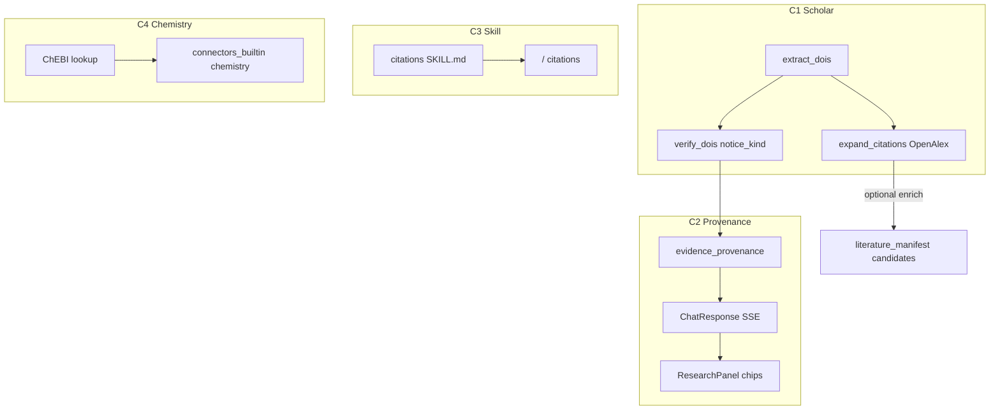

# Wave C：引用图扩展 · Provenance · Citations 技能 · ChEBI

> 状态：**已实施**（2026-09-27）  
> 依据：Wave A/B 已合入后的 OpenScience Top-5 评估；代选最优推荐开工。

## 已锁定产品决策

- **本波四项**：C1 引用图扩展 + 撤稿方向性 → C2 结构化 Provenance → C3 Citations Chat Skill → C4 ChEBI connector
- Chat 仍 fail-open；钢印出口仍走 Wave A preflight
- **明确不做**：完整 Literature Library / PDF runner、完整 ACP Reviewer、RO-Crate（可 Wave D）、Marketplace / Notebook / HPC

## 架构



## C1 — expand_citations + retraction directionality

**模块** [`backend/app/services/scholar_helpers.py`](backend/app/services/scholar_helpers.py)

- `verify_dois` 增加 `notice_kind`: `none | notice | retracted_work | corrected | unknown`
  - Crossref `update-to` / `updated-by` 解析 type 启发式
  - 保留 `retracted: bool` 兼容（`notice_kind in {retracted_work, corrected, notice}` 时 true 若含撤稿语义）
- 新 `expand_citations(doi, n_backward=12, n_forward=8)` → OpenAlex works
- 新 `expand_top_dois(dois, …)` 批量（最多 3 个 seed DOI）
- 旗标：`citation_expand_enabled`（默认 true）；`evidence_doi_verify_enabled` 沿用

**接线**

- Evidence 路径：`postprocess_evidence_answer` / chat 可选把 expand 结果写入 `ChatResponse.citation_expand`
- 可选：expand hits → `literature_manifest` capture 候选（fail-open，不挡 chat）

## C2 — 结构化 Provenance

**字段**（ChatResponse + SSE done）

```json
"evidence_provenance": {
  "doi_status": [{"doi", "status", "notice_kind", "title"}],
  "evidence_availability": "supported|partial|unavailable|unknown",
  "notes": ["…"]
}
```

- 由 `doi_results` + `sourced_claims` 汇总：`unsupported` 多 → partial/unavailable
- FE：`ResearchPanel` 小条显示 availability + 撤稿/未解析计数
- 旗标：`evidence_provenance_enabled`（默认 true）

## C3 — Citations Chat Skill

- 新 [`backend/app/resources/chat_skills/citations/SKILL.md`](backend/app/resources/chat_skills/citations/SKILL.md)
  - 移植 SynSci resolve-before-cite 纪律（涂料/配方语境）
- 走现有 skills 发现 / slash / Composer
- 无新旗标（`chat_skills_runtime_enabled`）

## C4 — ChEBI connector depth

- [`connectors_builtin.py`](backend/app/services/connectors_builtin.py)：chemistry 查找 = PubChem **+** ChEBI（OLS/EBI API 或本地启发式 HTTP）
- catalog `sources` 增加 ChEBI；`use_when` 更新
- 新 [`backend/app/services/chemistry_chebi.py`](backend/app/services/chemistry_chebi.py) fail-open
- 旗标：沿用 `connectors_builtin_enabled`

## 测试 / 文档

- `tests/test_scholar_helpers_wave_c.py`：notice_kind、expand mock
- `tests/test_evidence_provenance.py`：availability 汇总
- `tests/test_chemistry_chebi.py`：lookup mock
- FE smoke：provenance strip（可选 vitest）
- USER_GUIDE 中/英 Wave C 小节；更新 `2026-09-27-post-162-openscience-top5.md`

## 明确不做（本波）

RO-Crate、PDF page anchors、smart-collections LLM、Evidence 50 题 bench、完整 ACP
