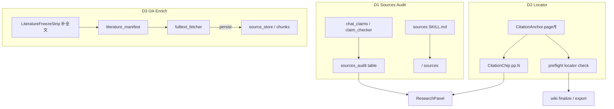
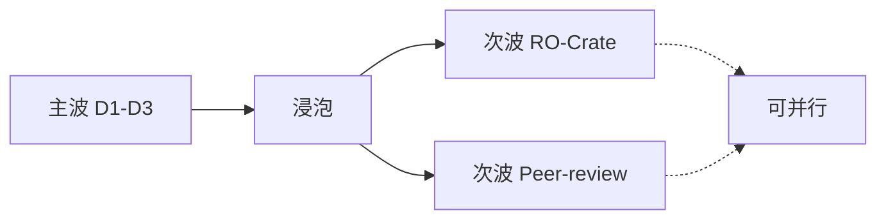

# Wave D：Sources 审计 · Locator 诚实度 · 冻结 OA 补全

> 状态：**主波实施中**（2026-09-27）— D1–D3 编码落地  
> 依据：[`2026-09-27-post-wave-c-openscience-top5.md`](./2026-09-27-post-wave-c-openscience-top5.md)  
> 用户锁定：**主波 D1→D2→D3**；**次波 D4∥D5**（可并行，本文件附施工纲要）

## 已锁定产品决策

| 层级 | 项 | 说明 |
|------|----|------|
| **主波** | D1 Sources 审计 | skill + claim→passage 表（升级现有 claim-check） |
| **主波** | D2 Locator 诚实度 | 页码/段落透传 + Preflight（非整 pdf-structure 引擎） |
| **主波** | D3 冻结 OA 补全 | Manifest/Freeze 批量挂 `fulltext_fetcher` |
| **次波** | D4 轻量 RO-Crate | metadata+checksum 可携包（默认关） |
| **次波** | D5 Peer-review skill | STORM/卷宗审稿纪律（不自动改稿） |

**不变边界**

- Chat **fail-open**；导出钢印仍走 Wave A `publication_preflight`
- **不做**：Marketplace / Notebook / HPC / 完整 ACP / 完整 Literature Library / 全量 pdf-structure / `.science` 主路径 / 付费 PDF 绕过

## 架构（主波）



---

## D1 — Sources 审计技能 + claim→passage 表

### 现状缺口

- 已有：`build_sourced_claims` → `SourcedClaim{text, chunk_ids, status∈supported|weak|unsupported}`
- `claim_checker.ClaimVerdict` 已含 `conflicting`，但 **未映射到** Chat 对外状态
- 缺：SynSci `sources` 纪律（原子化论断、对照原文措辞、**contradicted**、以审计表为交付物）
- 缺：UI 折叠「Sources 审计表」；与 Wave C `evidence_provenance`（DOI 层）互补而非替代

### 目标契约

**ChatResponse / SSE done**（旗标 `sources_audit_enabled`，默认 **true**）：

```json
"sources_audit": {
  "schema_version": 1,
  "rows": [
    {
      "claim": "…",
      "grade": "supported|partial|unsupported|contradicted",
      "chunk_ids": ["…"],
      "locators": [{"chunk_id": "…", "page": 3, "paragraph": 2}],
      "note": "optional short reason"
    }
  ],
  "summary": {"supported": 0, "partial": 0, "unsupported": 0, "contradicted": 0}
}
```

**映射**（确定性，在 `chat_claims.py`）：

| ClaimVerdict / 现状 status | sources_audit.grade |
|----------------------------|---------------------|
| supported | supported |
| insufficient / weak | partial |
| unsupported | unsupported |
| conflicting | contradicted |

`locators`：由 `chunk_ids` 反查 chunk/`Evidence.page|paragraph`（缺则 null，不编造）。

### 技能

新 [`backend/app/resources/chat_skills/sources/SKILL.md`](backend/app/resources/chat_skills/sources/SKILL.md)

- 改编 SynSci `core/sources`（涂料/配方语境）
- `activation_policy: user-controlled`；`/` 可发现
- 非谈判点：原子化论断、先定位再读、数字精确匹配、错归属=contradicted、**报告不自动改写**
- 与 `citations` 分工：citations=元数据解析；sources=主张↔原文对照

### 接线文件

| 文件 | 变更 |
|------|------|
| `backend/app/services/chat_claims.py` | `build_sources_audit(...)`；映射 contradicted；附 locators |
| `backend/app/domain/chat_schemas.py` | `sources_audit` 字段；可选扩展 `ClaimStatus` 或保持 audit 独立枚举 |
| `backend/app/api/chat.py` | sync/stream finalize 填 `sources_audit`（fail-open） |
| `backend/app/config.py` + `env_flags.py` | `sources_audit_enabled: bool = True` |
| `frontend/src/api/types.ts` + `searchSlice.ts` | 透传 |
| `frontend/src/components/ResearchPanel.tsx` | 折叠「Sources 审计」表（grade 色点） |
| `backend/app/resources/chat_skills/sources/SKILL.md` | 新建 |

### 切片

1. **D1a** skill only + 发现  
2. **D1b** `sources_audit` 结构化 + FE 表  
3. **D1c**（可选）Evidence 模式默认提示注入 sources 纪律（仍 fail-open）

### 测试

- `tests/test_sources_audit.py`：verdict→grade；空 claims；locators 填充/缺失  
- skill 出现在 `list_chat_skills()`  
- FE：有 audit 时渲染行数（可选 vitest）

### 明确不做（D1）

自动改写正文、完整 ACP Reviewer、挡 chat

---

## D2 — 引用 Locator 诚实度（页码 / 段落）

### 现状缺口

- 已有：`CitationAnchor`、`Evidence.page|paragraph`、ingest `page_no`
- CitationChip **只显示 title**，不显示 `pp. N`
- Preflight 对「裸数值」要求邻近 `[^n]` / doi，**不检查**脚注目标是否有 page
- 检索命中 `Evidence` 常丢 page（未从 chunk 回填）

### 目标行为

1. **透传**：chat citations / sourced_claims / sources_audit.locators 尽量带 `page`/`paragraph`  
2. **UI**：`CitationChip` 显示 `pp. N`；无页码显示灰色 `页码未知`（诚实，不省略）  
3. **Preflight**（旗标 `citation_locator_preflight`）：  
   - 默认模式 **`warning`**（major，不挡 finalize）  
   - 可选 **`blocking`**（浸泡后开）  
   - 规则：含裸数值的行，其最近 `[^n]` 对应锚点 **无 page 且无 paragraph** → finding `locator_missing`  
   - 无任何 `[^n]` 的裸数值仍走现有 numeric 规则

### 接线文件

| 文件 | 变更 |
|------|------|
| 检索/chat 组装 Evidence 处（`chat.py` / hybrid retrieve） | 从 chunk 回填 `page`/`paragraph` |
| `frontend/.../ResearchPanel.tsx` `CitationChip` | `pp. N` / `页码未知` |
| `backend/app/services/publication_preflight.py` | `locator_missing` check + 严重度由旗标 |
| `config.py` / `env_flags.py` | `citation_locator_preflight: Literal["off","warning","blocking"] = "warning"` |

### 切片

1. **D2a** Evidence 回填 + CitationChip  
2. **D2b** Preflight locator 规则（默认 warning）

### 测试

- `tests/test_citation_locator_preflight.py`：有页码通过；无页码→major/blocking  
- unit：Evidence 回填 page  
- FE：chip 文案（可选）

### 明确不做（D2）

完整 figure/table layout、bbox 高亮、临床排版解析

---

## D3 — 冻结语料 OA 批量补全

### 现状缺口

- 已有：`fulltext_fetcher.enrich_search_results` / Unpaywall / EuropePMC；KB 一键全文入库  
- `literature_manifest` Capture/Freeze **无**批量 OA enrich  
- `LiteratureFreezeStrip` 仅 Capture / Freeze / 筛选

### 目标 API

`POST /api/wiki/literature/enrich-oa`

```json
{
  "project_id": "…",
  "scope": "candidates|frozen|missing_fulltext",
  "limit": 20,
  "actor": "user"
}
```

**响应**（fail-open）：

```json
{
  "attempted": 12,
  "fetched": 7,
  "persisted": 6,
  "skipped": 3,
  "failures": [{"item_id": "…", "doi": "…", "reason": "no_oa|paywall|timeout|…"}],
  "manifest": {…}
}
```

### 行为

1. 从 manifest items 选缺全文且有 DOI（或已有 `oa_pdf_url`）的条目  
2. 构造 `Evidence` → 复用 `fulltext_fetcher` 拉取并 `_persist_fulltext`  
3. 回写 item 字段：`has_fulltext`、`source_id`、`enrich_status`、`enriched_at`  
4. **不自动 Freeze**；若当前 frozen，enrich 成功后可选提示「语料已变，建议 re-freeze」（与 Capture 使 unfrozen 策略对齐：成功 persist **使 digest stale / unfreeze**，与 recapture 一致，避免钢印指过期字节）

### 接线文件

| 文件 | 变更 |
|------|------|
| `backend/app/services/literature_oa_enrich.py` | **新建**编排 |
| `backend/app/services/literature_manifest.py` | item 字段 + enrich 后事件 |
| `backend/app/api/wiki.py` | `enrich-oa` endpoint |
| `frontend/.../LiteratureFreezeStrip.tsx` | 「补全文」按钮 + 结果计数 |
| `frontend/src/api` | client 方法 |
| `config.py` / `env_flags.py` | `literature_oa_enrich_enabled: bool = True`；复用 `fulltext_enrich` 超时/邮箱配置 |

### 切片

1. **D3a** API + 服务 + 单测（mock fetcher）  
2. **D3b** FreezeStrip UI + 失败原因展示

### 测试

- `tests/test_literature_oa_enrich.py`：mock Unpaywall/persist；limit；flag off → 403/空操作  
- FreezeStrip 按钮调用（可选）

### 明确不做（D3）

付费出版社绕过、完整 Literature Library、自动批量数千篇无上限

---

## 主波实施顺序与旗标

| 序 | ID | 旗标 | 默认 |
|----|-----|------|------|
| 1 | D1 | `sources_audit_enabled` | true |
| 2 | D2 | `citation_locator_preflight` | `warning` |
| 3 | D3 | `literature_oa_enrich_enabled` | true |

**建议 git 提交切片**

1. `docs: Wave D plan`  
2. `feat(skills): sources audit Chat Skill`  
3. `feat(chat): sources_audit table on ChatResponse`  
4. `feat(frontend): sources audit strip + CitationChip locators`  
5. `feat(preflight): citation locator honesty`  
6. `feat(literature): OA enrich into manifest`  
7. `docs: USER_GUIDE Wave D`

**验收清单（主波）**

- [ ] Evidence 回答含 `sources_audit`，contradicted 来自 conflicting  
- [ ] `/` 可见 `sources` skill  
- [ ] CitationChip 显示页码或「页码未知」  
- [ ] Preflight warning 模式对无 locator 数值引用出 major  
- [ ] FreezeStrip「补全文」能提高 `has_fulltext` 计数  
- [ ] 关旗标后行为回退、chat 不炸  
- [ ] 中英 USER_GUIDE Wave D 小节

---

## 次波纲要（D4 ∥ D5，可并行）

> 主波合入并浸泡后再开工；此处只锁施工纲要，不阻塞 D1–D3。

### D4 — 轻量 RO-Crate / 钢印可携包

| | |
|--|--|
| **源** | AIPOCH `ro-crate-export.ts` lightweight profile |
| **旗标** | `ro_crate_export_enabled` 默认 **false** |
| **产物** | zip：`ro-crate-metadata.json` + `literature-manifest.json` + `preflight.json` + `evidence_provenance`/`sources_audit` 快照 + 可选 PDF 路径/checksum（complete 后置） |
| **API** | `POST /api/wiki/export/ro-crate`（project_id + report kind） |
| **不做** | 全会话 replay、环境锁、`.science` |
| **切片** | D4a metadata-only → D4b 附已落地全文字节 |

### D5 — Peer-review Chat Skill（卷宗/STORM）

| | |
|--|--|
| **源** | SynSci `core/peer-review` |
| **旗标** | 无新旗标；skill `user-controlled` |
| **产物** | `resources/chat_skills/peer-review/SKILL.md`；BLOCKING vs OBSERVATION；校准推荐 |
| **可选 UI** | Hub 报告页「审稿一遍」→ 注入 skill + 当前草稿（**不自动改稿**） |
| **不做** | ACP Reviewer 子进程、ScholarEval 打分平台、自动 finalize |



---

## 文档与分支

- 评估原文：更新为 **已锁定**（见同日 Top-5 文件）  
- 实施分支建议：`cursor/wave-d-sources-locator-oa`（自 `main` / Wave C 合入后）  
- 次波可另开：`cursor/wave-d2-rocrate-peerreview`

## 开工触发

回复 **「开工」** 或 **「按方案实施主波 D1–D3」** 后按本文件切片提交；次波等主波合入后再开。
