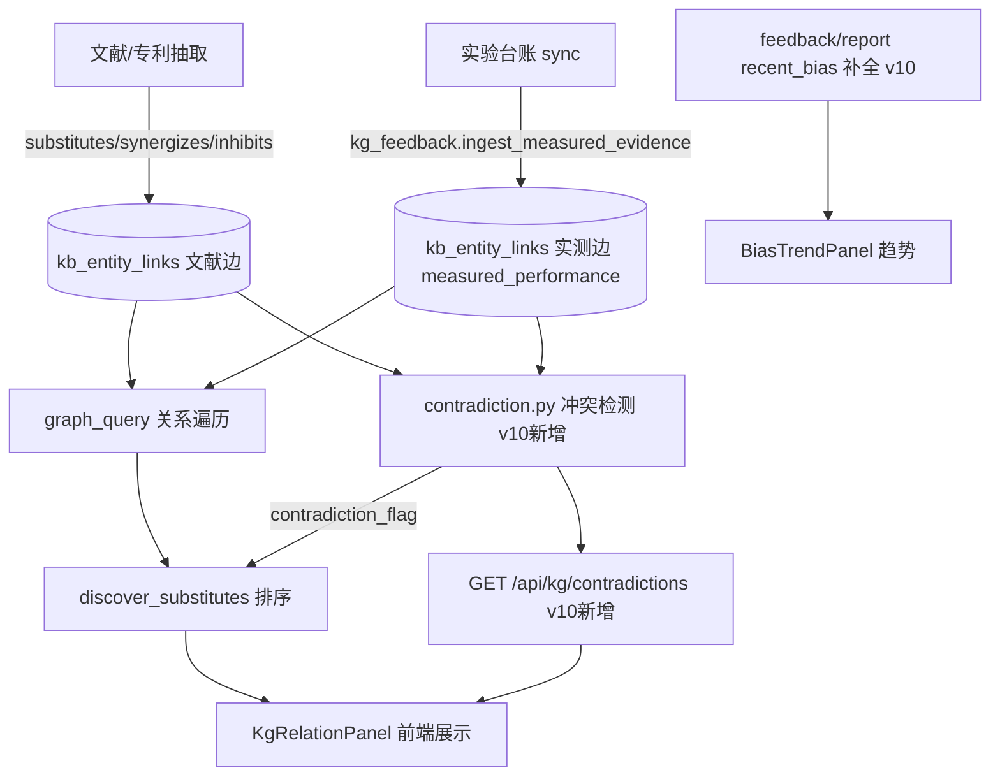

# FormuMind v10 — 知识图谱矛盾检测与实测闭环增强

> 基线：main @ 91cdbe7（v8 后端收敛 + v9 前端交叉审计已闭环），2026-08-29
> 调研事实（非假设）：
> - KG 已是闭环自进化系统：`services/kg/`（抽取→解析→链接→关系→图遍历→检索融合→替代发现）+ `services/kg_feedback.py`（实测回流 `measured_performance` 边）+ 校准（penalty/bonus）。
> - 前端已深度接入 KG：`KgRelationPanel.tsx` 调用 `kg/resolve`、`kg/relations`、`kg/discover/substitutes`、`kg/feedback/*`。v9 审计对 KG「死路由」判断准确（`kg/retrieve` 走内部检索、`kg/relations` 前端有用故未列入死路由）。
> - 关系类型 6 种：`substitutes / synergizes / inhibits / correlates_pos / correlates_neg / requires`（domain/kg_schemas.py:14）。
> - **实测回流已写入**：`ingest_measured_evidence` 把 campaign 同步行的实测指标写成 `measured_performance` 边，覆盖 `confidence` 并置 `extraction_method="measured"`、`is_valid=True`。
> - **两处未完成价值点**：① `feedback/report` 的 `recent_bias` 返回空列表（bias 趋势抽取消极，api/kg.py:90）；② 全代码库 **0 处文献↔实测冲突检测**（`grep conflict|contradict` 无结果）——文献说 synergizes/substitutes，实测 measured_performance 却反向，从未被标记。

---

## 一、目标

把 KG 从「关系罗列 + 实测回流」升级为**带矛盾预警的研发决策支持**：当文献关系与团队实测结论冲突时，主动标记并影响替代推荐排序，让闭环真正"自纠错"而非只"自累加"。

---

## 二、增量设计（3 个聚焦、低侵入）

### 增量 1：文献↔实测冲突检测器（核心）
**新增** `services/kg/contradiction.py`：

- 输入：一个领域/材料实体 `src_id`
- 逻辑：
  - 取该实体所有 `substitutes` / `synergizes` / `inhibits` / `correlates_*` 的**文献边**（extraction_method ∈ {rule, llm}）
  - 取该实体所有 `measured_performance` 的**实测边**（extraction_method="measured"）
  - 对每个文献目标实体，若实测边存在且**方向冲突**（文献 synergizes 但实测该属性 performance 低 / 文献 inhibits 但实测高 / 文献 substitutes 但实测替代物性能更差），产出 `ContradictionMark`
  - 冲突强度 = |实测偏离| × 文献置信度，阈值可调（config `kg_contradiction_threshold`，默认 0.3）
- 输出：`KGContradictionResponse { entity_id, contradictions: list[ContradictionMark] }`，每条含：文献关系、实测证据、冲突类型（synergy_vs_poor / inhibit_vs_good / substitute_vs_poor）、置信度、建议动作（复核实验 / 降权文献边）
- **不修改**已有边，仅新增只读检测视图（不破坏现有闭环）

**路由**：`GET /api/kg/contradictions?entity_id=|q=`（默认 `include_in_schema=True`，因为这是 v10 的新价值入口，前端要接）

### 增量 2：feedback/report 的 recent_bias 补全
- 当前 `api/kg.py:90` 返回 `recent_bias: []`（stub）
- 改为从 `loop_history`（campaign 的闭环迭代记录）抽取最近 N 个 campaign 的 objective→measured 偏差趋势，输出 `{campaign_id, objective, measured_delta, trend}[]`
- 复用 `kg_feedback.feedback_stats()` 的 `by_campaign` 数据，避免重复查询
- 失败 best-effort（异常则返回空，不 500）

### 增量 3：替代推荐冲突感知排序
- `discover_substitutes`（graph_query.py:151）已有 `measured 优先`排序
- **增强**：对命中增量 1 冲突标记的候选，加 `contradiction_flag: bool` + `confidence_adjusted` 字段，前端 `KgRelationPanel` 可展示"⚠ 文献替代但实测偏弱"徽标
- 排序 key 增加 `contradiction_flag` 降权（冲突候选置于末尾，除非实测明确好）
- 向后兼容：无冲突时排序与现状完全一致

---

## 三、架构图（Mermaid）

---

## 四、文件变更清单

| 文件 | 动作 | 说明 |
|---|---|---|
| `backend/app/services/kg/contradiction.py` | 新增 | 文献↔实测冲突检测核心 |
| `backend/app/domain/kg_schemas.py` | 改 | 加 `KGContradictionResponse` / `ContradictionMark`（+ config 字段） |
| `backend/app/api/kg.py` | 改 | 加 `GET /api/kg/contradictions`；补全 `feedback/report` recent_bias |
| `backend/app/services/kg/graph_query.py` | 改 | `discover_substitutes` 接入 contradiction_flag 降权 |
| `backend/app/config.py` | 改 | 加 `kg_contradiction_threshold`（默认 0.3） |
| `backend/tests/test_kg_contradiction.py` | 新增 | 冲突检测单测（含正向/无冲突/阈值边界） |
| `backend/tests/test_kg_graph_query.py` | 改 | 扩展 discover_substitutes 冲突排序断言 |
| `frontend/src/api.ts` | 改 | 加 `kgContradictions` 调用 |
| `frontend/src/components/KgRelationPanel.tsx` | 改 | 展示矛盾徽标（⚠）+ 调用 contradictions |
| `docs/使用指南.md` / `USER_GUIDE.md` | 改 | 补 `/api/kg/contradictions` + recent_bias 说明 |

---

## 五、实施步骤时间表

1. **P1 数据层**：`config.py` 加阈值 + `kg_schemas.py` 加响应 schema（0.5d）
2. **P2 检测核心**：`contradiction.py`（文献边 vs 实测边方向冲突判定 + 强度计算）（1d）
3. **P3 路由**：`api/kg.py` 加 `contradictions` 端点 + 补 `recent_bias`（0.5d）
4. **P4 排序融合**：`discover_substitutes` 接 contradiction_flag（0.5d）
5. **P5 前端**：`api.ts` + `KgRelationPanel` 矛盾徽标（0.5d）
6. **P6 测试**：`test_kg_contradiction.py` + 扩展 graph_query 测试（1d）
7. **P7 文档 + 全量验证**：指南更新 + 跑全量测试（1601 基线）（0.5d）

合计约 4.5 人日。

---

## 六、风险矩阵

| 风险 | 概率 | 影响 | 缓解 |
|---|---|---|---|
| 冲突判定方向定义错（synergy 与 performance 负相关误判） | 中 | 高（误报毁信任） | P2 先定义明确的"方向冲突表"（`substitutes`→替代物实测应≥原物；`synergizes`→关联属性实测应升；`inhibits`→应降），单测覆盖每种 |
| 实测数据稀疏导致多数实体无冲突可检 | 高 | 低 | 冲突检测器对"无实测"实体返回空列表，UI 显示"暂无实测对照"，不报错 |
| 排序降权误伤有效候选 | 中 | 中 | 仅对"实测明确差"的候选降权；模糊区间保留原位；阈值 config 可调 |
| 新增端点被 v9 审计标为"前端 0 调用" | 低 | 低 | 本方案 P5 同步接前端，且 v9 脚本会把它列为"已接入" |
| 破坏现有 measured 优先闭环 | 低 | 中 | 增量 1/3 均只读或不改原边，仅新增视图字段 |

---

## 七、验收标准

- [ ] `GET /api/kg/contradictions?entity_id=X` 对"文献 synergizes 但实测该属性低"返回 `contradiction_flag=true` 的标记
- [ ] 无实测实体返回空列表（不 500）
- [ ] `feedback/report` 的 `recent_bias` 非空（当存在 loop_history 时）
- [ ] `discover_substitutes` 对冲突候选 `contradiction_flag=true` 且排序置后
- [ ] 全量测试通过（基线 1597 passed 无回归）
- [ ] 前端 KgRelationPanel 展示 ⚠ 矛盾徽标
- [ ] v9 脚本复跑：新增端点已接入、无新增死路由

---

## 八、决策点（待您确认）

1. **增量 3 排序降权**：冲突候选是"置后"还是"仅标记不降权"？（建议置后，但保留 config 开关 `kg_contradiction_demote`）
2. **recent_bias 数据源**：从 `loop_history` 抽（best-effort）还是要求 campaign 显式记录 objective→measured？（建议 best-effort，失败返回空）
3. **作用域**：v10 只做"矛盾检测+"三增量，还是顺带把 `kb/integrity` 接前端（v9 保留的 C 组）？建议 v10 专注矛盾检测，integrity 留 v11。

---

## 九、执行状态（2026-08-29，已确认实施）

决策点按建议执行：冲突候选置后 + config 开关 `kg_contradiction_demote`；recent_bias 从 loop_history best-effort；v10 专注矛盾检测（integrity 留 v11）。

- [x] P1 config.py 加 `kg_contradiction_threshold=0.3` / `kg_contradiction_demote=True`；kg_schemas.py 加 `KGContradictionMark` / `KGContradictionResponse` / `KGSubstituteCandidate.contradiction_flag`
- [x] P2 新增 `services/kg/contradiction.py`（domain-anchored 矛盾检测：实测为领域级性能，反驳所有正向文献关系）
- [x] P3 `api/kg.py` 加 `GET /api/kg/contradictions`（进 OpenAPI）；`feedback/report` 的 `recent_bias` 从 loop_history 抽取（best-effort，异常不 500）
- [x] P4 `discover_substitutes` 接 `contradiction_flag` 降权（修复了 `..config` 误写为 `...config` 的导入层级 bug）
- [x] P5 前端 `api.ts` 加 `kgContradictions` + 类型；`KgRelationPanel` 加 ⚠ 实测反驳徽标 + 折叠态矛盾计数（顺手修原代码 `({label, pct})` 逗号表达式 bug → 改为 `,`）
- [x] P6 `test_kg_contradiction.py`（7 例：无实测空 / substitute_vs_poor / synergy_vs_poor / 阈值过滤 / query 解析 / discover 降权 / API 端点）+ graph_query 测试全绿；TS `tsc --noEmit` 0 错误
- [x] P7 文档更新；全量测试（基线 1597，预期无回归）分 2 commit 推送 origin

**测试发现的关键设计修正**：初版矛盾检测要求 literature target 与 measured target 精确匹配，但 measured_performance 是 domain→property、literature substitutes 是 domain→sub，二者无共同 target 导致永不触发。重构为 domain-anchored：domain 实测整体表现差 → 反驳其所有正向文献关系（substitutes/synergizes/correlates_pos/requires）。
