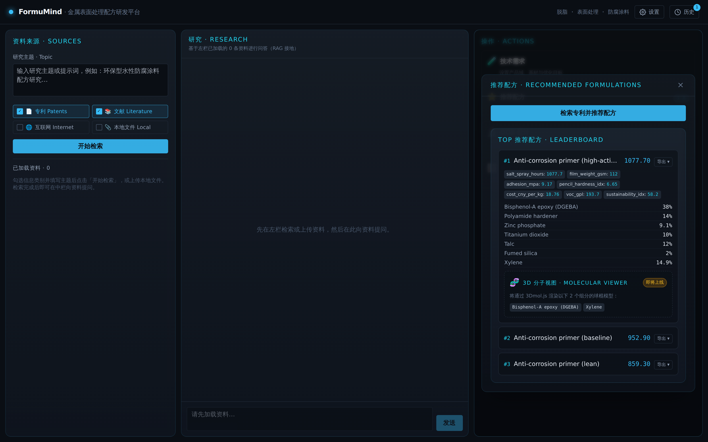
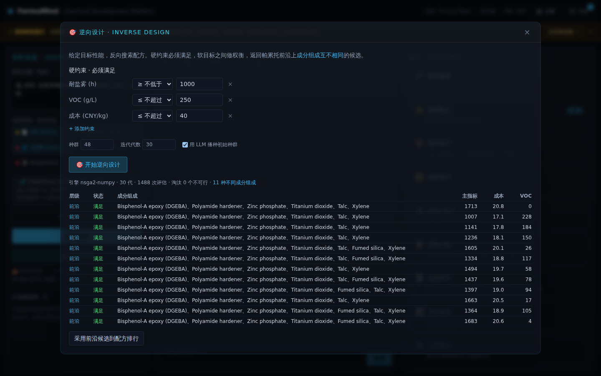
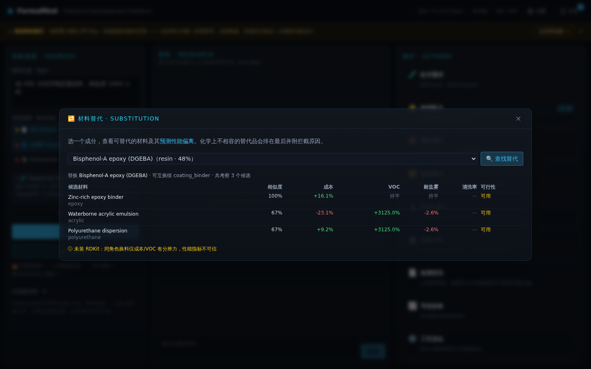
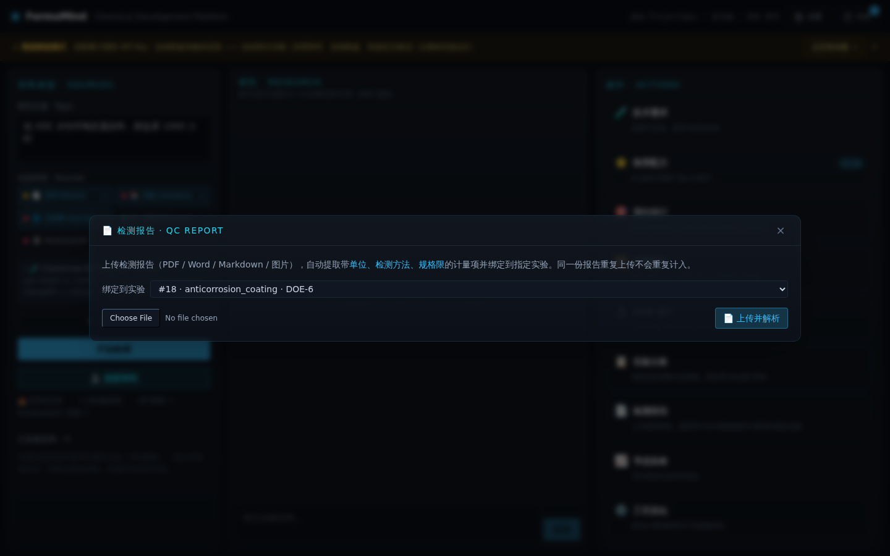
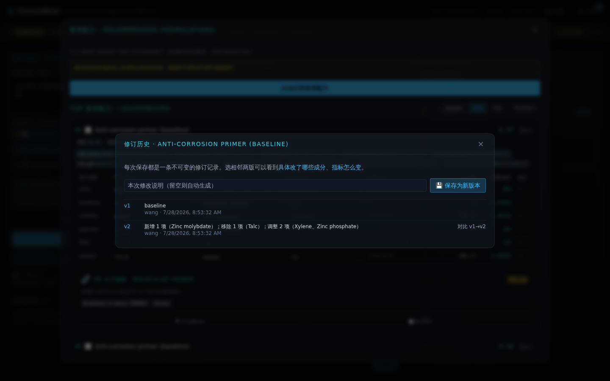
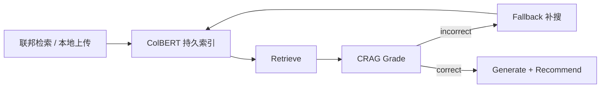

# FormuMind 使用指南

**Chemical Development Platform（化学研发平台）** —— 支持自由 ProjectSpec（产品类型、应用场景、自定义 metric/DOE 因子），并保留防腐蚀涂料、脱脂剂、表面处理剂三大 legacy 产品域。

本指南面向研发工程师与实验室人员，介绍软件的全部功能与端到端使用流程。

> English version: [USER_GUIDE.md](./USER_GUIDE.md)

---

## 目录

1. [软件概述](#1-软件概述)
2. [设计理念：适配器 + 离线回退](#2-设计理念适配器--离线回退)
3. [界面导览](#3-界面导览)
4. [完整使用流程（闭环）](#4-完整使用流程闭环)
5. [核心功能详解](#5-核心功能详解)
6. [DOE 实验结果回灌与模型训练](#6-doe-实验结果回灌与模型训练)
7. [Schema-Driven 闭环与单一真相源](#7-schema-driven-闭环与单一真相源)
8. [数据导入导出](#8-数据导入导出)
9. [项目历史管理](#9-项目历史管理notebooklm-式)
10. [API 参考](#10-api-参考)
11. [安装与运行](#11-安装与运行)
12. [配置项](#12-配置项)
13. [启用真实科学引擎](#13-启用真实科学引擎)
14. [常见问题与边界说明](#14-常见问题与边界说明)

---

## 1. 软件概述

FormuMind 接收一项研发需求（基材、耐盐雾目标、膜重、固化温度、清洗率、VOC 上限等），运行一个完整的研发闭环：

```
需求输入 → 专利/文献检索 → RAG 知识构建 → 推荐配方
        → IP 新颖性 / 风险分析 → DOE 实验计划
        → 固化/界面模拟 → 贝叶斯闭环寻优 → Top-N 配方排行
        → 工艺参数优化
                  ↑                                  │
                  └──────── DOE 实验结果回灌 ◄────────┘
                            （训练数据驱动模型）
                  ↑                                  │
                  └──────── 一键自驱动闭环 ──────────┘
                            （数据→重训→寻优→下一批主动学习 DOE）
```

**核心价值**：提高配方成功率、缩短研发周期。随着真实实验数据的积累，平台会用 **Property Intelligence Stack**（机理 → 先验 → 项目级 ML blend）逐步提升预测精度。

**ProjectSpec 要点**（左侧面板）：

| 字段 | 说明 |
|------|------|
| `product_type` | 自由文本产品描述（如「水性环氧防腐底漆」） |
| `application` | 应用场景 / 基材 |
| `objectives` | 多目标优化 metric 列表（可编辑 metric id） |
| `levers` | DOE 因子上下限；未定义时从配方或 legacy 域表推导 |
| 示例项目 | 下拉加载内置三域模板（`/api/examples/{id}`） |

**三大 legacy 产品域**：

| 产品域 | 中文 | 关键指标 |
|--------|------|----------|
| `anticorrosion_coating` | 防腐蚀涂料 | 耐盐雾时长、膜重、附着力、铅笔硬度 |
| `degreaser` | 脱脂剂 | 清洗率、泡沫指数、槽液寿命 |
| `surface_treatment` | 表面处理剂 | 膜重、耐盐雾、附着力促进指数 |

---

## 2. 设计理念：适配器 + 离线回退

平台的每一个外部重型引擎都置于一个**适配器**之后，并配有**确定性离线回退**实现。因此 FormuMind **今天即可端到端运行** —— 无需 GPU、无需 API 密钥、无需 C++ 工具链 —— 当真实引擎被安装后会自动"点亮"切换。

| 能力 | 真实引擎（可选） | 内置回退 |
|------|------------------|----------|
| 研究 / 对话 | 9 家大模型 —— Claude、OpenAI、Gemini、Grok、Meta(Groq)、DeepSeek、Qwen、Kimi、MiniMax | 基于知识库的规则合成 |
| 智能解析意图 | 配置的大模型（`complete_json`） | 正则 / 关键词启发式 |
| 专利检索 | `patent_client` | 各产品域的精选种子语料 |
| 文献检索 | `arxiv`、`semanticscholar` | （离线时不返回额外结果） |
| 互联网检索 | `duckduckgo-search` | （离线时不返回额外结果） |
| **NotebookLM 源** | `notebooklm-py`（浏览器会话认证） | （未启用 → 不返回额外结果） |
| 文件摄取 | `markitdown`（PDF/DOCX/XLSX/PPTX/HTML/图片…）→ `pypdf`/`python-docx` | 纯文本解码 |
| RAG 检索 | sentence-transformers 嵌入 + chromadb | 内存 TF-IDF 索引 |
| 接地问答 | ChemCrow 智能体（化学类问题）· paper-qa（语义合成） | TF-IDF 重排 → 配置的大模型 → 摘录 |
| 物性预测 | RDKit（8 个描述符）· MoLFormer（预留） | 透明的经验代理模型 |
| 流变性 / Tg | Fox 方程 + Mooney 粘度（知识库 `tg_k`） | 数据缺失时跳过 |
| 颜色（CIELAB / ΔE₀₀） | `colour-science` | （跳过） |
| VOC / 密度 | `thermo` 质量加权密度 | 1.3 kg/L 名义假设 |
| 化合物数据 | PubChemPy（SMILES / 分子量） | 人工精选的原料库 |
| 化学计量与安全 | ChemFormula + 酸碱、SVHC、VOC 类别检查 | 自包含解析器 + 规则检查 |
| 寻优 | BoTorch GP（qNEHVI）· Summit（Bayesian/TSEMO）· Optuna（NSGA-II/TPE, CPU） | 纯 numpy UCB 贝叶斯寻优器 |
| 主动学习 DOE | 已训练代理模型 + DOE 网格上的 EI | 随机 LHS 采样 |
| IP 合规分析 | 大模型 JSON（`complete_json`）+ 检索专利 | 离线关键词重叠 → 风险标签 |
| 工艺优化 | 共用寻优引擎，作用于制造参数空间 | Arrhenius / 经验产出模型 |
| 固化 / MD 模拟 | HTPolyNet · LUNAR · LAMMPS (Docker) | 解析近似 |

> 真正轻量且高价值的部分 —— **DOE 引擎**（全因子 / 部分因子 / Plackett-Burman / 中心复合 / 拉丁超立方 / AI 主动选点）和**贝叶斯寻优器** —— 均以纯 numpy 真实实现。

---

## 3. 界面导览

界面为暗黑工业风、仿 NotebookLM 的三栏布局，将**输入 → 研究 → 输出**清晰分离：

```
┌──────────────────────────────────────────────────────────────────────┐
│  FormuMind · 金属表面处理配方研发平台      [⚙ 设置] [🕐 历史]         │
├──────────────────┬───────────────────────────┬───────────────────────┤
│  资料来源（左）   │  研究（中）                │  操作（右）           │
│                  │                            │                       │
│ · 研究主题       │  基于资料的接地问答：      │ 🧪 技术需求           │
│   （提示词框）   │  · 与已加载资料对话        │ ⭐ 推荐配方           │
│ · 来源类型：     │  · 每条回答附引用标签      │ 🎯 逆向设计           │
│   ☑ 专利         │                            │ 🔁 材料替代           │
│   ☑ 文献         │                            │ 🔬 DOE 设计           │
│   ☑ 互联网       │  [向资料提问… ][发送]      │ 📋 实验台账           │
│   ☑ 本地文件     │                            │ 📄 检测报告           │
│   ☐ 📓 NotebookLM│                            │ 📈 寻优收敛           │
│ [⬆ 上传][检索]   │                            │ ⚙️ 工艺优化            │
│                  │                            │ 🔄 自驱动闭环         │
│ ── 已加载 (N) ── │                            │                       │
│ 📄 专利 · ✕      │                            │                       │
│ 📚 arxiv · ✕     │                            │                       │
│ 📓 NotebookLM ✕ │                            │                       │
│ 📎 本地 · ✕      │                            │                       │
└──────────────────┴───────────────────────────┴───────────────────────┘
```

- **左栏（资料来源）**：顶部是**研究主题提示词框**；其下是来源类型复选框、**多文件上传**、**检索**、**🔬 深度研究**、**+ 添加数据源**（NotebookLM 风格弹窗：关键词检索 / 批量上传 / 网页 URL / 粘贴文本，全部并入当前项目资料库）。已加载资料列表支持勾选用于中栏问答。底部进度条显示 `资料数 / 300` 上限。
- **中栏（研究）**：基于**已加载资料**进行问答的对话界面（语义嵌入或 TF-IDF 重排 → LLM 作答），每条回答下方以引用标签标注所用证据。
- **右栏（操作）**：十个按钮各自打开一个聚焦的**弹窗** —— 🧪 技术需求、⭐ 推荐配方、🎯 **逆向设计**（给定目标性能反解帕累托前沿，见 §5.15）、🔁 **材料替代**（替代品排序 + 预测性能偏离，见 §5.16）、🔬 DOE 设计（生成实验方案与导出记录表）、📋 **实验台账**（AG Grid 填报实际参数与实测值，同步 SQLite，BayBE 主动 DOE 从 Completed 行读数）、📄 **检测报告**（上传报告抽取计量项并绑定实验，见 §5.17）、📈 寻优收敛、⚙️ 工艺优化、🔄 自驱动闭环。按钮上的状态徽章显示运行中 / 结果条数（台账显示 `已完成/总数`）。
- **标题栏**：⚙ **设置**（三个 Tab：**大模型**、**API 配置**、**依赖管理**）与 🕐 **历史**（项目快照抽屉，带实时条数徽章）。
- **设置 · 两种密钥（勿混淆）**：
  - **平台 API 访问令牌**（`FORMUMIND_API_TOKEN`）：保护 `/api/*` 的 Bearer 鉴权；内网开发可设 `FORMUMIND_API_AUTH_ENABLED=false`。启用时，设置页顶部会出现令牌输入框，或与服务器 `.env` 保持一致。
  - **大模型 / 检索 API Key**（DeepSeek、Tavily、SerpAPI 等）：在「大模型」或「API 配置」Tab 填写，写入服务器 `.env`，用于 LLM 问答与在线检索——**不是**平台 Bearer 令牌。

---

## 4. 完整使用流程（闭环）

### 步骤 ⓪ 加载资料、围绕主题做研究（左栏 + 中栏）

1. 在**左栏**的提示词框输入研究主题（如"低 VOC 水性防腐蚀涂料"）。
2. 勾选要检索的来源类型 —— **专利**、**文献**（arXiv + Semantic Scholar）、**互联网**（DuckDuckGo）、**📓 NotebookLM**，并/或**上传本地文件**（PDF/DOCX/XLSX/PPTX/HTML/图片，经 markitdown 解析）。点击**检索**。
3. 已加载资料显示在下方列表中。在**中栏**向这些资料提问 —— 回答基于已加载证据，并标注所引用来源。

> 离线时专利检索返回精选种子语料；文献、互联网、NotebookLM 检索需安装对应可选 extra（见 §12）。检索完成后，各来源复选框旁的状态指示点会更新，显示哪些来源实际可用。如需一键完成多源综合研究，可点击「🔬 深度研究」按钮，代替手动分步问答，直接运行完整的 DeepResearchEngine 多源综合研究流程并将报告推送至中栏。

### 步骤 ① 设定需求并检索推荐（右栏弹窗）

右栏的研究功能以按钮承载；每个按钮打开一个聚焦的弹窗，便于一次只关注一项任务。

1. 打开 **🧪 技术需求**。顶部 **✨ 智能解析 · NL Intent** 框接受一句话需求 ——*"开发汽车底盘环保水性环氧防腐涂料，耐盐雾 1000 小时，120℃ 固化"* —— 自动解析为结构化字段（有 LLM 时走 LLM；无 LLM 时走纯正则离线回退）并填进下方表单。
2. 调整**产品域**（如"防腐蚀涂料"）与**基材**（碳钢 / 镀锌钢 / 铝 / 不锈钢 / **镁合金**）、优化目标、权重、方向与约束。约束支持 `constraint_values` 字典（如浴温上限、浸渍时间上限）；组分可填中文名 `zh_name` 并通过 **CAS 检索**（`/api/chemical/lookup`）自动富集结构。
3. 打开 **⭐ 推荐配方**，点击**检索专利并推荐配方**。排行榜支持**手动录入配方**（`POST /api/formulations/manual`）与 **AI 修改配方**（`POST /api/research/modify`，异步 SSE）。

平台会：
- 检索该产品域的专利/文献证据（离线种子语料）；
- 构建语义嵌入（或 TF-IDF）RAG 索引、召回最相关条目；
- 从知识库基线模板生成 3 个推荐配方变体（高活性 / 基线 / 精简），按目标指标打分排序；
- 合成机理解释与研究对话。

**结果**：中栏显示机理 + 证据 + 对话；排行榜显示 3 个推荐配方。展开配方卡可见成分表、含不确定度的预测指标（包含 **PVC / CPVC**、**Tg (°C)**、**viscosity_relative**，以及可选的 **lab_L/a/b + ΔE₀₀**）、**3D 分子视图面板**（见 §5.14），以及 **🔍 IP 合规分析** 按钮（见 §5.11）。



### 步骤 ② 运行寻优闭环

打开 **📈 寻优收敛** 弹窗，点击**运行 DOE 寻优闭环**，启动异步贝叶斯多目标寻优（默认 24 次迭代）：

- 寻优器自动选择已安装的最强引擎（**BoTorch** → **Summit** → **Optuna** → 内置 numpy UCB）；
- 在关键配方杠杆（如锌缓蚀剂用量、树脂/硬化剂比例）的设计空间内采样；
- 每个候选经化学计量校验，由经验/数据混合预测器打分（加权多目标聚合）；
- 结果反馈给寻优器并收敛。

**结果**：弹窗显示收敛折线图；排行榜更新为寻优后的 Top-5 配方。

### 步骤 ③ 生成 DOE、填报实验台账并回灌

1. 在 **🔬 DOE 设计** 弹窗，选择设计类型（中心复合 CCD、Plackett-Burman、…，或 **🧠 AI 主动选点**），点击**生成 DOE**。AI 主动选点行以紫色高亮。
2. 生成成功后，打开 **📋 实验台账**（位于 DOE 与寻优之间）。AG Grid 中填写**实际执行参数**与**实测指标**（支持 Excel 粘贴），点击**保存台账并同步**写入 SQLite。
3. 在台账底部点击 **回灌实验结果并训练模型**（或批量：**导出 CSV** → 实验室填写 → **导入 CSV**）。
4. 当某 (域, 指标) 累积样本 ≥ `min_train_samples`（默认 4），平台自动训练数据驱动模型。
5. **BayBE AI 主动 DOE** 下一轮推荐时，后端从台账 `Completed` 行的 `actual_params` / `measurements` 读数（`workbench_campaign_id`），无需手工传列表。

**结果**：右栏台账徽章显示 `已完成/总数`；模型质量仪表盘显示 R² 半圆仪表 + RMSE；推荐与寻优切换为"经验 + 实测"混合预测。

> **闭环**：实测数据越多，数据驱动模型权重越高（混合权重 `w = n/(n+8)`），预测越贴近实测。

### 步骤 ④ 工艺参数优化

打开 **⚙️ 工艺优化** 弹窗。平台用同一套贝叶斯引擎在**制造工艺参数**（固化温度、固化时间、分散转速、膜厚、浴温、浸泡时间、pH 设定值、促进剂倍数）上寻优。各产品域专属产出模型为候选打分（防腐用 Arrhenius 固化转化率、脱脂用 Q10 清洗、表面处理用幂律磷化）。结果显示最优工艺配方与迷你收敛图。

### 步骤 ⑤ 一键自驱动闭环

打开 **🔄 自驱动闭环**，点击**迭代一轮闭环**。在一个异步任务里，平台：

1. 从注册表拉取当前产品域的全部实测记录；
2. 重训数据驱动模型（每个指标的 RMSE / R² 回报）；
3. 运行寻优器（引擎自动选择 —— BoTorch / Summit / Optuna / numpy）；
4. 用刚重训好的代理模型在 DOE 网格上算 EI，建议下一批主动学习实验。

弹窗显示引擎、样本数、R²/RMSE 卡（含 ↓ 趋势箭头，RMSE 随轮次下降）、收敛折线图，以及下一批 DOE（紫色 = AI 主动选点）。一键导出下一批 DOE，循环跨轮持续。

---

## 5. 核心功能详解

### 5.1 多目标寻优（加权 Pareto 聚合）

工业配方通常是权衡 —— 高耐盐雾 *且* 低成本 *且* 低 VOC。各产品域内置默认目标集：

| 产品域 | 默认目标 |
|--------|----------|
| 防腐蚀 | salt_spray（最大化，0.5）+ cost（最小化，0.25）+ sustainability（最大化，0.25） |
| 脱脂剂 | cleaning（最大化，0.5）+ cost（最小化，0.3）+ VOC（最小化，0.2） |
| 表面处理 | salt_spray（最大化，0.5）+ coating weight（最大化，0.2）+ cost（最小化，0.3） |

每个目标经 min-max 归一化后加权；"最小化"目标取反，使"越高越好"统一。可在 API 的 `objectives` 字段覆盖指标、权重与方向。

### 5.2 成本、可持续性与 PVC / CPVC 评分

知识库中 32 种种子原料均带 `price_cny_per_kg` 与 `voc_contrib`（挥发分，0–1）。每次预测自动计算：

- `cost_cny_per_kg` —— 质量分数加权的配方成本；
- `voc_gpl` —— VOC 含量（g/L）；密度默认 ~1.3 kg/L，安装 `thermo` 后切换为真实质量加权混合密度；
- `sustainability_idx` —— 可持续性指数（0–100，惩罚高 VOC 与高成本）；
- **`pvc`** —— 颜料体积浓度（%），颜填料相对总不挥发分的体积分数；
- **`cpvc`** —— 临界 PVC，按 Asbeck 公式从知识库的吸油量推算；
- **`pvc_to_cpvc_ratio`** —— 用于标记过度填料的配方（> 1 时光泽差、密封差）。

当配方 VOC 超出需求 `voc_limit_gpl` 时，卡片显示黄色警告。安全检查器还会针对酸碱冲突与已知 REACH SVHC 成分提示警告。

### 5.3 流变性、Tg 与颜色

- **Tg (°C)** —— 用 Fox 方程估算多组分玻璃化转变温度，使用知识库 `tg_k`。任一组分缺 `tg_k` 时返回 `None`。
- **viscosity_relative** —— Mooney 颜填料体积粘度模型（`η_r = exp(2.5·φ / (1 − φ/φ_max))`，`φ_max ≈ 0.64`）。
- **viscoelastic_index** —— 0–1 指数，综合 PVC/CPVC 比值与 Tg 距常温的距离。
- **lab_L / lab_a / lab_b + delta_e** —— CIELAB 色度与 CIEDE2000（相对白参考），安装 `colour-science` 后从颜料的 `spectral_reflectance` 计算（排行榜卡片在这些字段存在时渲染 2rem 真实色块）。

### 5.4 预测置信区间

每个预测指标都附带 `predicted_std` 不确定度估计：

- **sklearn 随机森林**：单树预测的标准差（集成不确定度）；
- **numpy ridge 回退**：训练集 RMSE 作为保守常数。

配方卡显示 `值 ± std`；当 std 超过值的 20% 时以黄色高亮提示低置信度。

### 5.5 收敛过程可视化

寻优器返回每次迭代的最优目标得分序列（`history`），用 recharts 渲染为折线图 —— X 轴 = 迭代次数，Y 轴 = 最优分数，悬停显示精确数值。自驱动闭环弹窗复用此组件。

### 5.6 模型质量仪表盘

每个已训练模型显示一个半圆 SVG R² 仪表（>85% 绿色 / >60% 黄色 / 其余红色）+ 后端类型（sklearn-rf 或 numpy-ridge）+ 样本数 + RMSE + 交叉验证 R²。

### 5.7 多大模型供应商支持

研究合成与接地问答可运行在**九家大模型供应商**之上，从 ⚙ **设置**对话框（或环境变量）中选择。七家 OpenAI 兼容供应商共用一个 `openai` SDK，仅以各自的 `base_url` 区分；Claude 用 `anthropic`，Gemini 用 `google-genai`。

| 供应商 | 推荐模型 | SDK / base URL |
|--------|----------|----------------|
| Anthropic (Claude) | `claude-sonnet-4-6` | `anthropic` |
| OpenAI | `gpt-4o` | `openai` |
| Google (Gemini) | `gemini-2.0-flash` | `google-genai` |
| xAI (Grok) | `grok-2` | `openai` · `https://api.x.ai/v1` |
| Meta（经 Groq） | `llama-3.3-70b-versatile` | `openai` · `https://api.groq.com/openai/v1` |
| DeepSeek | `deepseek-v4-pro`（旗舰，推荐）/ `deepseek-v4-flash`（快速经济） | `openai` · `https://api.deepseek.com` |
| Qwen（通义千问） | `qwen-plus` | `openai` · `https://dashscope.aliyuncs.com/compatible-mode/v1` |
| Kimi（Moonshot） | `kimi-k3` | `openai` · `https://api.moonshot.cn/v1` |
| MiniMax | `abab6.5s-chat` | `openai` · `https://api.minimax.chat/v1` |

在设置中选择供应商与模型、粘贴 API Key（支持显示/隐藏）、按需填写自定义 base URL，点击**保存并测试连接**。Key 写入服务器 `.env`（runtime overlay）。未配置 Key 时，全部功能仍可通过离线规则引擎运行。

**设置页三个 Tab**：

| Tab | 用途 |
|-----|------|
| 大模型 | 当前 LLM 供应商 / 模型 / API Key / base URL |
| API 配置 | SerpAPI、Tavily、EPO、USPTO 等检索与数据源密钥（分组管理） |
| 依赖管理 | 查看可选 pip 包安装状态，一键安装 `llm` / `intel` / `science` 等 catalog 依赖（`POST /api/dependencies/install`，完成后需重启后端） |

若三个 Tab 内容为空且控制台出现 401：服务器启用了 `FORMUMIND_API_AUTH_ENABLED=true` 但前端未携带平台令牌。内网请关闭鉴权，或于设置页顶部填写与 `FORMUMIND_API_TOKEN` 相同的 **API 访问令牌**。

### 5.7.1 LLM 结构化配方推荐

- **主引擎**：`POST /api/formulations/recommend` 与 `POST /api/research` 均通过 `recommend_formulations()` 调用大模型，按 `objectives` 契约输出带 **CAS No.**、**MF（分子式）**、SMILES、当量/称重等字段的 JSON（Pydantic 校验 + OpenAI `json_schema` 或 prompt 回退）。
- **离线回退**：LLM 不可用或 JSON 校验失败时，自动降级为 `offline_recommend_fallback`（原 `variant_formulations` 逻辑），响应 `engine=offline` 并在 warnings 中说明原因。
- **前端**：排行榜展开区显示 8 列实验室配方表（组分类型 / 名称 / 结构式 / MW / 当量 / mmol / 称重 / 备注）；标题旁 badge 显示「LLM 推荐」或「离线模板」。
- **知识库 SSOT**：`baseline_formulation` + `RAW_MATERIALS` 仍负责 DOE 基准与 CAS 富集，不作为主推荐路径直接暴露。

### 5.8 多源检索、文件上传与接地问答

研究步骤被拆分为可勾选的多个来源，全部置于带离线回退的适配器之后：

- **专利** —— `patent_client`（离线：各产品域精选种子语料）；
- **文献** —— arXiv + Semantic Scholar；
- **互联网** —— DuckDuckGo（无需 API Key）；
- **NotebookLM** —— `notebooklm-py` 直连库：通过该非官方 SDK 查询一个固定的 Google NotebookLM notebook。一次性浏览器登录（`notebooklm login`）写入会话文件，适配器把 `chat.ask` 结果映射为 `Evidence(source="NotebookLM")`。默认禁用；未启用 / 未登录 / 库未装时静默返回 `[]`。
- **本地文件** —— 支持**多选**上传 PDF/DOCX/XLSX/PPTX/HTML/图片；**markitdown** 解析后切分为证据片段。亦可通过 **+ 添加数据源** 批量上传、粘贴 URL 或纯文本。
- **深度研究**（🔬 按钮）—— `POST /api/research/deep` 异步端点，运行 DeepResearchEngine：
  `web_agent`（DuckDuckGo 网页）+ `kb_agent`（HyDE 查询扩展 → 向量/TF-IDF 重排 →
  `llm_rerank` → `answer_question`）+ `report_agent`（交叉验证 web 与 KB 来源，
  强制每条论断注 `[来源]`，证据不足时显式标注）。结果为带 `report_markdown`、
  `citations`、`candidates` 的 `ComprehensiveReport`，自动填充中栏与配方排行。

所有勾选来源的结果会被合并、去重，并按相关度排序进入左栏资料列表。中栏对话随后基于这些资料**接地作答**：先用语义嵌入（装了 `sentence-transformers` 时）或 TF-IDF 重排选出最相关证据，再由 LLM 组织答案，并在每条回复下以标签展示所用引用。

### 5.9 可选智能引擎（自动检测）

除大模型供应商外，FormuMind 在内置回退之上叠加了若干专业引擎。每个都**自动检测**：安装对应库即自动切换、无需改代码；未安装时继续走确定性离线路径，行为永不崩坏。

- **寻优分层** —— 闭环寻优器自动选择已安装的最强引擎：**BayBE Campaign**（`baybe` + `bo` extra，约束贝叶斯 + 可选 Pareto）→ **BoTorch**（GP + qNEHVI，`bo` extra）→ **Summit**（Bayesian/TSEMO，`heavy` extra）→ **Optuna**（NSGA-II/TPE，纯 CPU，轻量 `optimize` extra）→ 内置 numpy UCB 寻优器。`POST /api/optimize?engine=` 可选 `auto|baybe|legacy`；所用 `engine` 会写入寻优结果。
- **冷启动 DOE（pyDOE）** —— `POST /api/doe?engine=pydoe` 启用 pyDOE 后端，支持 Box-Behnken、混合物 simplex、Sobol 等设计；未安装时自动降级为内置 numpy 设计（`engine=native` 为零依赖默认）。
- **主动学习 DOE** —— DOE 弹窗可选 **经典 EI**（`engine=legacy`）或 **baybe Campaign**（`engine=baybe`，JSON `campaign_state` 无状态往返）。当 ≥ `min_train_samples` 条记录存在时，代理模型指导选点；否则回退到 LHS。后端会自动读取 registry 中已录入实验，无需前端传空列表。
- **接地问答路由** —— 化学类问题（LogP、溶解度、毒性、相容性、反应、结构…）在安装 **ChemCrow** 后路由至该智能体；其余问题走 **paper-qa** 语义合成（带页码引用）。两者均回退到 TF-IDF 重排 → 配置的大模型 → 摘录。
- **ChemCrow 可用性徽章** —— 安装 `intel` extra 且勾选了「文献」或「互联网」来源时，资料来源面板显示绿色 🧪 徽章（"ChemCrow 化学增强检索 · 已启用"）；未安装 `intel` 时显示灰色徽章并附 `pip install -e '.[intel]'` 安装提示。
- **语义 RAG** —— 安装 `sentence-transformers`（`embedding` extra）后，RAG 检索从 TF-IDF 升级为 MiniLM 嵌入 + chromadb，显著提升同义词召回率（如 "epoxy" ↔ "bisphenol-A"）。
- **化合物富集** —— 设置 `FORMUMIND_ENRICH_COMPOUNDS=true` 且安装 **PubChemPy** 后，启动时自动补全原料库缺失的 SMILES / 分子量（人工精选值始终优先）。
- **物性接地 VOC + Tg + 粘度** —— 安装 **thermo** 后，`voc_gpl` 由真实质量加权混合密度计算；Fox 与 Mooney 模型采用知识库中树脂的 `tg_k` 值。
- **颜色测量** —— 安装 **`colour-science`**（`color` extra）后，CIELAB 与 CIEDE2000 ΔE₀₀ 由光谱反射率计算；排行榜卡片渲染真实色块。
- **NotebookLM 源** —— 安装 **`notebooklm-py`**（`notebooklm` extra）且 `FORMUMIND_NOTEBOOKLM_ENABLED=true` 后，对配置的 notebook 的查询会以 `source="NotebookLM"` 返回证据。

### 5.10 智能解析意图（✨ NL Intent）

**🧪 技术需求** 顶部的 *✨ 智能解析 · NL Intent* 框接收一句话项目需求，平台抽取为结构化 `Requirement`：

- 有 LLM 时调用 `complete_json()`（与 IP 分析共用同一 JSON 抽取助手）；
- 无 LLM 时走完全确定的正则 / 关键词回退：识别产品域（防腐 / 脱脂 / 表面处理）、基材（碳钢 / 镀锌 / 铝 / 不锈钢 / 镁）、耐盐雾时长、VOC 上限（命中"低 VOC / 水性"等关键词时降至 200）、固化温度。

响应中列出已填充字段，下方表单原地更新。

### 5.11 IP 合规分析（🔍）

每张排行榜配方卡都带有 **🔍 IP 合规分析** 按钮。平台：

- 从成分列表中抽取化学术语关键词；
- 通过 `literature.search_patents()` 检索最多 N 篇相关专利；
- 有 LLM 时调用 `complete_json()`，按 `{novelty_score, risks[], whitespace_hints[]}` 格式输出；
- 无 LLM 时走确定性关键词重叠风险打标。

结果弹窗显示新颖性仪表（0–1）、逐专利风险卡（含权利要求重叠与改造建议）、空白区差异化机会。

### 5.12 工艺参数优化（⚙️）

制造工艺杠杆 —— 固化温度/时间、分散转速、膜厚、浴温、浸泡时间、pH、促进剂倍数 —— 是与配方组成完全正交的设计空间。**工艺优化** 弹窗用同一套贝叶斯引擎在该空间寻优；各产品域专属产出模型为候选打分：

- **防腐**：Arrhenius 固化转化率、分散均匀性、盐雾厚度修正；
- **脱脂剂**：温度修正清洗效率、泡沫衰减；
- **表面处理**：磷化幂律膜重沉积。

### 5.13 自驱动闭环（🔄）

自驱动闭环弹窗把平台各模块串成一个一键迭代：

```
本域记录 → 重训 → 寻优（引擎自动选择）
                  ↓
            RMSE / R² → 下一批主动学习 DOE
```

它是已有部件（`registry.records_for`、`workflow.run_optimization`、`active_learning_doe`）的薄编排层；尚无实测数据时优雅退化为经验先验 + LHS 采样。

### 5.14 3D 分子视图（预留）

每个展开的排行榜配方卡都带有 **3D 分子视图面板**。本版本为**占位符 + 数据契约**：列出配方中带 SMILES 的组分，并说明它们将通过 **3Dmol.js** 渲染为球棍模型。完整 WebGL 视图（以及用于增强物性预测的预留 **MoLFormer** 嵌入路径）将在后续升级中交付；占位符让当前打包保持轻量。

### 5.15 逆向设计（🎯）

**⭐ 推荐配方**给出候选。**🎯 逆向设计**反过来：从规格出发，返回一组同时满足规格的配方，并显示它们各自牺牲了什么。

**它和「寻优」的本质区别。** 在这个能力交付之前，配方重建只能对一份**硬编码基线模板**按重量百分比缩放——**有哪些料是常量，只有各占多少是变量**。这一条限制同时解释了三件看似无关的事：没有逆向设计（搜索空间里根本没有「选料」这个维度）、不能做材料替代（换料就是换拓扑，而拓扑不可变）、帕累托前沿只是装饰（候选全来自同一模板，前沿上没有真正的多样性）。把拓扑解锁之后，这三件事才在同一个地基上同时变得可做。

**请求结构** —— 硬约束与软目标现在是**两种不同的语义**，这是此前完全缺失的：过去两者混在 `ObjectiveSpec.weight` 里只当评分权重，从不作为搜索必须满足的条件。

| 字段 | 含义 |
|---|---|
| `targets.hard[]` | `(metric, op: le\|ge\|between, value[, value_max])` —— 必须满足 |
| `targets.soft[]` | `ObjectiveSpec` —— 参与优化与相互权衡 |
| `population`、`generations` | 搜索预算（默认 48 × 30） |
| `seed_with_llm` | 用 LLM 提案播种初始种群（无 key 时回落到基线 + 随机变体） |

**引擎** —— NSGA-II，纯 numpy 实现。这个选型来自实测而非偏好：本环境只装了 numpy（baybe / optuna / botorch / torch / rdkit / scipy / sklearn 全部是可选依赖且默认缺失）；仓库里原有的四个优化器**全是单目标标量化**；而单个候选的评估成本约 1.1 ms —— 于是 60×40 ≈ 2.7 秒的直接进化搜索，胜过在预测器外面再套一层代理模型。约束用**约束支配**处理（可行解永远优于不可行解；两个都不可行时比违反量总和），从而**避免了任意设定惩罚权重**。

**返回**：`candidates`、`pareto_frontier_ids`、`tradeoff`（复用既有 `TradeOffAnalysis`，场景化选型与置信度全部免费继承）、`generations`、`evaluations`、`engine`、`rejected_infeasible`、`seeded_from`。

有两个行为值得知道，因为它们**只有真跑一遍才会暴露**，任何单元测试都抓不到：

- **不加界限它会薅代理模型的羊毛。** 实测它找出了一份声称耐盐雾 5110 小时的「配方」。现在每个位点都用 DOE lever 的取值范围定界。
- **拥挤度只作用于目标空间**，所以成分完全不同但预测指标相近的两个个体，在它看来是可互换的，选择过程会把种群塌缩到单一成分集。加入按拓扑分桶的结构小生境后，从 1 个成分集变成 12 个。



异步：`POST /api/design/inverse` → 202 + SSE 进度。

### 5.16 材料替代与断供扫描（🔁）

`POST /api/materials/substitutes` 对配方某个位点的替代料排序，融合三路信号：

1. **结构相似** —— `substitute_group` 精确命中最高分，其次 `functional_class` 相同，再次 Hansen 距离 `Ra = √(4Δd² + Δp² + Δh²)`；RDKit 可用时叠加 Tanimoto 指纹相似度（用 `chemtools.availability()` 判定，而非 try/except）。
2. **预测性能偏离** —— 用候选替代料重建基因组并重新预测，得到每个指标的 Δ。这是核心差异化：给出的不是「这几个相似」，而是「换了之后会变成什么样」。
3. **文献证据** —— 知识图谱 `substitutes` 边，每条带 `{source_id, chunk_id, sentence}`。

32 种种子材料全部补齐了 `functional_class` 与 `substitute_group`（18 个可互换组：`epoxy_hardener`、`anticorrosive_pigment`、`pu_crosslinker`、`organic_solvent`、`thixotrope` …）。注意 `extender` 与 `thixotrope` 是**刻意分开的两组**——滑石粉与气相二氧化硅同为填料，但并不可互换。

> **`delta_confidence` 不是装饰，必须读。** 没有 RDKit 时 `_molecular_features` 返回 `{}`，预测器区分同角色材料只能通过角色用量、胺/环氧当量比与价格/VOC 查表。实测：替换三种环氧固化剂，成本变化（13.2 / 17.8 / 20.2 元/kg），而 `salt_spray_hours` **三者完全相同，都是 867 h**。报告如实标注 `delta_confidence: cost_only`，以免把「数值没变」误读成「换料对性能无影响」——那是模型没有分辨力，不是等价的证据。装 `".[science]"` 后该字段才会提升。

**候选召回**按 `role` + `substitute_group`，**刻意不用** `genome.swappable()` —— 后者是**搜索**约束（排除了颜料与填料），而替代是用户指定的，任何位点都应可查。



**断供扫描**：`POST /api/materials/availability` 把材料标为 `discontinued` 或 `restricted`；`GET /api/materials/supply-risk` 随即列出所有受影响配方并附替代建议。

### 5.17 逐条实测值与检测报告入库（📄）

`measured` 过去是实验行上的一个 JSON 字典——数值没有单位、没有方法、没有时间戳。新增的 `measurements` 表把每个观测拆成独立一行（指标、数值、**单位、检测方法、规格限**、时间戳），于是一条耐盐雾数据会记住它来自 ASTM B117、规格限 ≥1000 h，从而与下一条**可比**。

**向后兼容是设计出来的，不是碰巧的。** `ExperimentRecord.measured` 保留为 Pydantic `computed_field`，由 `measurements` 派生，所有既有读取方原封不动；`model_validator(mode="before")` 负责把历史 payload 里的 `measured` 提升成 `Measurement` 列表。

**报告上传**（`POST /api/qc/report`）：上传 → LLM 抽取 → 入库。入库在**单个事务**内完成，按内容哈希去重，且**先挂附件再写计量值**——顺序反了的话，中途失败会留下一批查不到出处的数值。



回读：`GET /api/qc/experiments/{experiment_id}/measurements`。

### 5.18 配方版本谱系

`POST /api/formulations/versions` 把配方存为一个**谱系**中的版本——可回溯的父子链。差异是**结构化**的（新增/移除/调整的成分，外加重命名），不是一段文本；作者没写备注时 `describe_diff` 自动生成一行摘要：

> 移除 1 项（聚酰胺固化剂）；新增 1 项（异佛尔酮二胺）；调整 2 项（环氧树脂、二甲苯）



| 端点 | 用途 |
|---|---|
| `POST /api/formulations/versions` | 保存版本（可指定父版本） |
| `GET /api/formulations/versions?name=` | 按配方名查谱系 |
| `GET /api/formulations/versions/{lineage_id}` | 遍历某条谱系 |
| `GET /api/formulations/versions/detail/{version_id}` | 单个版本的完整快照 |
| `GET /api/formulations/versions/{from_id}/diff/{to_id}` | 结构化差异 |

### 5.19 可编辑材料库

原材料库原本是一个模块级 dict 字面量，被几十处直接读取。现在它是**种子库 + 数据库叠加层**，并以普通 Mapping 的形式暴露，因此那几十处调用点**一行都不用改**：精选的种子化学数据永远优先，而种子里根本没有的字段——`availability`、`supplier`、`functional_class`、`hansen_*`、`substitute_group`——由数据库补齐。

| 端点 | 用途 |
|---|---|
| `GET /api/materials` | 检索材料库（可按角色、化学族、可互换组过滤） |
| `POST /api/materials` | 新增或更新材料 |
| `POST /api/materials/promote` | 把临时成分提升为正式材料 |
| `POST /api/materials/availability` | 标记 `available` / `restricted` / `discontinued` |

### 5.20 引用完整性巡检

本 schema 中大多数跨表引用是普通字符串列，而且其中若干**不可能**变成外键：当 `FORMUMIND_CAMPAIGN_BACKEND=datalab` 时，被引用的行存在于外部 ELN 中，加数据库约束会拒绝完全合法的数据。对「无法强制执行的约束」，诚实的替代方案是**真的去跑一遍检查**——否则孤儿行会静默累积，而第一个症状是某次检索悄悄少返回了一些结果。

`GET /api/kb/integrity` 报告每一条软引用及其孤儿数。结构性不可连接的引用（Datalab 托管）会被标记 `unjoinable` 并**排除在孤儿总数之外**，而不是贡献一个假数字。

> SQLite 默认**不执行**外键约束，除非设置 `PRAGMA foreign_keys=ON`，而且这个开关是**每连接**生效的——不打开的话，所有 `ForeignKey` 声明都只是装饰。引擎已对每个新连接设置该 PRAGMA。

---

## 6. DOE 实验结果回灌与模型训练

这是平台的核心闭环机制。经验预测器只是一个先验，真实实验数据才是事实来源。

### DOE 设计类型

| 设计 | 用途 |
|------|------|
| `full_factorial` | 全因子，因子少时全面探索 |
| `fractional_factorial` | 部分因子，降低实验次数 |
| `plackett_burman` | 主效应筛选，最省实验 |
| `ccd` | 中心复合设计，建二次响应面 |
| `lhs` | 拉丁超立方，空间均匀填充 |
| `active` | 🧠 AI 主动选点 —— DOE 网格上的 EI（基于已训练代理模型；样本不足时退化为 LHS） |

### 回灌与训练机制

1. **实验台账**（`📋 实验台账` 弹窗）：AG Grid 编辑 `actual_params` / `measurements`，`PUT /api/experiments/workbench/sync` 写入 SQLite；Completed 行供 BayBE 与回灌使用。
2. 每条实验记录被特征化（`features.py`）为基于角色的组成 + 工艺向量。
2. 当某 (域, 指标) 累积样本 ≥ `FORMUMIND_MIN_TRAIN_SAMPLES`（默认 4），训练一个模型：
   - 装了 scikit-learn → `RandomForestRegressor`；
   - 否则 → 自包含 numpy ridge 回归。
3. `predictor.predict` 将训练模型与经验先验**混合**，样本越多模型权重越大（`w = n/(n+8)`）。
4. **数据是事实来源**：模型不做二进制持久化，启动时从持久化的实验数据集重建，保证可复现。

---

## 7. Schema-Driven 闭环与单一真相源

平台采用 **Schema-Driven** 契约，避免「技术要求纯文本」「台账只认一个指标」「Campaign 与需求漂移」等断层。

### SSOT 层级

| 层级 | 存储位置 | 说明 |
|------|----------|------|
| 运行时契约 | `Requirement.objectives[]` / `levers[]` / `active_formulation` | 左栏技术需求面板编辑 |
| 项目持久化 | `ProjectWorkspace.requirement` + `leaderboard` | SQLite `/api/projects` |
| 实验战役快照 | `Campaign.objectives_snapshot` + `lever_snapshot` | DOE 生成时刻冻结，旧台账不受后续改需求影响 |
| 台账实测 | `ExperimentRecord.measurements` | 键 = `ObjectiveSpec.metric`（机器键）；表头显示 `display_name` + `unit` |

### 多目标台账

- 生成 DOE 时，`POST /api/experiments/workbench/campaigns` 传入当前 `requirement` 与 `project_id`。
- AG Grid 按 **每个 objective 一列实测** 动态生成（`workbenchColumns.ts`）。
- `sync` 时校验 `measurements` 键集合；主指标填齐即标为 `Completed`（可选扩展为全指标必填）。

### 多指标回灌与 BayBE

- **回灌训练**：`submitResults` 将 Completed 行的 **全部已填 objective 指标** 写入 `measured` 字典，按 metric 分别训练模型（`GET /api/models` 可见多条记录）。
- **BayBE 主动 DOE**：`fetch_campaign_data_for_baybe` 按 `objectives_snapshot` 列顺序组装 `measurements_Y`；`match_target` 方向映射为 BayBE 匹配变换。
- **闭环寻优**：`POST /api/optimize` 可传 `workbench_campaign_id`；每轮 `recommend` 从台账 Completed 行读取实测并 `add_measurements`，与 predictor 虚拟 Y 合并。
- **列名 SSOT**：全程使用 `ObjectiveSpec.metric`（如 `salt_spray_hours`），**禁止**在 BayBE / Pandas 路径使用 `objective.id`。
- **配方结构化**：推荐配方为强类型 `Formulation` + `Ingredient`（含可选 `cas_no`）；`POST /api/formulations/validate` 可做 CAS/结构富集与校验。

### ColBERT + CRAG 知识库（v2）

研究/推荐管线统一为 **单一知识平面**：



| 能力 | 说明 |
|------|------|
| ColBERT 索引 | `FORMUMIND_COLBERT_INDEX_DIR`（Docker 卷 `./data/colbert_index`）；`/api/ingest` 上传即入库 |
| CRAG | `retrieve → grade → fallback? → generate`；仅 `grounded_evidence` 进入推荐 prompt |
| 深度研究 | `POST /api/research/deep` → **202** + `task_id`；进度经 `GET /api/tasks/{id}/stream` SSE（阶段：retrieve → grade → fallback → generate → recommend） |
| 源策略 | `FORMUMIND_FEDERATED_SOURCES` 默认 `patents,literature,internet`；前端无需勾选源类型 |
| 补充知识库 | `POST /api/research/kb/refresh?query=...` 或左栏「📥 补充知识库」 |

**推荐配方**（「从知识库推荐配方」）与 **深度研究** 均只消费 CRAG 评分后的 ColBERT 片段，不再将原始联邦检索全量直传 LLM。

### 闭环时序（DOE → 台账 → BayBE）

```mermaid
sequenceDiagram
  participant UI as 前端 Store
  participant DOE as generateDoe
  participant WB as Workbench Campaign
  participant Grid as AG Grid 台账
  participant BayBE as BayBE Engine
  participant Opt as POST /api/optimize

  UI->>DOE: requirement.objectives
  DOE->>WB: createWorkbenchCampaign
  WB-->>UI: objectives_snapshot 写入 Zustand
  WB->>Grid: 按 metric 动态列
  Grid->>WB: sync measurements[metric]
  Note over WB: Completed 行冻结 actual_params + measurements
  UI->>BayBE: activeDoe(workbench_campaign_id)
  BayBE->>WB: fetch_campaign_data_for_baybe
  BayBE->>BayBE: resolve_campaign_objectives + add_measurements
  UI->>Opt: runOptimize(workbench_campaign_id)
  Opt->>BayBE: run_optimization 每轮 recommend
```

### 推荐操作顺序

```
确认 objectives → 研究推荐配方 → 选 active_formulation → 生成 DOE（冻结快照）
→ 实验台账填报多列实测 → 回灌训练 → AI 主动 DOE / 闭环寻优
```

---

## 8. 数据导入导出

### DOE 实验记录表导出（B3）

- 在 DOE 区点击**导出 CSV** 或 **XLSX**，下载一份含空白 `measured_<指标>` 列的实验记录表，发给实验室填写。
- API：`GET /api/doe/{plan_id}/export?format=csv|xlsx`
- XLSX 需后端安装 `openpyxl`（可选 `[export]` extra）；CSV 用标准库，永远可用。

### 实验结果 CSV 导入（B3）

- 在 DOE 区点击**导入 CSV**，上传填好的记录表，批量入库并自动重训。
- API：`POST /api/experiments/import-csv`
- 解析规则：`measured_*` 列识别为实测值，`cure_temperature_c` 路由到工艺字段，空白行自动跳过，兼容 Excel 的 UTF-8 BOM。

### 配方导出（F2）

排行榜每张配方卡右上角的**导出 ▾**菜单提供：

- **复制 JSON** —— 复制完整配方对象到剪贴板；
- **导出 CSV** —— 成分行 + 预测指标导出为表格；
- **导出 PDF** —— 生成单页报告单（配方名、成分表、预测指标含不确定度、配方理由）。jsPDF 按需懒加载，不增加首屏体积。

---

## 9. 项目历史管理（NotebookLM 式）

- 每个**研究项目**在 SQLite（`./data/formumind.db`）中保存完整工作区：研究主题、RAG 资料、中栏问答、技术需求、推荐配方、DOE 计划、寻优曲线、工艺优化、自驱动闭环报告等。
- 点击标题栏 **🕐 历史** 打开**项目历史**抽屉：显示资料数 / 对话数 / 配方数徽章，以及 DOE、寻优、闭环、工艺等标签。
- **打开**项目 → 主界面全量恢复；**新建** / **删除**项目；切换前自动保存当前项目（约 1.5s 防抖）。
- 首次升级时，浏览器旧版 localStorage 会话快照会自动迁移至 SQLite（一次性）。
- 仅 `activeProjectId` 与 LLM 设置仍存于 localStorage；项目正文走 `/api/projects` API。

### + 添加数据源

- 入口：左栏 **🔬 深度研究** 下方 **+ 添加数据源**。
- 对话框：关键词检索（专利/文献/互联网）、**多文件上传**、**添加网页**、**粘贴文本**。
- 所有新源追加到**当前 active 项目**，不新建项目；资料上限 **300** 条。

---

## 10. API 参考

| 方法 | 路径 | 用途 |
|------|------|------|
| POST | `/api/search` | 多源检索（专利 / 文献 / 互联网 / NotebookLM）→ 合并去重后的证据 |
| POST | `/api/ingest` | 上传本地文件 → 提取的证据片段 |
| POST | `/api/ingest/batch` | 批量上传多个文件 |
| POST | `/api/ingest/url` | 抓取公开网页 URL 为资料源 |
| POST | `/api/ingest/text` | 粘贴纯文本为资料源 |
| GET | `/api/projects` | 列出项目摘要（资料/对话/配方统计） |
| POST | `/api/projects` | 新建项目 |
| GET | `/api/projects/{id}` | 读取完整项目工作区 |
| PUT | `/api/projects/{id}` | 保存项目工作区（autosave） |
| DELETE | `/api/projects/{id}` | 删除（归档）项目 |
| POST | `/api/projects/migrate-local` | 导入浏览器旧 history 快照 |
| POST | `/api/chat` | 基于已加载资料的接地问答（语义 / TF-IDF 重排 → LLM 作答带引用） |
| GET | `/api/auth/status` | 平台 Bearer 鉴权是否启用（公开，无需令牌） |
| GET/POST | `/api/settings` | 读取 / 更新大模型供应商、模型、Key、base URL（`POST /api/settings/test` 测试连接） |
| GET/POST | `/api/settings/secrets` | 分组 API 密钥（大模型 / 检索 / 专利数据源） |
| GET | `/api/dependencies` | 可选依赖安装状态 |
| POST | `/api/dependencies/install` | 异步安装 catalog 中的 pip 包 → `task_id` |
| GET | `/api/chemical/lookup` | 化学品名称 → CAS / SMILES / 分子量 |
| POST | `/api/formulations/manual` | 手动录入配方 → 校验 / 富集 / 打分 |
| POST | `/api/research/modify` | AI 按提示修改配方（异步 SSE） |
| POST | `/api/intent/parse` | 自然语言项目需求 → 结构化 `Requirement`（LLM `complete_json` 或正则回退） |
| POST | `/api/research` | 检索专利 + RAG + 推荐配方（可接收预加载的 `sources`） |
| POST | `/api/research/deep` | 异步深度研究：DeepResearchEngine 多智能体管线（web + KB + HyDE + 重排 + 交叉验证报告）→ 返回 `task_id` |
| GET | `/api/search/status` | 轻量级各来源可用性检查（无检索、无网络请求） |
| POST | `/api/agents/review` | 多智能体配方审查：ChemistAgent（RDKit + 水性不相容规则）+ InspectorAgent（SVHC/VOC）+ InitializeAgent 主管 → `ReviewVerdict` |
| POST | `/api/ip/analyze` | 逐配方新颖性评分、侵权风险列表、空白区提示 |
| POST | `/api/doe?design=…` | 生成 DOE 计划（5 种设计） |
| POST | `/api/doe/active` | 🧠 主动学习 DOE：代理模型 EI 选点（样本不足时退化为 LHS） |
| GET | `/api/doe/{plan_id}/export?format=csv\|xlsx` | 导出实验记录表（含空白实测列） |
| POST | `/api/optimize` | 启动异步多目标寻优 → **202** + `stream_url`（SSE 订阅进度） |
| POST | `/api/process-optimize` | 工艺参数寻优（Arrhenius / 经验产出模型） |
| POST | `/api/loop/iterate` | 一键自驱动闭环 → **202** + `stream_url` |
| POST | `/api/qc/analyze` | （预留）CV 缺陷检测桩 |
| GET | `/api/tasks/{id}` | 只读任务快照（调试 / 重连） |
| GET | `/api/tasks/{id}/stream` | **SSE** 实时进度（EventSource 主路径） |
| POST | `/api/experiments/workbench/campaigns` | 从 DOE 计划创建实验台账 Campaign |
| GET | `/api/experiments/workbench/{id}` | 读取 AG Grid 台账行 |
| PUT | `/api/experiments/workbench/sync` | 批量保存台账编辑（自动标记 Completed） |
| POST | `/api/experiments` | 回灌实测结果 → 持久化 + (重)训练 |
| POST | `/api/experiments/import-csv` | 上传填好的记录表 → 批量入库 + 训练 |
| POST | `/api/train` | 强制基于全部实验重训 |
| GET | `/api/models` | 列出已训练模型及 `n_samples`、`R²`、`cv_R²`、`RMSE` |
| POST | `/api/formulations/recommend` | LLM 结构化配方推荐（objectives 驱动；失败时 offline 回退） |
| POST | `/api/formulations/validate` | 校验并富集配方列表（CAS / 结构 / 组分权重） |
| GET | `/api/ingredients` | 完整原料库（含价格、VOC 贡献） |
| **POST** | **`/api/design/inverse`** | **逆向设计：目标规格 → 帕累托配方集（异步，见 §5.15）** |
| **GET/POST** | **`/api/materials`** | **检索 / 新增可编辑材料库（§5.19）** |
| **POST** | **`/api/materials/substitutes`** | **某位点的替代品排序，带每指标 Δ（§5.16）** |
| **GET** | **`/api/materials/supply-risk`** | **受停产材料影响的配方清单** |
| **POST** | **`/api/materials/availability`** | **标记材料 `available` / `restricted` / `discontinued`** |
| **POST** | **`/api/materials/promote`** | **把临时成分提升为正式材料** |
| **POST** | **`/api/qc/report`** | **上传检测报告 → 抽取计量项并绑定实验（§5.17）** |
| **GET** | **`/api/qc/experiments/{id}/measurements`** | **逐条实测值（指标、数值、单位、方法、规格限）** |
| GET | `/api/experiments` | 列出实验（id + 标签），供报告与计量值引用 |
| **POST/GET** | **`/api/formulations/versions`** | **保存配方版本 / 查询谱系（§5.18）** |
| **GET** | **`/api/formulations/versions/{from}/diff/{to}`** | **两个版本之间的结构化差异** |
| **GET** | **`/api/kb/integrity`** | **软引用的孤儿行报告（§5.20）** |
| GET | `/api/meta`、`/api/templates/{domain}` | 元数据与基线模板 |
| GET | `/health` | 数据库、**任务队列**与 Datalab 可达性 |

完整交互式文档：后端启动后访问 `http://localhost:8000/docs`。

### 异步提交与 503 契约

所有异步端点（`/api/research/recommend`、`/api/research/deep`、`/api/optimize`、`/api/design/inverse`、`/api/search/stream`、`/api/loop/iterate`、`/api/dependencies/install`）返回 **202** + `task_id` + `stream_url`；当任务队列不可达时返回 **503** 与一条 JSON `detail`。

返回 503 而不是 500 是刻意的，快速失败也是。Redis 掉线时 Celery 的 `.delay()` **不会干净地失败**：它会对 *result backend* 重试约 19 秒，然后抛出 `RuntimeError: Retry limit exceeded … The Celery application must be restarted`，到浏览器就是一个**任何 JSON 错误处理都读不了的纯文本 500**。现在 API 会先用 1 秒的 TCP 连接探测 broker，于是调用方在约 30 毫秒内就能拿到一条可操作的原因。

**被拒绝的提交是「延迟的工作」，不是「丢失的工作」。** 持久化 outbox 行在派发**之前**就已写入，broker 恢复后 `dispatcher.recover_stalled` 会重新入队。

### 健康检查

```bash
curl -s localhost:8000/health
```

```json
{"status": "ok",
 "database":    {"ok": true,  "scheme": "sqlite"},
 "task_broker": {"required": true, "reachable": true},
 "datalab":     {"required": false, "reachable": false}}
```

- 某个依赖不可达时 `status` 变为 `degraded`（而非 failed），端点仍返回 **200**。容器健康检查断言的就是 200，而且重启 API 并不能让 Redis 活过来。
- 同步（eager）模式下 `task_broker.required` 为 `false`，此时任务在 API 进程内执行。**如果你确实起了 worker 容器却看到 `required: false`，说明任务根本没有发到它那里**——见 §12。

### 逆向设计示例

```bash
curl -X POST localhost:8000/api/design/inverse -H 'content-type: application/json' -d '{
  "requirement": {"domain": "anticorrosion_coating", "substrate": "carbon_steel"},
  "targets": {
    "hard": [
      {"metric": "salt_spray_hours", "op": "ge", "value": 1000},
      {"metric": "voc_gpl",          "op": "le", "value": 250}
    ],
    "soft": [
      {"metric": "cost_cny_per_kg",  "weight": 0.5, "direction": "minimize"},
      {"metric": "salt_spray_hours", "weight": 0.5, "direction": "maximize"}
    ]
  },
  "population": 48, "generations": 30
}'
# → 202 {"task_id": "...", "stream_url": "/api/tasks/.../stream"}
# 结果含 candidates（成分集互不相同）、pareto_frontier_ids、tradeoff、
#        rejected_infeasible —— 前沿很稀疏时先看最后这个字段。
```

### 材料替代示例

```bash
curl -X POST localhost:8000/api/materials/substitutes -H 'content-type: application/json' -d '{
  "formulation": { "...": "一个 Formulation 对象" },
  "slot_index": 1,
  "requirement": {"domain": "anticorrosion_coating"},
  "limit": 5
}'
# 每个候选都带 metric_deltas 和 delta_confidence。
# delta_confidence 为 "cost_only" 表示性能类指标在此处没有分辨力 ——
# 装上 ".[science]" 之后再去解读「数值没变」这件事。
```

### 自驱动闭环请求示例

```bash
curl -X POST localhost:8000/api/loop/iterate -H 'content-type: application/json' -d '{
  "domain": "anticorrosion_coating",
  "substrate": "carbon_steel",
  "salt_spray_hours": 800,
  "film_weight_gsm": 70,
  "cure_temperature_c": 80,
  "cleaning_efficiency": 0,
  "voc_limit_gpl": 250,
  "ph_target": null,
  "notes": "",
  "objectives": [],
  "optimize_iterations": 24,
  "n_suggest": 4
}'
# → {"task_id": "...", "stream_url": "/api/tasks/.../stream", "status_url": "/api/tasks/..."}
# 前端用 EventSource 订阅 stream_url；或 GET status_url 读取终态快照。
# 结果包含 optimization.top_formulations、next_doe（带 ai_suggested 标记）与 rmse_by_metric。
```

### 智能解析示例

```bash
curl -X POST localhost:8000/api/intent/parse -H 'content-type: application/json' -d '{
  "text": "开发汽车底盘环保水性环氧防腐涂料，耐盐雾1000小时，120℃固化"
}'
# → {"requirement": {"domain":"anticorrosion_coating", "salt_spray_hours":1000, ...},
#    "engine": "offline-heuristic", "extracted_fields": ["domain","salt_spray_hours",...]}
```

### 自定义多目标寻优示例

```bash
curl -X POST localhost:8000/api/optimize -H 'content-type: application/json' -d '{
  "requirement": {
    "domain": "anticorrosion_coating",
    "salt_spray_hours": 800,
    "objectives": [
      {"metric": "salt_spray_hours", "weight": 0.7, "direction": "maximize"},
      {"metric": "cost_cny_per_kg",  "weight": 0.3, "direction": "minimize"}
    ]
  },
  "iterations": 30
}'
```

---

## 11. 安装与运行

### 一键安装（Linux/macOS）

```bash
./scripts/install.sh                 # backend .venv + [dev,llm] + frontend npm
cp .env.example .env                 # 内网开发建议 FORMUMIND_API_AUTH_ENABLED=false
```

### 本地（无 Docker，完全离线）

```bash
# 后端
cd backend
python3 -m venv .venv              # 首次运行时创建（Debian/Ubuntu PEP 668 环境必须）
source .venv/bin/activate          # Linux / macOS（Windows 用 .venv\Scripts\activate）
pip install -e ".[dev]"
pytest -q                          # 1040+ 项测试，全部离线通过
uvicorn app.main:app --reload --reload-exclude .venv  # http://localhost:8000/docs

# 前端（另开一个终端）
cd frontend
npm install
npm run dev                        # http://localhost:5173
```

### Docker

```bash
cp .env.example .env               # LLM 密钥、FORMUMIND_API_TOKEN、Tavily/SerpAPI 等
docker compose up -d --build       # redis + backend + worker + frontend
docker compose exec backend alembic upgrade head    # 已有数据库执行迁移
curl -s localhost:8000/health      # 用界面之前先确认这一步
docker compose --profile heavy up  # 额外启动 LAMMPS / HTPolyNet 引擎
```

> **不要混用 compose 启动方式。** 基础文件把服务放在桥接网络上；host 叠加用的是 `network_mode: host`。在两者之间切换时，只有定义发生变化的服务会被重建，其余的仍留在旧网络里——于是后端解析不到 `redis`，任何 `localhost:` 形式的 URL 也变成指向容器自己。典型症状是 `task_broker.reachable:false` 与 `datalab.reachable:false` **同时出现**，而 `docker compose ps` 里一切都显示 "Up"；决定性的线索是 **redis 那一行没有端口映射**（`docker-compose.yml` 明确声明了 `6379:6379`，为空只可能是 host 网络的遗留容器）。用 `docker compose down` 再 `up -d` 可以把所有容器强制对齐。

**内网 / 实验室**：在 `.env` 中设置 `FORMUMIND_API_AUTH_ENABLED=false`，设置页无需平台令牌即可加载。**公网部署**：保持默认 `true`，设置 `FORMUMIND_API_TOKEN`，并在前端构建时传入 `VITE_API_TOKEN`（见 `docker-compose.yml` `frontend.build.args`）或在设置页填写令牌。

**Host 网络叠加**（Docker bridge 受限时）：

```bash
docker compose -f docker-compose.yml -f docker-compose.host.yml up -d
```

**企业 ELN 叠加**（Postgres + Datalab）：`docker compose -f docker-compose.yml -f docker-compose.eln.yml up` — 见 `deploy/eln/README.md`。

**生产 / Nginx 反向代理（SSE）**：异步任务（深度研究、寻优、检索、闭环、依赖安装）经 Celery Worker 执行，API 仅转发 Redis Pub/Sub 进度。代理需允许长连接 SSE：

```nginx
location /api/tasks/ {
    proxy_pass http://backend:8000;
    proxy_http_version 1.1;
    proxy_set_header Connection "";
    proxy_buffering off;
    proxy_read_timeout 3600s;
    add_header X-Accel-Buffering no;
}
```

确保 `redis` 与 `worker` 服务与 `backend` 一并启动；无 Worker 时 POST 仍返回 202，但任务会堆积在队列中。

```bash
# Docker / 生产部署（使用锁定的 requirements.txt）
pip install -r requirements.txt
pip install -e . --no-deps
```

### 数据库迁移

迁移用 Alembic，且 `alembic.ini` **已打进镜像**，因此已部署的数据库可以就地迁移：

```bash
docker compose exec backend alembic upgrade head
curl -s localhost:8000/api/kb/integrity     # 迁移后确认
```

非生产环境下启动时会执行 `Base.metadata.create_all`，它会补建**缺失的表**，但**永远不会修改已存在的表**。所以在列类型变更之前建立的数据库**必须跑迁移**，`create_all` 不会替你完成。

### 镜像构建说明

镜像**默认不安装任何 apt 包**。它安装的每个 Python 包在 linux/x86_64/cp311 上都有预编译 wheel；唯一只有 sdist 的依赖（jieba）是纯 Python 的，在没有编译器的环境里也能构建。如果确实需要镜像内有工具链——例如通过依赖安装器在运行时安装某个只有 sdist 的可选扩展——显式开启：

```bash
docker compose build --build-arg INSTALL_BUILD_TOOLCHAIN=true backend
```

前端镜像跑的是 `npm ci`，它会**拒绝**不完整的 lockfile，而 `npm install` 会默默把它修好——这就是这类问题能一路走到部署的原因。若报 `Missing: … from lock file`，重新生成并提交：

```bash
cd frontend && npm install --package-lock-only
```

---

## 12. 配置项

所有配置通过环境变量驱动（前缀 `FORMUMIND_`），均有安全的离线默认值。

| 环境变量 | 默认值 | 说明 |
|----------|--------|------|
| `FORMUMIND_LLM_PROVIDER` | `anthropic` | 当前供应商：`anthropic`/`openai`/`gemini`/`xai`/`groq`/`deepseek`/`qwen`/`moonshot`/`minimax` |
| `FORMUMIND_LLM_MODEL` | `claude-sonnet-4-6` | 当前供应商使用的模型 |
| `FORMUMIND_<供应商>_API_KEY` | 空 | 大模型 API 密钥（在设置 → 大模型 / API 配置 中管理） |
| `FORMUMIND_API_AUTH_ENABLED` | `true` | 是否对 `/api/*` 启用平台 Bearer 鉴权；内网开发建议 `false` |
| `FORMUMIND_API_TOKEN` | 空 | 平台访问令牌（与 LLM Key 不同）；生产环境鉴权开启时必填 |
| `FORMUMIND_SERPAPI_API_KEY` | 空 | SerpAPI（Google Scholar / Patents 检索链） |
| `FORMUMIND_TAVILY_API_KEY` | 空 | Tavily 语义检索 |
| `FORMUMIND_LLM_BASE_URL` | 供应商默认 | 覆盖 OpenAI 兼容 base URL |
| `FORMUMIND_SEARCH_LIMIT_PER_SOURCE` | `5` | 每个来源类型最多抓取的结果数 |
| `FORMUMIND_RAG_BACKEND` | `auto` | RAG 后端：`auto`（装了 sentence-transformers 用嵌入，否则 TF-IDF）/ `embedding` / `tfidf` |
| `FORMUMIND_USE_CHEMCROW` | `true` | 安装后将化学类问题路由至 ChemCrow |
| `FORMUMIND_ENRICH_COMPOUNDS` | `false` | 启动时用 PubChem 补全 SMILES/分子量（需 `intel` + 网络） |
| `FORMUMIND_NOTEBOOKLM_ENABLED` | `false` | 启用 NotebookLM 检索源 |
| `FORMUMIND_NOTEBOOKLM_NOTEBOOK_ID` | 空 | 要查询的固定 notebook id |
| `FORMUMIND_NOTEBOOKLM_STORAGE_PATH` | `./data/notebooklm_auth.json` | `notebooklm login` 生成的会话文件 |
| `FORMUMIND_DB_URL` | `sqlite:///./data/formumind.db` | 实验数据库；可指向 Postgres |
| `FORMUMIND_REDIS_URL` | `redis://localhost:6379/0` | Celery broker |
| `FORMUMIND_CELERY_EAGER` | `true` | 无 broker 时在进程内同步执行任务。**归运维所有**——见下 |
| `FORMUMIND_OPTIMIZE_ITERATIONS` | `24` | 寻优迭代次数 |
| `FORMUMIND_TOP_N_FORMULAS` | `5` | 排行榜配方数 |
| `FORMUMIND_MIN_TRAIN_SAMPLES` | `4` | 训练某指标模型的最小样本数 |
| `FORMUMIND_AUTO_RETRAIN` | `true` | 提交实验后自动重训 |
| `FORMUMIND_FULLTEXT_ENRICH` | `false` | **当前的全文获取开关**：把摘要级命中升级为全文并入库（需网络；默认 false 保证离线测试通过）|
| `FORMUMIND_PATENT_PREFER_HTML` | `true` | 专利取 Google Patents 落地页正文，一次请求约 0.7 秒且不需要 OCR。关闭则优先下 PDF |
| `FORMUMIND_ARXIV_PREFER_SOURCE` | `true` | arXiv 取 LaTeX 源码而非 PDF：同一篇 100 页论文实测 53 秒 → 1.2 秒 |
| `FORMUMIND_PDF_DOWNLOAD` | `false` | **旧版**专利 PDF 下载，已被「检索全文获取」取代，仅保留兼容 |
| `FORMUMIND_PDF_DOWNLOAD_MAX` | `3` | 每次 DeepResearchEngine 最多下载几篇 PDF |

### 界面里保存的设置 vs 部署设置的配置

设置对话框里的大多数开关会在启动时被提升进进程环境，**刻意压过容器创建时注入的值**——用户最后保存的那个值是最新的明确意图，一个陈旧的 `env_file` 键不该赢过它。

**`FORMUMIND_CELERY_EAGER` 是例外。** 它决定任务是发往 broker 还是在 API 进程内执行——也就是 worker 容器到底有没有存在意义——所以它属于运维，而不属于一个界面开关。当部署已经设置了它时，界面里保存的值会被忽略，并**记录一条 warning**，而不是静默覆盖。反过来，部署没有设置时就没有什么可压过的，单进程安装仍然可以从界面选择同步模式。

如果 `/health` 报 `task_broker.required:false` 而你确实在跑 worker 容器，那就正是这个情况：去后端日志里找那条「被忽略的值」warning，并在设置页把「任务同步执行」关掉以清除存量。

### 数据持久化（B5）

- 实验记录持久化于 SQL 数据库（默认 SQLite，零配置文件型）。
- 启动时若检测到旧的 `experiments.json`，会**自动迁移**进 SQLite（幂等，原文件保留作审计）。
- 多进程部署时把 `FORMUMIND_DB_URL` 指向 Postgres 即可，无需改代码。

---

## 13. 启用真实科学引擎

在有能力的机器上安装对应 extras，适配器会自动切换，无需改动代码：

```bash
pip install -e ".[llm]"          # Claude + OpenAI + Gemini SDK（覆盖全部 9 家供应商）
pip install -e ".[science]"      # scipy, scikit-learn, RDKit, ChemFormula, thermo
pip install -e ".[optimize]"     # optuna（纯 CPU 多目标寻优器，NSGA-II/TPE）
pip install -e ".[bo]"           # BoTorch + gpytorch + torch CPU（GP qNEHVI 寻优器）
pip install -e ".[pydoe]"        # pyDOE 经典实验设计（LHS/CCD/Box-Behnken/混合物/Sobol）
pip install -e ".[baybe]"        # BayBE 约束贝叶斯主动学习（需 bo + science；推荐 Python 3.10–3.12）
pip install -e ".[bo,baybe,pydoe,science]"  # 双引擎 DOE + 寻优完整栈
pip install -e ".[intel]"        # patent_client, paper-qa, chemcrow, pubchempy, arxiv, semanticscholar, duckduckgo-search
pip install -e ".[file_ingest]"  # markitdown, pypdf, python-docx（本地文件上传）
pip install -e ".[embedding]"    # sentence-transformers（+ chromadb）→ 语义 RAG
pip install -e ".[color]"        # colour-science（CIELAB / CIEDE2000）
pip install -e ".[colbert,crag]"   # ColBERT 持久索引 + LangGraph CRAG 研究管线
pip install -e ".[notebooklm]"   # notebooklm-py[browser]（NotebookLM 源；需一次性 `notebooklm login`）
pip install -e ".[heavy]"        # torch, deepchem, transformers（MoLFormer）, summit, ase
pip install -e ".[export]"       # openpyxl（XLSX 导出；CSV 无需任何依赖）
```

> ⚠️ **`.[intel]` 会静默降级四个钉住的依赖**：`patent-client` 要求 `httpx<0.28` 与 `pypdf<5.0`，解析结果还会带下 `arxiv` 与 `ddgs`。实测：`httpx 0.28.1→0.27.2`、`pypdf 6.14.2→4.3.1`、`arxiv 4.0.0→3.0.0`、`ddgs 9.14.4→9.14.3`。pip **不报错**，`pip check` 也说没问题。只有需要**在线 USPTO/EPO 专利检索**时才装它——专利**全文**走 Google Patents 落地页，完全不需要。CI 会校验这几个被接受的确切版本（`.github/workflows/ci-deps.yml`）。


安装 `science` extra 后：
- 物性预测会补充 **8 个 RDKit 描述符**（MolWt、MolLogP、TPSA、HBD/HBA、可旋转键、FractionCSP3、RingCount），并启用 Fox/Mooney 计算 Tg / 粘度；
- PVC / CPVC 由知识库的 `density_gcm3` + `oil_absorption` 计算；
- 模型训练自动从 numpy ridge 升级为 scikit-learn 随机森林（含集成不确定度）；
- 化学计量校验改用 ChemFormula 精确计算；
- `thermo` 让 VOC（g/L）按真实混合密度计算。

寻优器会自动选择已安装的最强引擎（**BoTorch** → **Summit** → **Optuna** → numpy），接地问答把化学类问题路由至 **ChemCrow**、其余走 **paper-qa**，两者均回退到 TF-IDF + 配置的大模型，RAG 检索在装了 `sentence-transformers` 时升级为语义嵌入（见 §5.9）。IP 分析与智能解析共用 `complete_json()` 调用配置的 LLM。以上全部可选 —— 每个引擎在安装后自动点亮。

### NotebookLM 首次配置

```bash
pip install -e ".[notebooklm]"
notebooklm login                   # 弹出浏览器登录 Google（~170 MB Chromium）
# 然后在 .env 中：
FORMUMIND_NOTEBOOKLM_ENABLED=true
FORMUMIND_NOTEBOOKLM_NOTEBOOK_ID=<你的-notebook-id>
```

> NotebookLM 没有官方公开 API；`notebooklm-py` 调用未公开的 Google 内部端点，可能随时变更。将 NotebookLM 源视为研发辅助工具，不要作为生产爬取链路。

---

## 14. 常见问题与边界说明

**Q：设置页三个 Tab 是空的 / 显示 401？**
服务器默认 `FORMUMIND_API_AUTH_ENABLED=true`，前端未带 Bearer 令牌时 `/api/settings` 等会 401。内网设 `FORMUMIND_API_AUTH_ENABLED=false` 并重启后端；公网则在设置页顶部填写与 `FORMUMIND_API_TOKEN` 相同的平台令牌（与大模型 API Key 无关）。

**Q：没有 API 密钥能用吗？**
能。所有功能在完全离线下端到端可用，仅 LLM 研究合成会使用基于知识库的规则引擎替代。智能解析与 IP 合规分析也都有确定性离线回退。

**Q：预测的性能数值可信吗？**
离线产出的是**工程合理的筛选估算值**，不是实验室验证的规格。请通过 DOE 回灌真实实验数据，让数据驱动模型逐步取代经验先验 —— 或直接用 **🔄 自驱动闭环** 一键完成每一轮迭代。

**Q：3D 仿真在哪里？**
每个排行榜配方卡都带有 **3D 分子视图面板**，当前为占位符 + 数据契约（列出待用 3Dmol.js 渲染的带 SMILES 组分）。完整 WebGL 渲染 —— 以及通过 HTPolyNet/LAMMPS（Docker `heavy` profile）的反应性 MD 轨迹渲染 —— 将在后续升级中交付。寻优收敛图显示在「寻优收敛」与「自驱动闭环」弹窗中。

**Q：专利检索是真实在线抓取吗？**
是真实抓取，开 `FORMUMIND_FULLTEXT_ENRICH=true` 即可；检索不到时回落到各产品域的离线种子语料。

专利全文走 **Google Patents 落地页**（`/patent/{公开号}/en`）的 `abstract` / `description` / `claims` 段，覆盖 US / CN / EP / WO / JP，中日文专利还附带英文机器翻译对照。

> 早期版本曾直连 USPTO / EPO 的 PDF 地址，**那三个地址现已全部失效**（`pdfpiw.uspto.gov` 连接被重置、`patents.google.com/…/pdf` 返回的是 HTML 落地页、EPO publication-server 返回错误页），所以现在不再走那条路，**也不再需要 `patent_client`**。

IP 合规分析共用此检索。

**Q：NotebookLM 在生产环境可用吗？**
`notebooklm-py` 使用未公开的 Google 内部端点，可能随时变更。该集成因此**默认禁用、可完全降级为无操作**，应作为研发辅助而非生产爬取链路。

**Q：项目历史存在哪里？**
完整项目工作区保存在后端 **SQLite**（默认 `./data/formumind.db`）。浏览器 localStorage 仅保留 `activeProjectId` 与 LLM 设置。旧版 localStorage 会话会在首次启动时自动迁移。

**Q：历史会话存在哪里？**
见上条「项目历史」；已废弃仅含 4 字段的 localStorage 快照模式。

**Q：逆向设计返回的候选很少，甚至没有？**
先看返回里的 `rejected_infeasible`。这个数很大而前沿又很稀疏，说明硬约束已经逼近（或超过）搜索空间能满足的极限——放宽其中一条，或把它改成软目标。如果前沿不空但成分高度雷同，通常是可换料的角色被约束得太死。

**Q：材料替代里每个候选的耐盐雾数值都一样，是不是说明换了也没影响？**
不是——这是**最值得理解的一个误判**。请看 `delta_confidence`。当它是 `cost_only` 时，表示 RDKit 缺失、分子特征为空，预测器**确实无法**在性能维度上区分同角色材料；数值相同是「模型没有分辨力」，不是「等价」的证据。成本、VOC 与 PVC 类的 Δ 仍然有效。装 `".[science]"` 后性能类 Δ 才有信息量。

**Q：某功能返回 503 并提到 Redis，任务丢了吗？**
没有。outbox 行在派发之前就已写入，所以这次提交已被记录，broker 恢复后会自动重新入队。启动 redis 与 worker 即可（用 `docker compose ps` 看是哪个没起）。

**Q：界面上只显示光秃秃的 `/api/... -> 502`，没有任何说明？**
那个响应**根本不是 API 发出来的**。FastAPI 的错误都带 JSON `detail`，界面会原样展示。只看到 `path -> status` 说明响应体不是 JSON，问题出在反向代理：nginx 在完全连不上后端时返回 502。请 `docker compose ps` 检查，并直接 `curl localhost:8000/health` 绕开代理验证。

**Q：`docker compose ps` 里 worker 显示 `unhealthy`？**
当前版本不应该出现。worker 与 backend 共用镜像，过去会继承镜像里针对 `:8000` 的 HTTP 健康检查——而 worker 根本不跑这个服务，于是永远报 unhealthy。现在它改用 `celery inspect ping`，该探针同时也证明了 broker 连通。若仍看到，请重新构建镜像。

---

> 本文档对应当前 FormuMind 主线分支。
>
> 最近最大的一次变化不是新增了一个功能，而是**移除了一条约束**。此前配方重建只能对一份硬编码模板按重量百分比缩放——**有哪些料是固定的，只有各占多少可变**。正是这一条限制，同时导致了逆向设计、材料替代与「有意义的帕累托前沿」三者全都无从谈起。把「成分」变成可搜索的维度（可编辑材料库 + 配方基因组）之后，这三件事才在同一个地基上同时变得可做，于是有了 **🎯 逆向设计**（§5.15）、**🔁 材料替代**（§5.16）与真正的多层帕累托分级。
>
> 与之一同交付的还有：带单位、检测方法与规格限的逐条实测值，以及为其供数的 **📄 检测报告**入库（§5.17）；带结构化差异的配方版本谱系（§5.18）；可编辑材料库（§5.19）；以及针对「无法承载数据库约束」的那些引用的完整性巡检（§5.20）。
>
> 以上全部构建在既有平台之上：仿 NotebookLM 的三栏布局（资料来源 / 研究 / 操作）配以**十按钮**操作工具栏；九家大模型供应商支持与应用内设置对话框；多源检索（专利 / 文献 / 互联网 / **NotebookLM** / 本地文件）；带语义嵌入升级的 RAG 接地问答；自动检测的智能引擎（BoTorch/Summit/Optuna 寻优、主动学习 DOE、ChemCrow/paper-qa 问答、PubChem 富集、thermo 物性接地、Fox/Mooney 流变性、CIELAB/ΔE₀₀ 颜色、PVC/CPVC、IP 新颖性分析、✨ 自然语言意图解析）；以及多目标寻优、成本/可持续性评分、置信区间、DOE 导入导出、SQL 持久化、配方导出、收敛图、模型仪表盘与项目历史。
>
> 当前验证水平：**后端 1040+ 项测试**、**前端 106 项测试**，全部离线通过。
