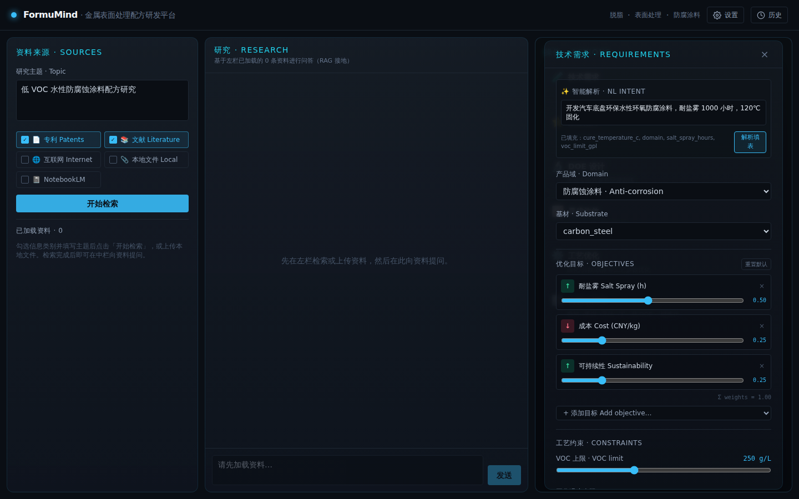
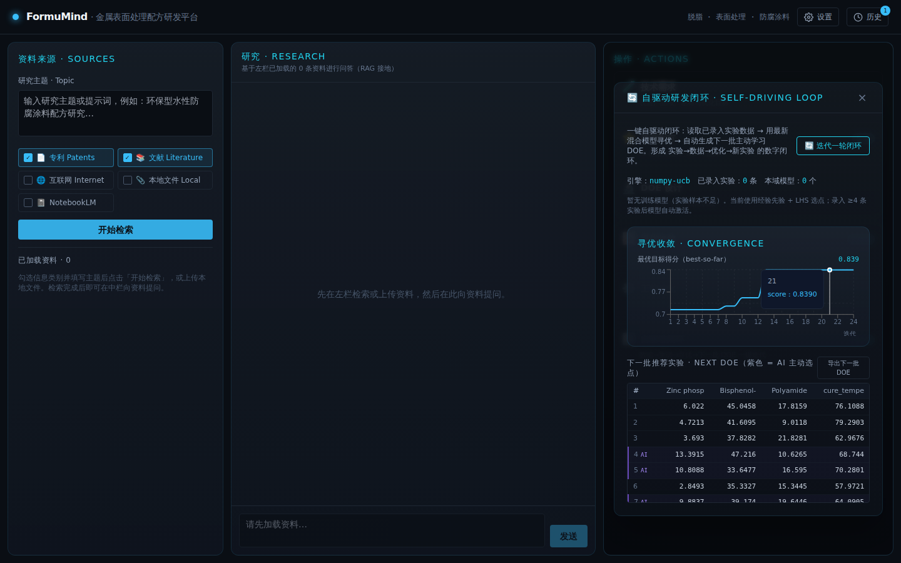

# FormuMind 快速入门（5 分钟上手）

本文用真实界面截图，带你在 5 分钟内跑通一次完整的配方研发闭环。
完整功能说明见 [使用指南.md](./使用指南.md)（English: [QUICKSTART.md](./QUICKSTART.md)）。

---

## 准备：启动平台

```bash
# 一键安装（推荐）
./scripts/install.sh
cp .env.example .env    # 内网：FORMUMIND_API_AUTH_ENABLED=false

# 或手动启动
# 后端（终端 1）
cd backend
python3 -m venv .venv
source .venv/bin/activate
pip install -e ".[dev]"
uvicorn app.main:app --reload --reload-exclude .venv  # http://localhost:8000/docs

# 前端（终端 2）
cd frontend
npm install
npm run dev                        # http://localhost:5173
```

打开浏览器访问 **http://localhost:5173**。无需大模型 API 密钥时平台完全离线可用；若服务器开启平台鉴权，请先在设置页填写 **API 访问令牌**（与 `FORMUMIND_API_TOKEN` 一致），或关闭 `FORMUMIND_API_AUTH_ENABLED`。

---

## 第 0 步 · 界面总览

FormuMind 采用仿 NotebookLM 的三栏布局，将**输入 → 研究 → 输出**分离：左栏是**资料来源**，中栏是**研究**问答，右栏是**操作**工具栏。标题栏含 **⚙ 设置**（大模型供应商）与 **🕐 历史**。


- **左栏（资料来源）**：研究主题提示词框、来源类型复选框（专利 / 文献 / 互联网 / 本地文件 / **📓 NotebookLM**）——每个来源类型按钮旁有**状态指示点**（🟢 绿 = 在线可用、🟡 黄 = 离线种子回退、🔴 红 = 未安装对应库）——文件上传、**开始检索**按钮（其下方另有 **🔬 深度研究** 按钮，触发多智能体 DeepResearchEngine 综合研究，生成带引用的研究报告）、已加载资料列表。勾选「文献」或「互联网」时，面板内会出现 **🧪 ChemCrow 化学增强检索**状态徽章，指示化学语义增强是否已启用；若检索失败，面板顶部会显示**红色错误横幅**提示具体原因。
- **中栏（研究）**：基于已加载资料的接地问答对话，附引用标注。
- **右栏（操作）**：七个按钮 —— 🧪 技术需求、⭐ 推荐配方、🔬 DOE 设计、📋 实验台账、📈 寻优收敛、⚙️ 工艺优化、🔄 自驱动闭环 —— 各自弹出聚焦窗口。

---

## 第 1 步 · 加载资料

输入研究主题（如"低 VOC 水性防腐蚀涂料"），勾选要检索的来源类型（专利 / 文献 / 互联网 / **📓 NotebookLM**），点击**开始检索**。也可上传本地文件（PDF/DOCX/XLSX/PPTX/HTML/图片），经 markitdown 解析。


所有勾选来源的结果会被合并、去重、按相关度排序，列于左栏（每条可删除）。离线时专利检索返回精选种子语料；文献 / 互联网检索需安装可选的 `intel` 依赖；NotebookLM 需安装 `notebooklm` extra 并一次性浏览器登录（见完整使用指南 §12）。

**v0.9 新增 · 来源状态与深度研究**

- **状态指示点**：每个来源类型按钮旁的彩色圆点实时反映可用性——🟢 绿 = 在线可用；🟡 黄 = 离线种子兜底（专利永远有种子语料，始终为黄或绿）；🔴 红 = 缺少对应 pip 包，需先安装再重启。
- **🧪 ChemCrow 徽章**：勾选「文献」或「互联网」时，左栏会出现 ChemCrow 化学增强检索状态徽章，显示当前化学语义增强是否已启用（安装 `intel` extra 后自动点亮）。
- **🔬 深度研究**：点击「开始检索」下方的 **🔬 深度研究** 按钮，平台将调用 `/api/research/deep` 异步端点，运行 **DeepResearchEngine** 多智能体管线——`web_agent` 广域网络检索 + `kb_agent`（HyDE + 重排）知识库检索 + `report_agent`（强制引用）报告综合——最终生成带严格引用标注的综合研究报告，并自动推送至中栏展示。

---

## 第 2 步 · 向资料提问（接地问答）

在中栏向已加载资料提问 —— 例如"这些专利中防腐蚀的主要机理是什么？"。回答**基于证据接地生成**（语义嵌入或 TF-IDF 重排 → LLM），并以引用标签链接回所用来源。


---

## 第 3 步 · 选择大模型（设置）

点击标题栏 **⚙ 设置**。对话框含三个 Tab：

| Tab | 说明 |
|-----|------|
| **大模型** | 九家供应商（Claude、OpenAI、Gemini、Grok、Groq、DeepSeek、Qwen、Kimi、MiniMax）的模型与 **LLM API Key** |
| **API 配置** | Tavily、SerpAPI、EPO 等检索与数据源密钥 |
| **依赖管理** | 查看 / 一键安装可选 pip 包（`llm`、`intel`、`science`…） |

若顶部出现 **API 访问令牌** 横幅：这是平台 Bearer 鉴权（`FORMUMIND_API_TOKEN`），**不是**大模型 Key。内网可在 `.env` 设 `FORMUMIND_API_AUTH_ENABLED=false` 后重启后端。

选择供应商与模型、粘贴 API Key、按需填写 base URL，点**保存并测试连接**。未配置 Key 时，全部功能仍通过离线规则引擎运行。


---

## 第 4 步 · 一句话描述项目（✨ 智能解析）

打开 **🧪 技术需求**，使用顶部 **✨ 智能解析 · NL Intent** 框：输入一段大白话需求，例如*"开发汽车底盘环保水性环氧防腐涂料，耐盐雾 1000 小时，120℃ 固化"*。点击**解析填表**，平台自动抽取产品域、基材、耐盐雾时长、VOC 上限、固化温度等字段并填进下方表单（有 LLM 时走 LLM；无 LLM 时走纯正则离线回退）。



---

## 第 5 步 · 推荐配方 + IP 合规分析

打开右栏 **⭐ 推荐配方**，点击**检索专利并推荐配方**。Top-N 排行榜随即出现 —— 每个配方卡显示成分表与预测指标，包括自动算出的 `cost_cny_per_kg`（成本）、`voc_gpl`（VOC）、`sustainability_idx`（可持续性指数）、**PVC / CPVC**（颜料体积浓度与临界值）、**Tg (°C)** 和 **viscosity_relative**（Fox 与 Mooney 模型），以及安装 `color` extra 时的 **lab_L/a/b + ΔE₀₀**。

点击任一配方卡的 **🔍 IP 合规分析**：平台检索相关专利、给出新颖性评分（0–1）并罗列侵权风险标注与白空间提示。展开配方卡可见 **3D 分子视图面板**，列出待用 3Dmol.js 渲染的带 SMILES 组分。


---

## 第 6 步 · 生成 DOE 并回灌实测结果

打开 **🔬 DOE 设计**，选择设计类型（如**中心复合 CCD** 或 **🧠 AI 主动选点**），点击**生成 DOE**。得到一张实验记录表，每行一个实验，列出各因子的自然值 + 一列空白"实测"。🧠 主动学习的行以紫色高亮，是期望改善（EI）选出的最具信息量的实验点。


两种回灌方式：

1. **手动**：在"实测"列直接填入实验室测得的指标值，点击 **③ 回灌实验结果并训练模型**。
2. **批量**：点**导出 CSV** 把表发给实验室 → 填好后点**导入 CSV** 上传。

当某指标累积样本 ≥ 4 时，平台自动训练数据驱动模型，模型质量仪表盘会显示 R² 半圆仪表 + RMSE，之后的推荐与寻优会切换为"经验 + 实测"混合预测。

---

## 第 7 步 · 运行寻优闭环

打开 **📈 寻优收敛**，点击**运行 DOE 寻优闭环**，启动贝叶斯多目标寻优（默认 24 次迭代）。**收敛折线图**绘制每次迭代的最优目标得分（best-so-far），悬停可看精确数值。排行榜更新为寻优后的 Top-5 配方，同时平衡耐盐雾、成本与可持续性。


---

## 第 8 步 · 工艺优化 + 自驱动闭环

- **⚙️ 工艺优化** —— 把制造工艺参数（固化温度/时间、分散转速、膜厚、浴温、pH 等）作为独立优化空间，配合 Arrhenius / 经验产出模型联调。寻优引擎与配方寻优共用，仅作用于*工艺*空间。
- **🔄 自驱动闭环** —— 一键串联**实测数据 → 重训模型 → 贝叶斯寻优 → 下一批主动学习 DOE**。弹窗显示各指标 R²/RMSE 卡（含 ↓ 趋势箭头）、收敛折线图，以及下一批 DOE（紫色 = AI 主动选点）。可一键导出下一批 DOE，循环持续。



> 每次研究 / 推荐 / 寻优 / 回灌 / 闭环成功后，平台自动保存一份会话快照 —— 点击标题栏 **🕐 历史** 可查看并恢复最近 20 次会话（存于浏览器 localStorage）。

---

## 下一步

- 想自定义多目标权重、约束 `constraint_values`、手动/AI 修改配方、配置多大模型与检索 API、对接真实引擎？见 **[完整使用指南](./使用指南.md)**。
- `pytest -q` 运行 **430+** 项离线测试；`pip install -e ".[dev]"` 安装开发环境。
- 交互式 API 文档：后端启动后访问 **http://localhost:8000/docs**。

> 离线产出的性能数值为工程合理的筛选估算值，非实验室验证规格。通过 DOE 回灌真实数据，预测会越来越准。
