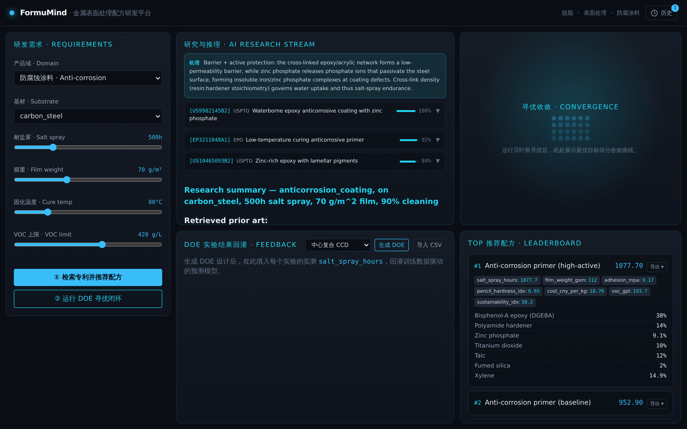
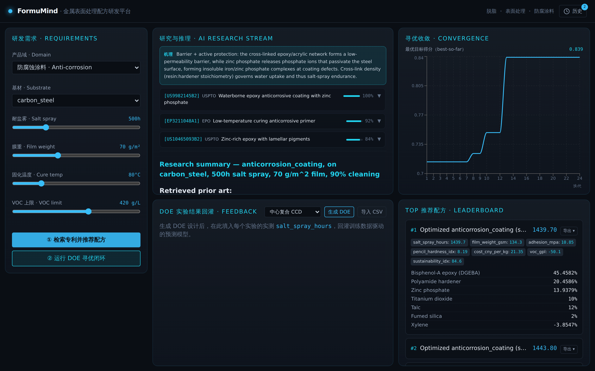
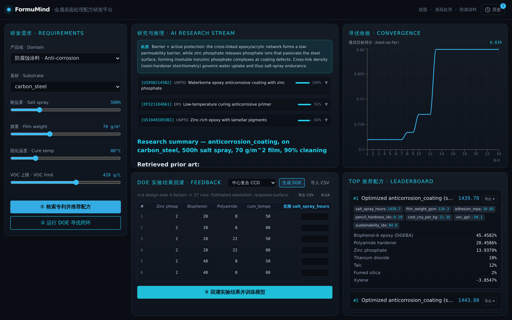
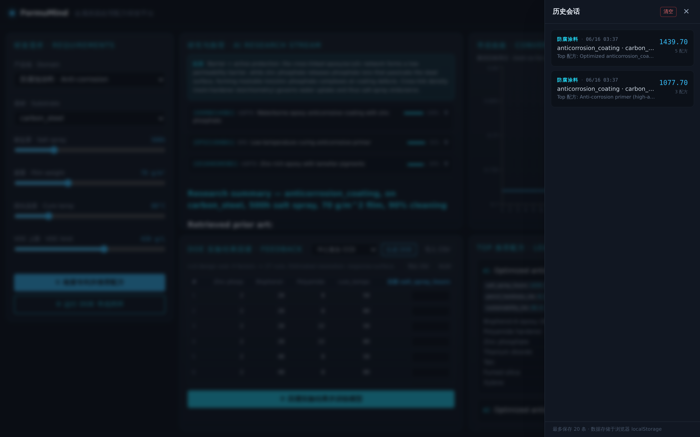

# FormuMind 快速入门（5 分钟上手）

本文用真实界面截图，带你在 5 分钟内跑通一次完整的配方研发闭环。
完整功能说明见 [使用指南.md](./使用指南.md)（English: [QUICKSTART.md](./QUICKSTART.md)）。

---

## 准备：启动平台

```bash
# 后端（终端 1）
cd backend
pip install -e ".[dev]"
uvicorn app.main:app --reload      # http://localhost:8000/docs

# 前端（终端 2）
cd frontend
npm install
npm run dev                        # http://localhost:5173
```

打开浏览器访问 **http://localhost:5173**。无需任何 API 密钥，平台完全离线可用。

---

## 第 0 步 · 界面总览

打开后是暗黑工业风三栏布局：左栏填需求，中栏看研究与 DOE，右栏看收敛曲线与配方排行。


- **左栏**：选择产品域 / 基材，拖动滑块设定目标指标（耐盐雾、膜重、固化温度、VOC 上限）。
- **中栏**：上方 AI 研究流，下方 DOE 实验回灌。
- **右栏**：上方寻优收敛图（未运行时为占位动画），下方 Top-N 配方排行。

---

## 第 1 步 · 检索专利并推荐配方

设好需求后，点击左下角 **① 检索专利并推荐配方**。



平台会：
- 检索该产品域的专利/文献证据（中栏「研究与推理」区，可点 ▼ 展开摘录，按相关度排序）；
- 给出反应机理说明（蓝色高亮段）；
- 在右栏排行榜产出 3 个推荐配方，每个配方卡显示成分表与预测指标 —— 注意已自动算出 `cost_cny_per_kg`（成本）、`voc_gpl`（VOC）、`sustainability_idx`（可持续性指数）。

---

## 第 2 步 · 运行 DOE 寻优闭环

点击 **② 运行 DOE 寻优闭环**，启动贝叶斯多目标寻优（默认 24 次迭代）。



- 右栏上方出现**收敛折线图**：X 轴为迭代次数，Y 轴为最优目标得分，悬停可看精确数值。
- 排行榜更新为 **Top-5 寻优配方**（卡片名带 `Optimized …` 与得分）。
- 寻优同时平衡耐盐雾、成本与可持续性（加权多目标聚合，默认权重见使用指南）。

---

## 第 3 步 · 生成 DOE 并回灌实测结果

在中栏「DOE 实验结果回灌」区选择设计类型（如**中心复合 CCD**），点击 **生成 DOE**。



得到一张实验记录表，每行一个实验，列出各因子的自然值 + 一列空白「实测」。两种回灌方式：

1. **手动**：在「实测」列直接填入实验室测得的指标值，点击 **③ 回灌实验结果并训练模型**。
2. **批量**：点 **导出 CSV** 把表发给实验室 → 填好后点 **导入 CSV** 上传。

当某指标累积样本 ≥ 4 时，平台自动训练数据驱动模型，模型质量仪表盘会显示 R² 半圆仪表 + RMSE，之后的推荐与寻优会切换为「经验 + 实测」混合预测。

---

## 第 4 步 · 查看与恢复历史会话

每次研究 / 寻优 / 回灌成功后，平台自动保存一份会话快照。点击标题栏右侧 **🕐 历史**。



- 右侧抽屉列出最近 20 次会话，显示产品域、时间、Top-1 配方名与得分。
- 点击任意一条即可**一键恢复**该会话的需求与排行榜。
- 历史存于浏览器 localStorage，刷新不丢失。

---

## 下一步

- 想自定义多目标权重、批量回灌、对接真实引擎？见 **[完整使用指南](./使用指南.md)**。
- 交互式 API 文档：后端启动后访问 **http://localhost:8000/docs**。

> 离线产出的性能数值为工程合理的筛选估算值，非实验室验证规格。通过 DOE 回灌真实数据，预测会越来越准。
